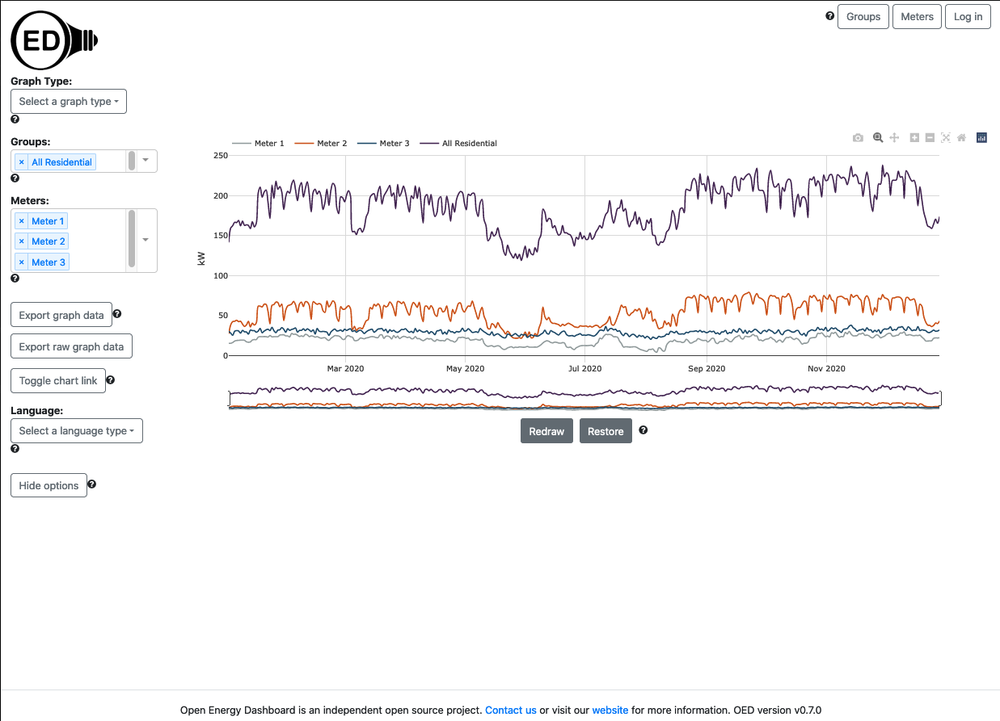
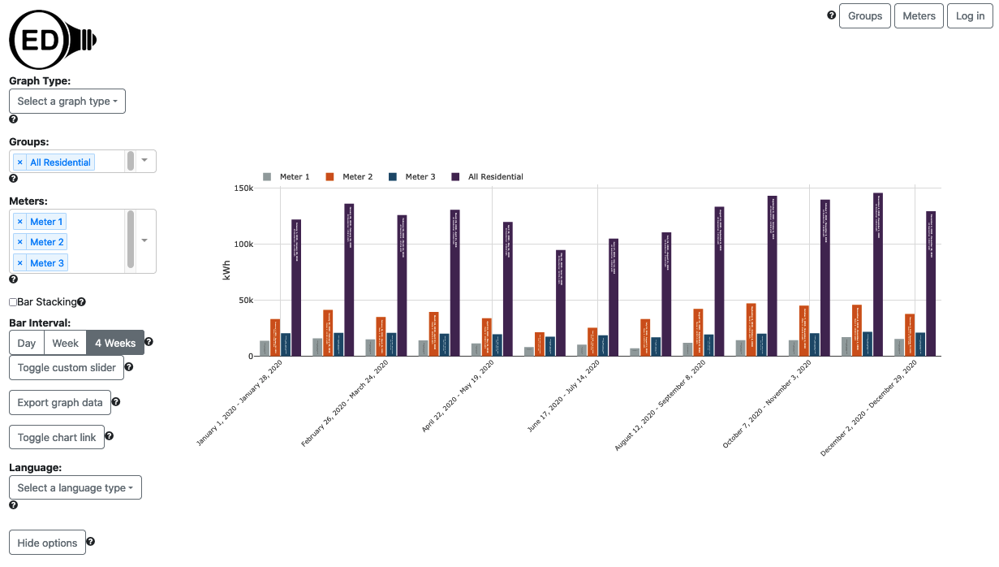

# Spring 2022 OED UI/UX evaluation

**Note the OED UI has changed since this analysis so some items may not apply or may need to be modified given changes.**

OED is an energy dashboard that targets two main types of users:

1. General users. These are the most common people to interact with an OED website. They do not log in. The goal is to make it as easy as possible for these users to work with OED.
2. Admin users. These is/are the person/people at a site that maintain OED. They control settings, set up data acquisition, maintain users, etc. The are assumed to have a reasonable knowledge of OED or be willing to read documentation to learn. The web pages aimed at admins are used much less and we are willing to have a somewhat lower quality UI/UX if that makes the pages easier to create/maintain. An admin has rights to do anything any other user can do. Note OED is committed to allowing a non-IT person to maintain a site so the pages are oriented toward that.

The CSV and obvius users are only designed as a login for automatic upload of data into OED so they do not interact with the website. The export user is designed to allow someone to log in to be able to download greater amounts of data without being an admin. As such, it only impacts the export feature and only in the sense that this user can get past the download size limits. As such, these three users don't really need UI/UX evaluation (except maybe export if you want).

Here are some thoughts on doing the UI/UX evaluation:

This is not an area of expertise for this project. As such, we expect the UI/UX team to have questions for us and want to interact. What follows are some general thoughts but are clearly not complete and may not be what the team wanted. Please just let us know.

First, as indicated above, we care the most about the general user experience. Starting there makes sense. While all areas are open, here are some thoughts. The landing page for OED is:

Some questions:

1. Is the ? icon for help clear. Are the popups with info clear?
2. Are the dropdown menus clear as they are used in many places in OED. Does selection seem obvious? Is listing already selected items for meters and groups good? Note we expect a user to select 1-10 items for meters and groups. The others are single selected item.
3. Is the Hide options button and the docked menus okay? Does getting back the options on the page make sense?
4. Is the opening of new choices on selection for Toggle chart link okay? We want to reduce the number of items shown at any time.
5. We don't think we have too many items on the page but we could make the two export buttons, toggle and language be under a further option choice if that seemed a good idea.
6. Are the colors of meters and groups a good choice? The help pages describe how they were chosen.

OED bar graphic page is:

1. Are the selection of time ranges good?

Some others for additional general user pages:

1. Is the way comparisons are shown on the comparison graphic clear. We have tried several ways and settled on this one.
2. The group page is quite different in how it displays pages because each group has lots of data. Is this a good way to do this?

Some admin page questions:

1. Are the table listing of data clear (this also applies to the reduced data shown to general users for the meter and group page)?
2. The pages were developed at different times by different developers. Thus, the meters, groups and maps pages all have different ways of editing the data. Is one better? Is there an overall better way?
3. Any thoughts on the other admin pages (admin for preferences, user off admin page, CSV, map creation)?

## OED setup and test data

The [developer pages](https://openenergydashboard.github.io/developer/index.html) have information on setting up OED and loading test data. Note that comparison graphics are harder so let us know if you want help (requires interacting with the database terminal).

## Known issues

Note that there are already some [issues on GitHub](https://github.com/OpenEnergyDashboard/OED/issues) that propose changes to the UI. These are (tried to put ones relating to same webpage near each other within two user groups):

## Ones for general users

- #685, 547 are to fix internationalizing strings.
- #611 to address placement of help icons when Spanish language is chosen. This is part of a more general issue that longer strings in some languages mess up the page layout (#524).
- #667 to fix getting blank map if only one available.
- #610 to remove extra information on map hover that was used during debugging and is only internal information.
- #600 to address that maps can limit the meters that can be seen (they must be visible on the map) but going to the map graphic does not temporarily hide the meter but permanently does this.
- #492 to fix that don't see data when first go to group page.
- #591 to allow users to see all meters in a group since this is a recursive process.
- #577 to have meter page sorted by name instead of internal id.
- #477 to improve label on comparison graphic
- #576 to fix that when there is no comparison data to show you see an empty graphic rather than something clearer.
- #466 that the size of the graphic does not scale vertically with window size.
- #181 that the line graphic shows an undesirable connection between points when there are gap in meter data.

## Ones for admins

- #692 to fix that the login button remains when an admin times out.
- #686 to fix that map creation has issues if no map is selected.
- #625 to fix that UI can crash if delete selected map
- #664 to upgrade meter page to allow input of all values.
- #694 to allow admin to create a meter via the meter web page.
- #566 to allow admin to reset the timezone to nothing.
- #496 to fix that can enter group with empty or just a space for name.
- #416 to fix that cannot remove the last character in a name while editing a group.
- #413 that arrow on group page cause issue but these are going away with the next version.
