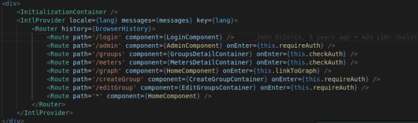
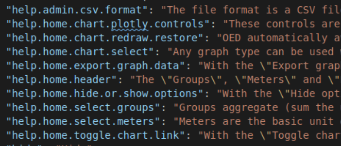
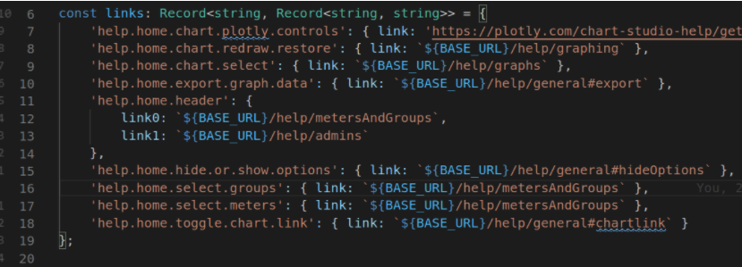

# How to add a new tooltip

**This is older documentation so some details/information may be out of data**

First routes, a tooltip has to be added at this level or lower so that the text can be internationalized.

There are two components. First the TooltipHelpComponentAlternative which is the tooltip itself. Next is the TooltipMarkerComponent is the icon for the tooltip.

Add one TooltipHelpComponentAlternative to a page at this routes (i.e for the home page add it to the HomeComponent, for the admin page add it to the AdminComponent). There is one TooltipHelpComponentAltenative to many ToolTipMarkerComponent; this creates the effect that only one tooltip would appear on a page. These two components share the `page` attribute which links them to each, so make sure they match. The `page` attribute for a TooltipHelpComponentAlternative should been unique; no two such components should have the have `page` attribute. This comes from a recommendation from the react-tooltip package that no two tooltips should have the same id.

The TooltipMarkerComponent has one more attibute: `helpTextId`. This should be a key under one of the languages in `src/client/app/translations/data.json`. Our chosen style for this id is: `help.&lt;page>.&lt;purpose of the tooltip>`. Below is a screenshot of data.json containing the help text in English.

To add a link to a tooltip, you need to make two modifications first in data.json, then in helpLinks.ts. First, in `src/client/app/translations/data.json`, you need to denote where it appears in the text with an identifier surrounded by curly braces. On line 60 of the screen below is a real example where we use {link} to denote where the link should appear for the `help.home.select.groups`:

Then in `src/client/app/translations/helpLinks.ts`, you need to add a key-value pair to the exported Record whose key matches a key in data.json (i.e. `help.home.select.group`) and whose value is another Record. The keys in this subrecord are the identifier used to denote the location of the link and the values are the links themselves. Below is a real example. Line 16 of the contains the link corresponding to `help.home.select.groups`.

**If the tooltip is not appearing it may be because the marker renders after the tooltip does. The tooltip component is only supposed to render once at which point it determines the markers that it should listen to. To resolve this, use ReactTooltip.rebuild() so the tooltips redetermine who they should listen to.**
