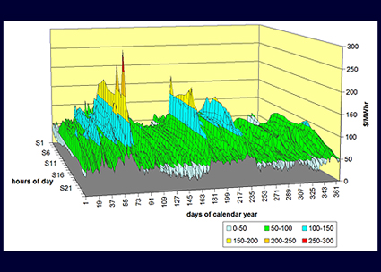
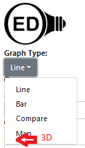

# 3D Graphic of usage

## Introduction

Another system has the following 3D graphic:

The graphic is defined by these three axes:

- The days in the year where we would likely try to label with some sort of date.
- The hours in the day where we would likely label with 24 hour labels.
- Usage value that is similar to other resources OED can display.

The goal of this graphic is to give a graphical idea of how usage varies. For example, the up and down pattern across days, as seen in the graphic above, may indicate times of the year that usage is higher. It may also be you see peaks and valleys across hours. For example, consistently lower values early/late in the day and peaking in the afternoon. This is a classic look where usage is lower at night than during the day.

This graphic allows one to see these patterns as well as more information than the 2D line graphics that OED currently supports. Another effort is adding error bars with the max/min values within the displayed point to give an idea of the variation in the averaged point on the 2D graphic. That graphic has the advantage that it will likely graph faster due to less data and OED's optimization of getting the needed values. However, it only gives the max/min whereas the 3D graphic shows the underlying values.

## Description of changes

### Database

#### Initial version

OED has an optimized view (can think of as a table) to get hourly data. It is in src/server/sql/reading/create_reading_views.sql in the hourly_readings_unit function. A new query should be created to get readings from this view for each hour of each day in the range of days requested. If there is a fraction of a day on either end then it is round to the full day. For example, if the range starts on 2/3/2023 3:00 then it begins on 2/4/2023 00:00:00 and if the range ends on 12/16/2023 20:00 then it ends at 12/16/2023 00:00:00. (The end time of a day is 00:00:00 of the next day.) If the query is for more than 1 year then no data should be returned. We should make the limit be a parameter to the function so it can easily be controlled if OED decides to put different limits on different users.

It is believed that this query will be reasonably fast for the following reason. OED currently gets hours data for requests with 15-60 days. The new query can be for a year so it is about 6 times more than the current max because 6 x 60 days is 360 days. The current max allows 1440 readings (24 x 60) and the new will be 24 x 366 = 8760 which isn't that much data. This is for each meter/line graphed.

#### Enhanced version

Graphing by each hour assumes that there are meter values at one hour or less. Otherwise, you are creating points that are more accurate than the original meter data. This is something OED is now avoiding. Sites will (in v1.0+) have a value on each meter that gives the frequency of readings. This value can be used to stop this from happening. The code that avoids returning this mythical data for the current line readings is in src/server/sql/reading/create_reading_views.sql in the function meter_line_readings_unit. It is not clear if the new DB query/function should use this type of logic or not but it may be useful.

In the case of the 3D graphic, the time between points on the hours of the day should be greater than the frequency of readings for that meter. It should also be an integer divisor of 24 to make the graph regular so it would be the value of 2, 4, 6, 8, 12. It should be the smallest of these values that is the same or higher than the frequency of readings for that meter. If you add 1 to the list then it is just another case where the frequency of reading is 1 hour or less. If the value would be larger than 12 (so one or fewer readings/day) then no data is returned for that meter.

In this enhanced version, if the frequency of reading on a meter is 90 minutes, then the query would return values for 00:00-02:00, 02:00-04:004, ..., 22:00-00:00 (of the next day) because 120 minutes/2 hours is the closest to 90 minutes. Thus, you get 12 evenly spaced points. If the frequency of readings for a meter was 30 minutes, then the query would return 00:00-01:00, ..., 23:00-00:00 for 24 points where 1 hour is the closest.

### Routing

The data received from the database needs to be routed back to the client. This involves these steps:

- A new item for getting 3D graph data needs to be added to src/server/models/Reading.js. The current getMeterLineReadings can serve as a template.
- A route is needed to transfer the data from the server to the client. See src/server/routes/unitReadings.js for meterLineReadings which is used in `router.get('/line/meters/:meter_ids', async (req, res) => {`. Similar types of code is needed for the 3D graphic data.
- A new API is needed on the client side. It will go in src/client/app/utils/api/ReadingsApi.ts where meterLineReadings is a good example.
= Actions are needed to deal with the new data. See src/client/app/actions/lineReadings.ts and start in fetchNeededLineReadings for an good template. This will lead to several functions used in this file and will be similar for 3D graph data.
- Redux functions are needed to get the readings into Redux state. First, the reducer is needed. See src/client/app/reducers/lineReadings.ts where cases will need to be added. Also, src/client/app/types/redux/lineReadings.ts will be updated to add types for the new 3D readings data.

These steps can be done in any order and some might prefer to go from last to first in the list as you need the types in several cases.

### Client

#### Initial version

A new graphic page will be created to display the 3D graphic. It will become another choice in the graph type and placed as the last item as shown here:

The code is in src/client/app/components/ChartSelectComponent.tsx. This should be done by adding it to the appropriate enum.

The actual page will have similarities to other graphic pages as in src/client/app/containers/LineChartContainer.ts. Note this scheduled to be converted to the new React hooks (see [issue #888](https://github.com/OpenEnergyDashboard/OED/issues/888)) and this page should use the new way if it is available/possible. A few of the differences are:

- It is unclear that displaying more than one meter at a time will be of value. It seems likely to make for a visual mess that will be hard to see/understand. Given this, I propose that only one item be allowed in a 3D graphic. I'm open to idea on how to do this but one idea is that if you go to the 3D graphic page and more than one item is selected then the user is informed of the issue and no graphic is shown. This needs to cover trying to add another item when a graphic is shown.
- If the length of time chosen (on the 2D line graphic page) is more than one year when the user goes to the 3D page then the user is warned that the time is limited to one year. They would have two choices:

1. Show one year backward from the current end time. This is consistent with no time selected (see below).
2. Show nothing.

The [Plotly 3D graphic](https://plotly.com/javascript/3d-charts/) can be used where the 3D Surface Plots are probably going to work best.

Note the user can zoom on the 2D line graphic to choose different time ranges. This time range will be honored for the 3D graphic (as done for the other graphics, i.e., bar/compare/map). If no time range is selected (because no meter/group has been selected yet), then the range can be set to one year starting at the current day and going back one year.

#### Enhanced version

It is believed that Plotly allows the user to rotate the graphic. Allowing this within OED would be the next step. This has not been researched but a quick web search found [this thread](https://community.plotly.com/t/i-want-to-rotate-3d-surface-plot-at-the-same-time/1246).

## Testing

New tests need to be added to be sure the 3D data is correct. It could be split into DB testing of the new functions and the routes that return the data. If the route returns the correct data then the DB functions are correct. Thus, it is okay to only do the routes.

There is test gig for readings in src/server/test/db/unitReadingsTests.js and described in [testing design document](../testing/testing.md). The needed CSV file for comparing to the received data will need updating for 3D data. Either the team doing this can take this on or ask earlier for OED to do this step. There may need to be some changes/additions to the testing code for 3D but it is hoped not too much. The main issue will be that each point has 3 values instead of 2. If creating a new file for this testing is better than that is okay as long as reused code is shared between the files.

In addition, OED checks the route for issues. This is not testing the returned values but making sure the route works and detects bad requests. See src/server/test/routes/unitReadingsRouteTests.js for the current line tests. These should be able to serve as templates for the new tests.

## Groups

The current logic in src/server/sql/reading/create_reading_views.sql for groups (group_line_readings_unit) uses the meter code to create each group. This should still work for 3D graphics but will involve more DB processing because it is more data.

One issue is that the groups code has not been updated to deal with the frequency. Hopefully this will happen soon so this project could reuse that code. If not and the team has time then they can look into this and applying to the 3D code.

## Implementation plan

The steps will be:

1. Initial DB
2. Initial client
3. Testing
4. Enhanced DB
5. Enhanced client
6. Groups

Early on there will be a discussion of how to split up tasks among the team. It should be possible to do the first 3 tasks in parallel (at least for a while). The later tasks can also be done in parallel. It is likely that different team members will work on different aspects of this project. As such, team members can focus on one or two of the technology areas. As usual, the members can express preferences on where to work and allowed to do that as long as all the tasks are covered.

An added item would be to see the speed and look of doing more than one year. Ideas to test are showing every day or grouping days so the number days in the days axis is keep under a certain limit. For example, if you ask for 2.5 years (about 900 days) then you would group three days into one line so, for example, 00:00-01:00 would be the sum of the group of three days. It is unclear if this is valuable/practical so testing is needed.
