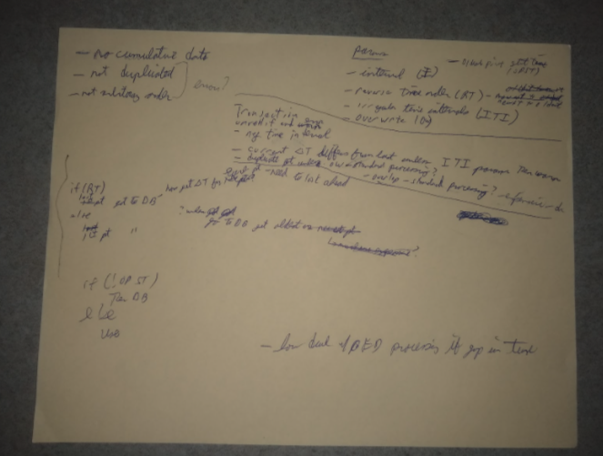

# CSV File Input of meters & readings

## Background

OED is expanding the types of meters we can read with the addition of Obvius (issue #[163](https://github.com/OpenEnergyDashboard/OED/issues/163)). Obvius and Mamac both use CSV formats and URL requests to get information to OED. With Mamac we have to pull the data and it contains duplicated readings and a separate request to get some meter information. Obvius pushes data without duplicates (it gets an acknowledgement that stops resending the same data). Obvius has two types of pushes: one for meter/configuration information and one for meter readings. Note that Obvius uses a key/value pair for configuration information.

In addition, on the admin panel we have the ability to drag-and-drop a CSV file to upload meter readings.

## Idea

We want to continue to expand the meter types that OED can accept data from. The new pipeline API is one way to do this. This would normally be done by creating new functions to accept and process the new meter and then feed the readings into the pipeline API. This code would do any work needed to transform the readings into the format we want before going into the pipeline. This requires adding code to OED but has the advantage that it becomes available to everyone and is controlled by the OED project. The pipeline currently does not deal with creating meters.

A second option is to modify/generalize the Obvius push system to allow OED to accept CSV files with needed information including meters and readings. Unlike Obvius, the meter/configuration information would be a CSV file. The advantage of this system is that a site can locally manipulate the needed data using any system/language they want and then upload the data to OED via a URL request. OED would not need to know about how the meter data was acquired or manipulated. We would still encourage these sites to provide the code to OED to allow others to more readily use it but it might not become part of the core OED system. See issue #[370](https://github.com/OpenEnergyDashboard/OED/issues/370) on accepting CSV meter readings and #[398](https://github.com/OpenEnergyDashboard/OED/issues/398) on CSV input of new meters. We may want to generalize CSV meter input to include updating meters.

Note the idea of allowing a site to provide a script that we would accept and then use to process the data was proposed. This means a site sends the data in any reasonable format and the script converts on the OED server. While this is interesting, I have security concerns about the OED server executing web provided scripts. What is proposed is scripts/routes that are integrated into OED after the usual review process and then available for sites to use. We could think about making this process easier but right now it is assumed that it takes a given, fairly standard file format and converts to the desired OED format to then feed into the pipeline in a similar way that a correctly formatted CSV would directly go into the pipeline.

## Details

### CSV readings

The current Obvius URL request has the following parameters:

*   password
    *   Authenticates the user to make a request
*   mode
    *   This tells the type of request being made. These include:
        *   CONFIGFILEUPLOAD: meter information that is normally only sent once before the first readings or if there is a change in meters
        *   LOGFILEUPLOAD: readings information/data that is sent each time new readings are uploaded
*   serialnumber
    *   This specifies the Obvius device that this request is coming from. This becomes part of the OED name of the meter. With Obvius, each row of the log file contains multiple readings so the meter name is a combination of the serialnumber and the column number (which specifies which logical meter the data is for). In the CSV system this should be the meter name.
*   modbusdevice
    *   This is only provided with a configuration file upload. This is used to construct a file name to hold the incoming data. This does not seem needed in the general CSV input.

The new CSV system will have related and additional URL request parameters (this list includes meter ones too):

*   email (no default value, request (cURL) ignored if not present or error response if wrong)
    *   Authenticates the user to make a request (used in conjunction with password)
*   password (no default value, request (cURL) ignored if not present or error response if wrong)
    *   Authenticates the user to make a request (used in conjunction with email)
    *   Maybe we should have a user name too so can have multiple users?
*   modeName (no default value, error response if invalid) (done)
    *   This tells the type of request being made. These include:
        *   meters: meter information that is normally only sent once before the first readings or if there is a change in meters
        *   readings: readings information/data that is sent each time new readings are uploaded
*   meterName (no default value, error response if mode is not readings)
    *   This specifies the OED meter name that the data is for in the CSV and is only used if the mode is readings. OED now has two names for meters: the internal one and the display one. Can we use one of these as the meter name for this? Do we need another value? The internal name should be unique but might be used less (by default, both names are the same).
        *   Note: we could have another column in the CSV with the meter name and then a site could upload multiple meter readings at a time. While this could have advantages, it has the negatives that the CSV file is larger (more likely to have transit and acquiring issues) and we sometimes reject meter data if there is an issue and this would make it harder to do if multiple meters are in a single file. Thus, we are going to require the site to send requests for a single meter. This differs from Obvius that sends multiple meter data in a single CSV. If we decide we want that we could layer a route to accept a CSV with multiple meters and then separate to put through this system.
    *   Note you cannot change a meter between cumulative and not. This is not just for CSV but in general. The possible work around would be to create a new meter with the new attribute and then create a group that sums the two meters to get all the values.
    *   **Note: The merges for OED version 0.7 is introducing new values in the DB for meters. The meter input needs to be updated for this.**
*   update (default value of false)
    *   Allow OED to modify a meter or reading if it already exists (true) or reject any row that already exists (false)
    *   OED will reject new readings if the start data/timestamp (I think this is correct) is the same as a current reading in the system. For readings, this parameter of true would overwrite the current reading with the incoming one. This has the advantage that it would allow admins to edit meter data via CSV and mitigate our need to create a complex editing system for readings that is not likely to be used very much. Should there be a value (readings only) that indicates deletion of an item and what could it be? Could have another option called delete. Also, should we archive instead of delete (that would be more work).
        *   We probably need a new SQL command that mirrors the current one with rejection as a transaction to make this work.
    *   For meters, this will allow the same named meter to have its information updated (true) or rejected (false).
    *   Changing some information, such as GIS coordinate, is fairly safe. Changing the units on a meter might be needed but can cause issues if done incorrectly. You can lose reading data if a mistake is made. OED is taking the position that an admin request can do what is asked and we don’t generally question it. However, we should log all changes and warn if they might cause issues.
    *   This is not an immediate implementation but we should do this at some point.
*   timeSort (default value of increasing)
    *   This specified the order of the start date/time for each reading. With increasing parameter value each reading should have a later date/time value. With decreasing parameter value, each reading should have an earlier date/time value. (see below on adding random)
    *   Initially or forever, we could choose not to have this parameter and force the site to sort the data in increasing order. I suspect this is easy to do in the OED code (either via logic or by direct sorting) and if this is the case then we should implement. Note streaming cannot easily be done (must do as a batch - see comments below). If we choose to sort the data then we might add the parameter value of unordered which means we have to sort the data since the date/time of readings are not assumed to be in any order in the CSV.
        *   Note from issue #370: If we accept random-order inputs, we cannot do stream processing, which means we have to throw out the existing loadFromCsvStream code and re-implement it with a block/batch processing algorithm. I think this may already be done but we need to check/think about this. [SHL note: we may want/need to limit the size of CSV files accepted since they would need to be in memory to sort/process as seems to be the case unless we use secondary storage algorithms that I don’t think we should get into.] \
This is a viable option, and would make solving the cumulative reading problem a lot easier, in that stream processing would have to recompute the cumulative reading base for each streaming window's worth of readings, which would require lots of database access and be very slow, while batch processing would permit computing the cumulative reading base one time, with one database access, and applying it sequentially to all further data.
        *   This note from issue #370 may also be important but I have not thought about enough: Forward-sorted inputs do not have either of these problems. We could simply sort data as it comes in and then pass it in a batch to a slightly modified version of loadFromCsvStream which does duration rectification, but that risks blocking the Node.js process (which is single-threaded) for a long time, preventing OED from servicing web requests.

            Another option is to create a "shim" service which asynchronously sorts incoming data and then streams it to the main OED server; or, taking this idea to its logical conclusion, we could separate out batch processing tasks into a separate service, which we will probably need to do to handle a large scale anyway, if we ever need that.

            I'm working on the first option (sorting data in-process and using loadFromCsvStream with some rectification logic), because I expect it to be easy to refactor out the sorting if we decide to do that.

        *   For now this parameter is not used and we assume increasing.
*   cumulative (default value of false)
    *   If the parameter value is true, then the readings provided are the sum usage and not the value for this particular reading. This means the next reading (in time) has a value that is the value provided minus the previous (in time) reading value. If the parameter value is false, then the reading provided is the one OED should use. See later pages on how this is implemented.
    *   Note: see timesort above on stream issue.
*   cumulativeReset (default value false)
    *   Note the pipeline automatically resets if cumulative value becomes less since some systems reset at a given time or when the value is too large. If true, we allow resets that mean that if a value is found that is smaller than a reset is assumed. If false, a smaller value is treated as an error for that reading. See below on what times of day the reset can occur.
*   cumulativeResetStart (default 0:00:00, e.g., the start of the day)
    *   The earliest time of day that a reset can occur. This used to be just before midnight but is now completely under user control. This only applies if cumulativereset is true.
*   cumulativeResetEnd (default 23:59:59, e.g., the end of the day)
    *   The latest time of day that a reset can occur. This used to be just after midnight but is now completely under user control. This only applies if cumulativereset is true. Note the defaults mean a reset can occur at any time of the day.
        *   How deal if around midnight given this description. Maybe if negative then it goes back into the previous day. Probably going to have boolean for DB so decide if same or different?
*   refreshReadings (default false)
    *   If true then after the new CSV data is processed, OED updates the daily readings so any new values can be graphed. This will do nothing if data is only added to the current day. It should be done if data is added to previous days or for more than one day if you want to see the new data before an automated refresh happens (normally each night if the site is set up in the usual way). If false, then no refresh is done.
*   duplication (default value of 1)
    *   The idea here is that we had one site where the same date/time reading/value was provided multiple times in a row in the CSV. The pipeline code deals with this where the value tells how many times the reading is duplicated. A value of 1 means no duplication, 2 means each reading shows up twice in a row in the CSV, etc. In essence, OED is deduping data.
    *   I have mixed feelings about this one. First, it isn’t clear this is a general issue and maybe a site should deal with it before they send us the data. Second, the update parameter might deal with this if a single transaction can reject duplicates (unsure what will happen in the DB). This is an argument to not include this parameter. However, if we sort the values for some of the other reasons, we likely could remove duplicates at this time without real cost. This means we won’t care about the dupulication number, just if it is true or false where we must sort with duplicate removal if true.
    *   This is something we will do later as needed or if we have the time.
*   length (no default value)
    *   This would specify the time range on every reading in the CSV file. If you only have one timestamp then it can be used to calculate the other one. This would also be used for checking for gaps between readings (otherwise we use the gap of the first two readings to check all the others). The values would be:
        *   No parameter means you must infer the length of each reading from the data. We currently assume the next reading start time is the end time of the previous one and the last one is the same as other ones in terms of duration.
        *   Positive is the reading length of time to use. If any reading does not match this length a warning is issued (should reading(s) be rejected?). If you only have one timestamp then use this to calculate the other one.
        *   Negative. The value does not matter. This indicates the readings can have variable lengths and OED should not warn about this case.
    *   This should be integrated into the discussion below about cumulative and gap so it does what is said.
*   lengthVariation
    *   +/- time allowed on length to consider within allowed length.
*   createMeter (default value of true?) (done)
    *   This only applies to readings. With parameter value of true then a meter that does not yet exist but is specified in the meter parameter would be created to store the new readings. The meter will not be set to either acquire data automatically or be displayable. The admin would need to do that. Doing this guarantees that reading values will be stored but it could create a new meter that is not desired. A parameter value of false means the meter is not created and the provided readings are dropped. We need to log/warn if we either create a meter or drop the readings.
*   headerRow (default value of false) (done)
    *   If true, the CSV file has a header row, if false then not present. See below for meaning of header row.
*   gzip (default value of true) (done)
    *   If true, we expect the csv file to be gzipped. Otherwise it will be a raw csv data file.

Note that some of these options may best be handled by adding new abilities to the pipeline code and then using the new functions in addition to the standard pipeline sequence for dealing with readings. This was the idea of the pipeline where different uses could put together different combinations of checks/options depending on its needs.

The reading CSV has three possible combinations for the timestamp: start only, end only or both. We need to think about what we want and add parameter(s) or other mechanisms to deal with this.

We should check every reading to be sure that its end timestamp abuts the start timestamp of the next reading and warn if there is a gap (the first/last value in the CSV needs to be thought through where one option is to check current values in the DB and not an issue if last reading is the latest in the DB). I believe the current pipeline only expects to get the start time for each reading and checks for this but it shows up differently because it infers the end timestamp. Thus, there cannot be gaps.

#### CSV meters

The case of inputting meters is similar (the parameters are given above). We need to figure out what values can be provided to determine the columns and column names that should be used. Given some values are likely to be skipped, we need to decide if all columns must be present and if the column header names must match. Forcing a direct match and number of columns means the files must be updated if we add new values. Matching the column name would allow for additions and different orders of columns. The code should be general enough to easily add new columns. See below for more on this.

The values that need to be specified seem more complex than readings in some cases. For example, the units of the meter. How can the admin specify these and how does this naming relate to units stored in OED. This is going to apply to other values so we need to think this through as we come up with a list of values in the CSV.

We need to think about what meter types are allowed and, maybe, how an admin could add new ones. We clearly need something that is outside Mamac and Obvius.

We currently store an IP address for each meter. That is needed for Mamac but not Obvius and possibly by others (we expect push systems and to have special code for pull systems such as Mamac). Assuming we leave it, we should decide what value to put in that DB attribute. For Obvius we use the server IP when it is created and we could do the same for CSV inputted meters.

#### General on CSV

1. Items for CSV header row
    1. If no header row then must be in canonical order with no missing columns that are needed and now gaps between columns given. Code will use function with canonical order in pipeline.
    2. If header row, then pipeline needs to be modified to treat it specially for first row. It will call a function to interpret the header row. For first implementation, it will ignore header row and return the canonical order function. Thus, CSVs need to be canonical until this is changed. In future, it will parse the header row to get the order and do validation on values.
    3. We need to decide and specify the canonical order of columns for both meter and reading CSVs, what values are required (if missing then error) and what values are optional with default values used for those not given.
2. Obvius does a gzip of the files before sending them. This makes them smaller. Should this always be done (another burden on the sending site) or we could make it an option?
3. Should we allow a checksum on sent files to ensure integrity? No - see below.
    4. I looked into this more and gzip includes a CRC which is used to verify the integrity of the file (see [https://unix.stackexchange.com/questions/160172/does-gzip-add-integrity-crc-check-to-a-tar](https://unix.stackexchange.com/questions/160172/does-gzip-add-integrity-crc-check-to-a-tar)). A checksum such as sha or md5 is more oriented toward malicious changes to files and we are not really interested in that case (we use password protection) (see [https://stackoverflow.com/questions/27609902/why-does-gzip-use-crc-instead-of-a-general-hash-algorithm](https://stackoverflow.com/questions/27609902/why-does-gzip-use-crc-instead-of-a-general-hash-algorithm)). Thus, if we use gzip (or any reasonable zip algorithm) we get integrity checking so we don’t need sha, md5, etc.
4. We need to decide about when data is stored or rejected. Currently we reject the entire batch if a value is  bad. This was partly due to Mamac that had recurring errors in points. I’m wondering if we should only reject the one point. Maybe we should have a parameter for the request?
5. We need to come up with a way to store passwords for CSV requests. This will also apply to Obvius and, for security, they should not be the same. We currently store admin passwords so it will be similar but this passwords should be different and stored separately. Given this, will it simply be another field in a table or something more general for site passwords?
6. The data downloaded from OED should be able to be uploaded in that same format via this system.
7. Should we place a limit on the file size and avoid the streaming case? This would mean the file can be processed in memory. This makes duplication, reverse sorted easier if sort in memory but must keep in mind that change row order from CSV for errors. If used, should it be a default value with admin override to different value. Setting to 4MB would probably allow more than 1 year of readings at 15 min. Intervals. That is probably enough and can be gotten around but either changing the admin value or splitting the file in this unlikely case. Note, this should never impact meter CSVs.
8. We need to specify the http error return codes that user with get.

## Overlap with other work

1. The test data (see issue #[141](https://github.com/OpenEnergyDashboard/OED/issues/141)) is partly done. In the developer’s wiki on GitHub, it describes directly using psql commands to load the data. This has the issue that the meter ids in the DB are from the CSV and they can conflict with existing or newly created meters. Using the new CSV system would remove this issue and avoid more complex instructions and the direct use of psql. We need to update the directions/procedures once this is available.
2. As we generalize OED, we will be adding lots of new values for meters, etc. We will need to augment the admin page to deal with this. The allowed values and what can be edited needs to be consistent with what we do/need here.
3. We should see how Mamac meter readings are acquired and see if we can integrate with this work.

## Notes

1. We need to document to the admin that having overlapping meter readings (where the start/end date/time of one reading is partly in the range of another reading) is not checked and can cause issues in what OED does with the data. This really should not happen for meter data.
2. Should we use DB functions for sorting, cumulative, etc.?

Here are pictures from previous discussions. The above should have this but they might be useful in some way:

Deal with cumulative and readings that have gaps between them. (does not deal with reset??)

*   R is a reading with (V, S, E) where V is the value of the reading, S is the start_timestamp and E is the end_timestamp
*   Rm is the current reading stored in the meter table. This will be the last reading received or R0 if no reading has been received.
*   R0 is the initial value of Rm of (V0, S0, E0) = (0, 1/1/1, 1/1/1). V0 value should not be important since not used. Y1/1/1 is a long time in the past so never can be an actual reading value.
*   Rp is the previous reading with (Vp, Sp, Ep)
*   Tgap is the allowed time variation in milliseconds when seeing if the gap between two readings is too large.
*   Tlen is the allowed time variation in milliseconds when seeing if two readings are of the same length.
*   Cum is true if meter values are cumulative (the next reading is larger than the previous reading and the value used by OED is the next reading V - previous reading V). It is false otherwise.
*   onlyEndTime is true if readings sent to OED only have a single timestamp that is assumed to be the endtime. It is false otherwise.
    *   Could we easily deal with the single reading be the starttime?

Note all except (onlyEndTime) is being added to the information in the DB for each meter. Thus, we might say the default is the value stored in the meter if not given. The DB will be set to the default value on creation so that would automatically give the default we want.

I need to incorporate the “length” param above into the Tlen idea.

function processData (batch of readings, onlyEndTime: boolean, ...) { \
    Rp = Rm // The initial previous point is the one from the DB when start a batch of data \
    Rok = true // Reading is okay to use until error is found. \
    For (all readings in the batch R) { // if onlyEndTime then no S set here \
        If (onlyEndTime) { S = Ep } // We have to assume the start time of this reading is the end time of the previous reading since only one time in reading. \
 \
        If (cum and isFirst(Ep) { // always drop point if first ever and cumulative \
            Rok = false \
            errMsg = must drop first ever reading with cumulative data \
        } \
 \
        // Want to check and error if end of reading is not after start \
        if (Rok and S.isSameOrAfter(E) { \
            Rok = false \
            errMsg = the reading end time is not after start time \
            If (onlyEndTime) {error += start time came from previous readings end time \
        } \
 \
        If (Rok) { \
            // Check that S is not before Ep (the reading seems after the previous one) \
            If (onlyEndTime and E.isSameOrBefore(Ep)) { \
                // We only have one value to check so we use the endtime. \
                // The current reading is not after the previous reading. \
                // = is an issue here since not start time so must check to Ep. \
                Rok = false // Cannot use this reading \
                errMsg = This reading not after previous reading with only end time given so must drop reading \
            } else if (S.isBefore(Ep)) { \
                // reading is before previous one (S=Ep okay when given) \
                If (cum) { \
                    // Since need to subtract from previous then cannot be done. \
                    Rok = false \
                    errMsg = reading start time before previous end time and cumulative so cannot use the reading \
                } else if (! isFirst(Ep)) { \
                    // This situation is expected for the first reading ever so ignored. \
                    // Treat as warning since maybe just sent in different order. \
                    Log warning that this reading is not later than previous reading. \
                } \
            } \
        } \
         \
        If (Rok and | S.diff(Ep) | > Tgap) { \
            // The start of the current reading is too far in time from the end of the \
            // previous reading (gap). Note cannot happen if onlyEndTime.~~ \
~~			If (cum) { \
                // Cannot deal with a gap with cumulative since this means \
                // subtracting to get value is not a good idea because the \
                // two readings are not contiguous or there was not a previous \
                // reading. \
                Rok = false \
                errMsg = the end of previous reading is too far from the start of the next readings in cumulative data so dropping reading \
            } \
            Else if ( ! isFirst(Ep) ) { \
                // You expect a gap in the first reading ever so ignore. \
                Log warning that gap in time between this reading and the previous reading that is not usual. \
            } \
        } \
     \
        If (Rok) { \
            // Can use this reading. \
            // Check if the time length of R differs from previous. \
            If ( | Ep.diff(Sp) - E.diff(S) | > Tlen and ! isFirst(Ep) { // may already be in pipeline? \
                // The time span of the current reading differs from the \
                // previous reading by more than Tlen. Note if first reading \
                // then this is expected so skip \
                // length parameter to CSV and/or meter comes in here (probably) \
                Log warning that previous reading has a different time length than the current reading \
            } \
            Okay to add this point to Readings table (after any other needed checks). Still need to subtract V is cumulative. \
        } else { \
            // An issue occurred that means we cannot deal with this reading \
            Log error with errMsg. \
            // Decide how return error to user URL request? Need to track error occurred \
            // Increment number of error messages. Concatenate the new errMsg to the old errMsg.  \
            // If # of errMsg = max # of errMsg stop processing the readings. No readings are added  \
               to the database. Returns errMsg’s.  \
            // max # of errors should be a parameter with default = 25? \
        } \
        // Done with current reading so it becomes the previous one \
        Rp = R \
    }

// The last reading dealt with in the batch needs to become the one stored in the DB. \
    Rm = Rp \
    // deal with telling request ok or error. \
}

function isFirst( t: moment) { \
    Return t.isSame(E0); \
}

### Test Cases

1. Non-cumulative
    1. Good values (verify first point correct)
    2. Reading with gap from E_k to S_k+1 near tolerance on both sides
    3. Reading with different length
        1. Longer and shorter
        2. Just at tolerance on both side
    4. Need to do with both start, end and only end (result for errors might differ)
2. Cumulative
        3. Good values  (verify first point correct)
        4. Verify drops first value
    5. Reset in middle and then later try start & end
        5. Drop if not allowed
        6. Check when always allowed
        7. Check when within supplied range
        8. Check when outside supplied range
3. More value that
    6. Immediately following (normal)
    7. before all others
    8. Much later than all others
4. Cases for cumulative and gap in batch of readings and how code responds
*   The reading has an start timestamp that is not before the end timestamp
    *   Error Happens in all cases where extra part if onlyEndTime
*   The readings are cumulative (cum = true)
    *   The readings only have end timestamp (onlyEndTime = true)
        *   This is the first reading ever received
            *   Should error since no previous reading. Separate first case so must happen.
            *   The reading does not occur after the previous one
                *   Error: must drop first ever reading with cumulative data
            *   The reading is not immediately after the previous one (gap) 
                *   Error: must drop first ever reading with cumulative data
            *   The reading length differs from previous
                *   Error: must drop first ever reading with cumulative data
            *   The reading is fine
                *   Error: must drop first ever reading with cumulative data
        *   This is not the first reading ever received
            *   Should error ordering or warn if length
            *   The reading does not occur after the previous one
                *   Error: This reading not after previous reading with only end time given so must drop reading
            *   The reading is not immediately after the previous one (gap) 
                *   (cannot happen) accept
            *   The reading length differs from previous
                *   Warn: that previous reading has a different time length than the current reading
            *   The reading is fine
                *   accept
            *   The readings are regular (not cumulative)
    *   The readings have start and end time stamps
        *   This is the first reading ever received
            *   Should error since no previous reading. Separate first case so must happen.
            *   The reading does not occur after the previous one
                *   Error: must drop first ever reading with cumulative data
            *   The reading is not immediately after the previous one (gap) 
                *   Error: must drop first ever reading with cumulative data
            *   The reading length differs from previous
                *   Error: must drop first ever reading with cumulative data
            *   The reading is fine
                *   Error: must drop first ever reading with cumulative data
        *   This is not the first reading ever received
            *   Should only use if fine or length differ
            *   The reading does not occur after the previous one
                *   Error: reading start time before previous end time and cumulative so cannot use the reading
            *   The reading is not immediately after the previous one (gap) 
                *   Error: the end of previous reading is too far from the start of the next readings in cumulative data so dropping reading
            *   The reading length differs from previous
                *   warning that previous reading has a different time length than the current reading; accept
            *   The reading is fine
                *   accept
*   The readings are regular (not cumulative)
    *   The readings only have end timestamp (onlyEndTime = true)
        *   This is the first reading ever received
            *   Should okay except first one
            *   The reading does not occur after the previous one
                *   Error: This reading not after previous reading with only end time given so must drop reading
            *   The reading is not immediately after the previous one (gap) 
                *   (cannot happen) accept
            *   The reading length differs from previous
                *   warning that previous reading has a different time length than the current reading; accept
            *   The reading is fine
                *   accept
        *   This is not the first reading ever received
            *   Should be okay except first one
            *   The reading does not occur after the previous one
                *   Error: This reading not after previous reading with only end time given so must drop reading
            *   The reading is not immediately after the previous one (gap) 
                *   (cannot happen) accept
            *   The reading length differs from previous
                *   warning that previous reading has a different time length than the current reading; accept
            *   The reading is fine
                *   accept
    *   The readings have start and end time stamps
        *   This is the first reading ever received
            *   Should accept all
            *   The reading does not occur after the previous one
                *   accept
            *   The reading is not immediately after the previous one (gap) 
                *   accept
            *   The reading length differs from previous
                *   accept
            *   The reading is fine
                *   accept
        *   This is not the first reading ever received
            *   Should warn on first three
            *   The reading does not occur after the previous one
                *   warning that this reading is not later than previous reading.; accept
            *   The reading is not immediately after the previous one (gap)
                *   warning that gap in time between this reading and the previous reading that is not usual.; accept
            *   The reading length differs from previous
                *   warning that previous reading has a different time length than the current reading; accept
            *   The reading is fine
                *   accept

# Finished

This document did not completely track the work and it was finished in May 2021.
