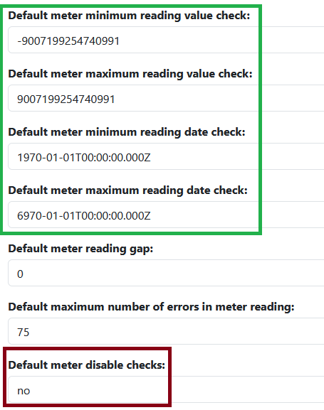
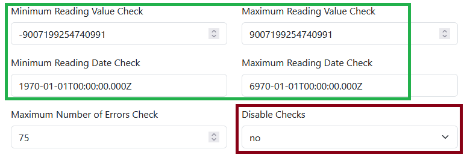

# Enable reading rejection if outside bounds on reading upload

## Introduction

PR #989 allowed admins to set min/max ranges for the reading values and start/end dates. The readings' pipeline enabled checks for these values. If a value is outside these ranges and the checks are not disabled then the reading is rejected and the entire upload of readings are not added to OED. There are two ways to control these values:

1. The site settings (formally the admin panel) sets values that are used if meter values are not given.
2. The values can be set on each meter and this takes precedence over site values.

While this was an improvement, sites have had issues with this system. For example, if the data is coming from a meter and it reports an invalid value then all the readings are rejected. There is no easy way to get OED to accept all the values in range. Also note that disabling the checks means undesirable values are accepted by OED and there is no easy way to remove them. For these reasons, this outlines changes to OED to allow for the rejection of values outside the range but still accepting the ones that are okay.

This is covered by [issue #1307](https://github.com/OpenEnergyDashboard/OED/issues/1307).

## Proposal

This proposal is split into two parts:

1. Directly address the issue without significant change in how OED deals with limit ranges.
2. Address the larger question of the validity and quality of the current range check system.

### 1. Basic changes

The current way to set the default range values on the site settings for readings is shown next. Note the actual look is likely to change in the near future but the idea is the same.

The items in the green box are used to set the allow range for reading value and date. These will remain as they are. The selection in the red box is used to set whether the checks are disabled. This will be modified to become a trinary choice where it is currently binary of no/yes. This type of choice is used in several place in OED. For example for displayable of units where the enum DisplayableType is used to store the choices, put values on the drop down menu and is properly translated. The choices in this case will be:

- No, only reject the bad reading(s)
- No, reject all readings in batch
- Yes, do not check values

OED is open to other wording to make the ideas clearer and the key associated with these strings is up to the developer. The third choice has not changed. The second choice is the former no choice. The first choice is the new one where only the readings outside the defined ranges for value and date are rejected and the other readings are incorporated into OED. The  default on site setup (see src/server/sql/preferences/insert_default_row.sql) will be "No, reject all readings in batch" so it is the same as now.

Each meter has the same values that only impact the meter (create and edit). The same change will apply to the disable check drop down menu.

In addition to the changes to these pages, how the disabled check is used needs to be modified. These are known to be impacted:

- src/server/sql/preferences/insert_default_row.sql needs the default changed as stated above and a new DB enum is needed for the trinary disable check choices.
- src/server/services/pipeline-in-progress/processData.js: The validate test near ``if (conditionSet !== undefined && !conditionSet['disableChecks']) {`` needs to be changed and the value properly dealt with.
- src/server/services/pipeline-in-progress/validateReadings.js: Checks need modification to give the correct message and may need to change what returned so individual reading reject is handled correctly. How this will be done has not been analyzed.
- src/server/test/db/validateReadingsTests.js: Tests may need updating.

### 2, Comprehensive solution

The pipeline checks and min/max ranges were conceived and partly designed before OED 1.0. Now, OED can deal with many types of units. This change raises concerns about the allowed range of values. For example, the range of values for temperature are likely very different than kWh. Even within a unit category (such as energy) or a specific unit, the range my depend on the meter device. For example, a meter that collects energy for the entire organization may allow much larger values than one for the lighting in a small building. As another example, the value of a meter reading watts will have very different values than one reading BTU.

The current system allowing values to be set on each meter can overcome these issues. However, it does not address the default site values that are applied if not set on the meter. One option would be to remove the default site values. The negative is this requires the site admin to enter a value on each meter even when categories of meters may be very similar, e.g., all temperature meters.

A second option is to make the max/min value range be unit dependent. (Note this proposal assumes that the date range will not be unit dependent as one global value seems likely to work so overriding on each meter is not a big issue.) Doing this is facilitated by the fact that there are separate meter units that are then linked via conversions to graphing units. It is even possible to have multiple meter units measuring the same unit (with different names) to allow for them to have different defaults if that is desired. Given this, the proposal is to have a default value for each meter unit type that will be used unless changed on an individual meter.

The following changes are envisioned:

- The unit create & edit modals will have three items added for the min/max default value and if the checks are enabled. It will be very similar to what is on the current meter pages for doing this. It will start with the current default value on the site page which does not exclude any value and the no, reject all is used.
- The DB will be modified to add these values along with the needed model and route changes.
- When a meter is created and a meter unit is selected, the value for min/max value and default disabled will be set to the one for that unit and not the site default value. The admin can modify as desired.
  - During migration of current sites, all current meter values will be retained. The units will get the default value for min/max value.
- The value min/max and default enabled will be removed from the site settings page and from the related routes, DB, model, etc.

Note, this should not require any significant change to the processData.js code as it continues to use the meter value. Also note, the parameter (coming) that takes slightly negative readings and forces them to zero should be done before the range check is done. This will likely happen naturally given the way the code currently processes readings.

## Plans

The plan is to do this in two stages for the two levels of solution. This should work well since they are mostly disjoint. The first step will be the basic changes followed by the comprehensive ones.
