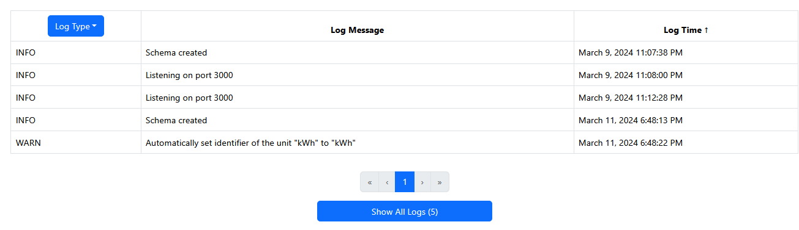

# Baseline

This version (28 April 2025) is substantially different from the previous version. It is believed to be reasonably correct but more edit will undoubtedly happen.

## Introduction

Meters can show a non-zero value even when no one is in a building. This is due to systems in the building, such as fans, that are not under the control of building occupants. The value of this reading is known as the baseline usage (or just baseline). The low trough for the meter in the figure below represents potential baseline dates when people were not around during a break period and is indicated with a green rectangle. As is common, the usage during a baseline is not constant but lower than other values and spans some amount of time.


When users look at usage they currently see the total usage including the baseline. This can confuse people because the usage may be much higher than they expect due to the baseline usage. Furthermore, when sustainability people ask for building occupants to reduce consumption, they may use OED to show the outcome. This can disappoint people because the percentage change is much lower due to inclusion of the baseline usage. To mitigate the impact of baseline usage, OED wants the option to subtract the baseline from the data shown to the user. OED will still allow the current graphic because energy managers and others want to see total usage because that represents the actual usage (and with the baseline removed at times).

OED includes server code for storing baseline information but it has never been used and probably needs updating. It can be found by searching for files with baseline in the name. OED wants to have a system for semiautomatic baselining of meters. This will allow an admin to choose the start and end time of low usage via a line graphic and OED will automatically calculate and allow the admin to store the optimal baseline. This requires a calculation because the energy usage varies a little over time and is not constant during the baseline period. With these two pieces in place, OED will be ready to add the option to subtract baseline values from the graphics displayed.

The very old [issue #209](https://github.com/OpenEnergyDashboard/OED/issues/209) covers baselining meters and [issue #210](https://github.com/OpenEnergyDashboard/OED/issues/210) addresses adding it to graphics.

## Overview

### Baseline unit

The natural unit of a baseline is the unit that meters collect data. In OED this is the meter unit but that is not a unit that is used for graphing. Generally there is a conversion from the meter unit to a graphic unit that has a slope of 1 and an intercept of zero (0) so it is effectively the same unit. However, to allow a general system, OED does not require this. In addition, it can vary with time (once that is implemented). A further complication is that the conversion (and even the units involved) can be changed after a baseline is set. If OED calculated the baseline in a unit other than the meter unit, it needs to be converted to the meter unit to apply and its value could change if conversions change. Given this, OED will set the baseline in the meter unit. The modest implications are discussed below about setting the baseline unit in the UI.

The meter unit of a meter rarely (generally never) changes. If it is changed, OED will assume the baseline value is the same. This is because the readings did not change and only the associated unit. Thus, the relative value of the baseline is not actually changed. An admin needs to manually change the baseline if desired in this case.

### Applying baseline

OED allows linear conversions of the form $f(x) = mx + b$ where OED calls m the slope and b the intercept. Most OED conversion have b = 0. In this case, the order of applying conversions when they are chained does not matter because multiplication is commutative. However, when both the slope and intercept are non-zero then the order does matter. So, if you have two linear transformations $f(x)$ and $g(x)$ then $g(f(x) \neq f(g(x))$. To allow OED to be general for linear transformation and special cases, OED needs to apply conversions in the proper order.

A baseline is a subtraction of value where $m = 1$ and -b is the baseline value. It is reducing the meter usage. This has two implications:

- The original meter value needs to have the baseline subtracted in the meter unit. This gives the net usage without the baseline.
- The baseline is first applied and then the conversion to the graphic unit. This means the net usage without the baseline is converted to the graphic unit value.

### Groups

As discussed above, the order of applying the baseline matters. It must be applied first. A group is an aggregation of meters where the meters in the group may be of different meter units but those units are compatible with at least one graphing unit. As such, OED cannot directly aggregate the meter values but must first convert to a compatible unit. Given this, the way to compute a group with a baseline is to apply the baseline to each meter, convert the readings to the desired graphic unit and sum with all other meters in the group. This applies the baseline first and sums in the same graphic unit.

OED is deciding if doing this in real-time (as is currently done to calculate groups) or via a view should be done. The tradeoff is non-trivial and the decision partly depends on how time-varying conversions for graphic units are handled. The way baselines are done will need to be updated once that decision is made.

### Views

OED uses materialized views of hourly and daily meter readings to speed up many graphic requests. It would be possible to create a second set of views that subtract the baseline. This would support both original readings and baseline readings in a similar way. The alternative is to do it on-the-fly. The tradeoffs seems to be:

- Baselines can vary with time but should infrequently change (probably on the order of years). This means there should be only one or a few baseline time ranges to apply. This may make on-the-fly faster than for other conversions.
- The view takes up space/time. For meters, the two views are about 26% of the size of readings. Not huge but some disk space. It will likely take a comparable amount of extra time to refresh the reading views if a baseline one is added.
- OED may decide to use views, which become larger, for time-varying conversions to speed them up. If so, then OED may decide to do it here too. Group views have the issues noted above for hourly/daily so they will likely depend on the decision on how to do them.

## Implementation

There are two large aspects associated with the changes:

- The database must be able to stored the desired values. Some server-side changes are also likely.
- The admin must be able to view/edit the baseline of a meter.

There are some smaller aspects discussed after these.

Note that access to all baseline pages is limited to an admin.

### Database changes

There is currently a baseline table in the DB that should mostly be okay. It is defined in src/server/sql/baseline/create_baseline_table.sql. It is okay to modify as appropriate. A few notes:

- The apply_range is the date/time range where this baseline for the given meter applies. A tsrange rather than a start/end time is likely easier but probably want to be consistent with the modified time-varying conversions tables.
- The calc_range are the dates used to calculate the baseline. If the admin manually enters the baseline value then this will be null. This means the ``NOT NULL`` must be removed for this column. It will be the same as apply_range in terms of type (tsrange) or if there are two separate items.
- The table has:

```
EXCLUDE USING GIST (
  meter_id WITH =,
  apply_range WITH &&
)

```

The utility and need for this needs to be investigated.

The meter table needs to be modified to add a new column to indicate if the meter has baseline value(s). It will be named ``baseline_active`` of type ``boolean`` with a default value of false (no baseline). The value will be come true when the first baseline is added for a meter. It becomes false if all the baselines are deleted for a meter. To support groups (see next), an admin can have one baseline of 0 (zero) for a meter that goes from -inf, inf but have the ``baseline_active`` be false. It will be used for a group but the meter will not be baselined. Note setting the ``baseline_active`` to true in this case means both the meter (with a baseline of zero) and the group will use this baseline. This is going to require special logic.

OED will only baseline a group if every meter in the group has a ``baseline_value`` of true. Keeping a fixed value in groups will require checks whenever the members of a group change (including recursively so any group change must be checked for all groups during an edit). OED has such logic for other tests. The value will be set to true if this is the case. The admin can set it to false so the group is not baselined. The admin cannot set to true unless all meters in the group are baselined. This requires a ``baseline_active`` in the group table similar to the meter table. It would be best if any change to this group value is confirmed with the admin.

See farther below for needed DB changes to support graphical selection of a baseline value.

All DB changes need a migration.

### Creating/Editing baselines

#### meters

The meters edit pages will have baseline items in the location as shown in this figure:


- A field to show if ``baseline_active`` is true or false (yes/no) on each meter card. It is displayed but cannot be changed here.
- A "Details/Edit Baseline" button that is similar to the "Details/Edit Meter" button that pops up the modal in the figure above. When it is clicked it will take the admin to a modal or page to work with the baselines of this meter. The details are in the next section.

Note that the ``baseline_active`` is set to false on meter creation. This is because there are no readings associated with a new meter.

##### Details/Edit Baseline of a meter

General Note: Changing the ``baseline_active`` of a meter can impact groups so they all need to be rechecked. If a group is active (true) but should not be then it is changed and the admin is informed. If it is inactive (false) but could now be made true then the admin is informed but no change is made. The group and other page(s) have examples of how to list and show to the admin.

When the "Details/Edit Baseline" button is clicked on a "Details/Edit Meter" modal, it will start this process. If possible it will be on a modal popup as other pages but can go to another page if that is best (and return to the meter modal popup for this meter when done). The choice will depend on what is possible/easy to display for this process.

The table for showing the baselines will have the general look an feel of the log message table:



The header row of the table for baseline will have these entries without any buttons or ability to sort. The baselines will be sorted by the apply_range where the start date/time is equivalent. The following table has the basic layout/structure but it will look a little different on the OED page. The first row is the headers, the next a description and the following rows are examples.

| Dates | Dates for calculation |  Value | Active | Note |    |    |    |    |    |
| :---- | :-------------------- |  :---- | :----- | :--- | :- | :- | :- | :- | :- |
| The date range that this baseline applies separated by a hyphen. If it is -inf or +inf then it has a special representation. | The dates OED used to calculate or "Admin input" if calc_range is null. | baseline value | "yes" if the baseline is active and "no" if not. | Any note associated with this baseline. The first ~100 characters (value based on look) will be shown and popup with the full message on click as done with the log messages. | Button "edit" | Button "Split adding earlier baseline" | Button "Split adding later baseline" | Button "Delete changing earlier baseline" | Button "Delete changing later baseline" |
| March 9, 2024 00:00:00 PM to January 2, 2025 00:00:00 PM | May 25, 2024 01:15:00 AM to June 2, 2025 9:17:00 PM | 123.45 | yes | Sample with full dates | see below | see below | see below | see below | see below |
| to January 2, 2025 00:00:00 PM | May 25, 2024 01:15:00 AM to June 2, 2025 9:17:00 PM | 13.75 | yes | Sample where it applies from -inf | see below | see below | see below | see below | see below |
| from January 2, 2025 00:00:00 PM | May 25, 2024 01:15:00 AM to June 2, 2025 9:17:00 PM | 22 | yes | Sample where it applies to +inf | see below | see below | see below | see below | see below |

The buttons will each allow the admin to modify the conversion in this row as described below.

The table above will be incorporated into the details/edit baseline modal/page. It is shown if at least one baseline exists for this meter. The modal/page will roughly look as in the following figure:


If there are no baselines for this meter, then the "Create First Baseline button" is shown. In this case the table is not shown since it would be empty. Otherwise the table is shown without the create button.

The \<meter name\> is replaced with the actual meter name. The help icon will show text to direct to a new help page (that project will create).

Note that OED will not require that the dates for calculation will be between the dates that the baseline applies. We could consider adding a warning if this is not true. This could happen either on creating or editing of these values.

Consideration was given to adding a button to allow deleting all baselines of a meter. It is a convenience since individual ones can be deleted. Given it is unclear if/how often it would be used, it is not being done at this time.

###### Create First Baseline button

This will allow the admin to create an initial baseline for this meter. The baseline value can either be set manually or graphically. The Dates must be [-inf, inf] to span all time. The details are below. In addition, the admin can specify these values:

- Active: Allow to set to yes/no. This is done via a drop down menu as is for displayable on the meter pages. Recall this can impact any existing group and must be checked and admin validated. Changing may override the OED default set during the value setting.
- Note: The admin can edit the note as desired.

There will also be discard and save all buttons as done on other pages such as meters.

###### Edit button

The exact look/feel of this is open as OED does not have an equivalent functionality to edit rows of a table. Maybe another popup if possible. There will also be discard and save all buttons as done on other pages such as meters.

This button will allow the admin to edit some of the values in the row. It is similar to creating a first baseline but the admin does not need to change any specific values. The look/feel will be similar.

Note that changing the dates associated with the baseline has some restrictions and impacts the adjacent baseline:

- The admin can modify the start or end of the dates for the baseline. The adjacent baselines are modified as follows when this is saved:
  - If the start date/time is changed then the baseline immediately before needs its end date/time set to this value. They are required to be the same so this keeps them consistent and makes conversions span all time.
  - Similarly, if the end date/time is changed then the baseline immediately after needs its start date/time set to this value.
- To make sure that all the meter baselines span all time, OED will not allow the start date/time of the earliest conversion with a value of -inf nor the end date/time of the latest conversion with a value of +inf to be modified. Once the exact UI is settled then this can be imposed in a good way. For example, if it is a button to change one of these values then it would be grayed out so it cannot be clicked. This is done elsewhere in OED.

Note the admin can change both dates, when appropriate, so this would impact the baseline just before and after the one being edited. Also, if there is only one baseline (-inf, inf) then the dates cannot be changed and a split must be used.

###### Split adding earlier baseline button

The admin will enter a date/time that is between this baseline's dates (exclusive meaning it cannot equal the start or end of the current date). The date will:

- The current row baseline will have its start date/time of the date be this value.
- A new baseline is created that will have the start date/time of the current row's start date/time and the end date/time will be the value input. This creates a new baseline just before the current one. The process will then proceed similarly to creating a first baseline to set all the needed values. A similar look/feel will be used and hopefully a reused component.

Note these rules guarantee that the baselines span all time so no time is left out. There will also be discard and save all buttons as done on other pages such as meters.

###### Split adding later baseline button

This is very similar to splitting earlier but the date values differ:

- The current row baseline will have its end date/time of the date be this value.
- A new baseline is created that will have the start date/time of  the value input and the end date/time of the current row's end date/time. This creates a new baseline just after the current one.

###### Delete changing earlier baseline button

This deletes this row's baseline. It changes the immediately previous baseline's end date/time to be this row's end date/time. This keeps the baselines spanning all time. If the admin wants a different value then they need to edit the changed conversion.

This does not apply to the earliest conversion (including if only one) so the button should be grayed out in this row.

As with other delete buttons in OED (such as conversion), a warning is given to verify this is what the admin wants. There will also be a cancel button.

###### Delete changing later baseline button

This is very similar to the earlier case but the immediately following baseline's start date/time changes to be this row's start date/time.

This does not apply to the latest conversion (including if only one) so the button should be grayed out in this row.

#### groups

The groups create/edit pages will have a field to show if ``baseline_active`` is true or false (yes/no) in the location as shown in this figure:


The look/feel should be similar to the meter pages where the value can modified as appropriate. The logic for doing this is described above. Invalid changes will not be allowed. It may be easier to do this check on save rather than for each change.

### Graphically setting baseline of meters

This process is used in multiple places for baseline setting. Given this, it would be good to make it into a reusable component.

The admin can manually change the value of the baseline. This might be part of this component or another component. The dates for calculation for this baseline value become "null" when this is done. The unit used must be the meter unit which can be displayed but not changed.

The admin is taken to a separate page or modal that will look very similar to the line graphic page. However, the menus on the left are all gone since the admin cannot make those choices. On entering, a line graphic over all time for the desired meter is shown without any conversion so it is in the meter unit. It would be possible to create new reading routes to get the values without conversion. Another idea is to have OED do the following (seems first choice):

- Create a new unit with a special name. It should have these values:
  - name/identifier of internal_oed_temp_baseline_unit.
  - Type of unit: unit.
  - Unit represent: same as meter unit.
  - Displayable: admin so can get reading values.
  - Preferred display: false.
  - Sec in Rate: 3600 so per hour.
  - Suffix: blank.
  - Checks can all be default values.
  - Note: "OED created for baselining and should have been removed."
- Create a conversion that has these values:
  - Source: meter unit.
  - Destination: new baseline unit.
  - Bidirectional: false.
  - Slope: 1
  - Intercept : 0.
  - Time range (name uncertain as not yet implemented for time-varying conversions): -inf, inf.
  - Note: "OED created for baselining and should have been removed."

For both these steps it seems unlikely it will fail but code should be in place to deal with that. Need to decide how to recover from errors.

Note cik needs to be updated after this is done.

- Request the data for readings of this meter using the internal_oed_temp_baseline_unit unit. This should return values in the original meter reading unit.
- Graph the values where set the y-axis label to the meter unit name.
- When the baseline setting process is done (saved, cancelled, error) then the temporary conversion and unit should be removed from the DB. cik must again be updated.

The page will also have two other buttons on the left that are new:

- "Select first baseline time point" button for starting to select the baseline time range.
- "Cancel" button will always be at the bottom of the choices on the left and it stops the process at any point and returns to the previous location without updating the values (see below under accept for more info).

Overall, the admin will see (the exact look and placement of the buttons may be different but this is the basic idea):


The admin will determine the time range desired for the baseline. The admin can zoom/redraw the graphic as desired to get an appropriate view of the baseline area. Once this is done, the admin will select two points on the graph. Each point represents a x-axis value or date/time. As such, the click does not have to occur on the reading line. The admin can now click on the graph. With each click, a circle will be added to the graphic to indicate the location. If another click is made then the previous circle is removed and the new location circle created. This continues until the admin clicks the "Select first baseline time point" button. It should be able to be clicked if the admin has yet to click to select a point. After that is clicked, a few things happen:

- The look of the selected point is changed so it is indicated on the graphic but different from the previous look. The exact look is open and will depend on what can easily be done in Plotly. For example, it might go from black to green fill.
- The button changes to "Select second baseline point".

The admin now selects the second baseline point. This is basically the same as the first point. Once they click the button the following happens:

- The order of the selected points does not matter and the code should work whether the first point is first or second in date/time.
- OED calculates the average reading over the time range of the two points. This is logically a single bar value over the time range divided by the time range. Another way to think about it is as being similar to the reading rate views but with one point for the entire time range. The current code is in src/server/sql/reading/create_reading_views.sql. A fast way to calculate this value is:
  - Round the time range to full days so the earlier point is rounded up to the start of the next day and the later point is round down to the end of the previous day (which may be the start of the next day).
  - Use a variant of the bar code where you get a single bar across all these days. This will basically use the daily reading table to get the correct sum of the daily readings. This needs to be converted to a rate if that is not done directly.
  - Now add in the time lost (if any) on the two ends for the partial days. This could be done first with full hours from the hourly table and then the missing parts not in full hours. However, this is not commonly done so it is fine to use the readings table to get these values as in a similar way to the raw line readings.
  - Note that the current functions take care of missing time and these versions need to do the same.
  - This should be a new route/model/DB function to do all of this (if possible) so it is encapsulated and easy to change.
  - Anyone needing help with this calculation should ask for it as this isn't too hard but it is a little complex.
- Place a horizontal line on the Plotly graphic where the y-axis value is the average reading just calculated and the x-axis limits are the time range selected. The hope is to leave the admin selected points from before so they need to be a size that does not obscure the line.
- The "Select second baseline point" is replaced with a button that says "Accept baseline value of XXXXXX" where XXXXX is the y-axis value shown on the graphic. Overall the page might look as follows:


Note that the user selected points do not need to lie on the line as they are at the y-axis value where they clicked. The line should clearly be distinguishable from any graphic line so thicker.

If the admin clicks the accept button then the admin returns to the starting point before the graphical baseline setting began and all values are saved/updated. If the admin clicks cancel at any time the they return to that same point but without saving any values. In this case saving values is to local state as it is not saved to the server until the save is done on the originating page.

### Baseline and graphics

Each graphic page will have a checkbox to subtract the baseline. It will work similarly to the area normalization button. Thus, meters/groups that cannot be baselined because the baseline_active is false will be hidden.

A few notes on the graphical values:

- See above about how to apply the baseline properly.
- bar, compare and map show quantities and OED is storing baselines as rates. The shifted value is thus the rate * time interval.
- The compare value % change is for the baselined value if that is being done.

OED is currently considering the proper way to deal with conversions that are time-varying such as baselines. Baselines have fewer values than some other conversions so it might do them in real-time. Doing new views is also being considered. Until this is settled it is probably best to wait to get the actual reading values. If needed, the initial implementation could do real-time calculations and then move the logic to views as needed.

### Admin setting of default behavior

Similarly to area, the admin page will allow setting subtraction of baseline as the default. This will require changes to the route and a new database column.

### Error estimate on baseline

When the admin sets the baseline graphically, OED could estimate the error. The error would give an idea of how much the actual data deviates from the calculated baseline. The value used is up for discussion but it might be the standard deviation or some other statical measure. This would be shown to the admin after the second point is entered and before the save happens. This is a nice feature but it is not essential so it may be done later if needed.

## Historical

This is ideas that did not work out but are kept for now just in case. They may not be complete so care should be used in reading and considering these ideas. For most developers, this information is not important.

### Groups

One can think of the baseline value as being associated with the meter unit. While this makes sense, it has a few issues:

- Users never see the meter unit and only see non-meter units that are used for graphing.
- Meters often have a default graphic unit but it is not required so does not guarantee a natural unit.
- When an admin manually enters the baseline value, they may have it in a unit other than the meter unit. While the admin could convert to the meter unit it would be easier to directly enter in the desired unit.
- Groups are composed of sets of meters which must have compatible units but can have different meter units. While many have a default graphic unit they are not required to have one. Thus, it is unclear what unit would naturally be associated with a meter.

Given this, OED will have a separate baseline unit for each meter and group. There is some analogy to the area unit which is set for each meter/group. The baseline unit will be a non-meter (graphic) unit that is used for graphing. The rationale is that this is what is shown in graphics for a meter and they are generally the more natural unit for discussing usage. In most cases there is a direct equivalent of the meter unit as a graphing unit where that conversion is of slope 1 and intercept of 0 (zero). OED could convert from the graphic unit to the meter unit for storage and convert back whenever it is displayed but it was felt that directly storing in the baseline unit of a graphing unit was better.

To simplify input, OED will use the default graphic unit for a meter or group as the initial value for the baseline unit. If there is not default graphic unit then OED will set it to "no unit". Note if the baseline unit is "no unit" then a baseline value cannot be stored.

In principle, OED could automatically update the baseline value if the baseline unit is changed. However, this will not be done for several reasons:

- This should not be common.
- Time-varying conversions mean that it is unclear which time range should be used if the baseline spans multiple conversion time ranges. OED could recalculate the baseline from the original points used but that would mean trusting the readings have not changed and it would be harder to redo the checks and confirmation of the original process. If the admin manually entered the value then OED could not know what should be done.

Thus, if the baseline unit is changed then the baseline value is cleared for all time ranges. Given this, the admin should be warned and a confirmation obtained before changing the baseline unit if baseline value is already set. Recall that the baseline unit is across all time ranges and associated with the meter or group.

If the meter unit of a meter or the group is modified in a way that changes the compatible unit (there are already such checks in group editing), then a check is needed to see if the baseline unit is still compatible with this change. If not, the admin should be warned, a confirmation obtained and, if it proceeds, the baseline unit is set to "no unit" and the baseline value is unset.

### Applying baseline

OED allows linear conversions of the form $f(x) = mx + b$ where OED calls m the slope and b the intercept. Most OED conversion have b = 0. In this case, the order of applying conversions when they are chained does not matter because multiplication is commutative. However, when the is both a non-zero slope and intercept then the order does matter. So, if you have two linear transformations $f(x)$ and $g(x)$ then $g(f(x) \neq f(g(x))$. To allow OED to be general for linear transformation and special cases, OED needs to apply conversions in the proper order.

A baseline is a subtraction of value where $m = 1$ and b is the baseline value. It is reducing the meter usage. This has two implications:

- The original meter value needs to have the baseline subtracted in the meter unit. This gives the net usage without the baseline.
- The baseline is first applied and then the conversion to the graphic unit. This means the net usage without the baseline is converted to the graphic unit value.

The conversion from a meter unit to a graphic unit cannot be bidirectional so it only goes from the meter unit to the graphic unit. This restriction is to avoid users being able to convert usage back into the meter. It is not because the linear transformation is not reversible. To properly apply a baseline value it must be in the meter unit. To go from the baseline unit, which is a graphic unit, to the meter unit requires going in the opposite direction that is normally allowed. This will be done and is safe mathematically.

The invertConversion in src/server/services/graph/pathConversion.js is a function that inverts a conversion. It shows how to properly invert a conversion. This logic an be used in the database to get the needed conversion of the baseline value to the meter unit using the conversion for the meter unit to the baseline unit. Given both the baseline and the graphing conversions are time-varying, there are more details given later.
