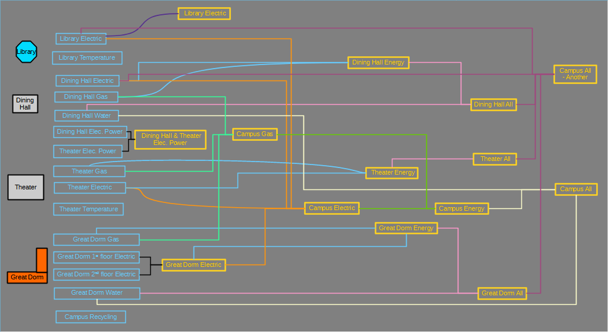

# New visualization for Groups

## Introduction

OED added a visualization to show the relationship of units and conversions. In a similar vain, OED would like to have a visualization to show the relationship of meters and groups. The following graphic is from the [OED help pages for graphic groups](https://openenergydashboard.org/helpV1_0_0/graphingGroups/):

It shows the relationship between the meters (on left in blue) and the groups (on right in yellow). It also shows that groups can be included in other groups. This is an example of the type of graphic desired but the one in OED will differ in some details.

## Idea

A graph will be used to represent the meters and groups in the new graphic. This will allow for similar software to the graph used for the current units and conversions graphic. Each vertex will be a meter or group and a line indicates if the meter or group is included in the group. When the graph is displayed, the meters and groups will be different colors (as above but other colors can be used and the text does not have to be the same color). If possible, they will be different shapes. Unlike the picture above, the OED graphic will not have different colored lines and the placement probably will be the default from the graphic package rather than initially ordered as in the picture. The line will have an arrow from the meter/group to the group that includes it. Note that each meter and group will only be a single vertex in the graph (as in the picture) so there may be many lines from any given vertex. It might be best if meters that are not included in any group are not shown since they would have no lines coming from them.

The units and conversion graphic shows two representations of the data as two separate graphics on one web page. Meters and groups will also have two separate graphics:

- The upper one will show which meters and groups are included in a group. OED calls these the childMeters and childGroups in Redux state (only available if logged in as an admin). The admin group page will show these when the details of a group are shown. The title above this graphic should be "Child Meters and Groups included in Groups" (properly internationalized).
- The lower one will show all the meters that are includes in a group. For any groups included in a group, this does a recursive analysis to find all the unique meters by determining all groups involved. OED calls these the deepMetes in Redux state (only available if logged in as an admin). The admin group page will show these when the details of a group are shown and labeled "All Meters". The title above this graphic should be "All Meters included in Groups" (properly internationalized).

## New web page

A new page will be created and added as an option to the "Pages" menu with the option labeled "Group Visual Graphic" (internationalized). The page will have a title at the top that is the same as the "Pages" menu option. Access to this page will be limited to admins. (Note that allowing non-admins to see this page would require keeping the info in Redux state and dealing with hidden meters/groups.) The overall look of the page will be similar to the unit/conversion visualization page.

## Getting more details

If any further information is desired or needed, please feel free to reach out to the project. We are also happy to look at intermediate work to provide feedback. We are happy to help.
