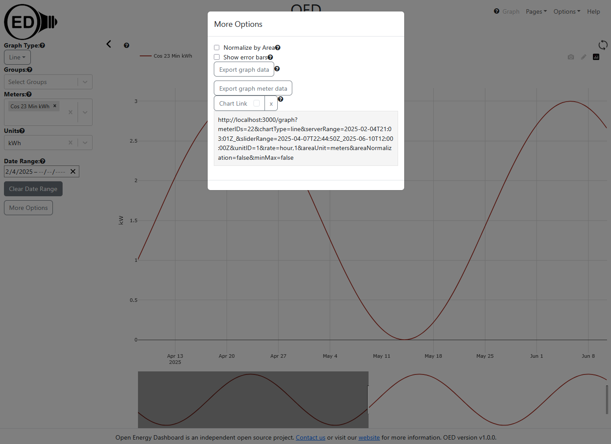

# Chart links that support showing the latest data

## Introduction

[Chart links](https://openenergydashboard.org/helpV1_0_0/chartLink/) allow someone to provide a URI that reproduces the current graphic.

Recent work on one-sided bounds [PR #1491](https://github.com/OpenEnergyDashboard/OED/pull/1491) made it so OED supports one-sided bounds. The bounds are date/time values to specify the state for getting server data and what range of values to show on a graphic (the slider value). When the server request is unbounded then the server will return all dates. For example, if the start time is unbounded then OED will return the earliest data available. When the slider range is unbounded then the entire graphic (all reading from server) are shown. The following figure shows the current status with that PR:

This image was created by moving the slider from the left (earliest time), refreshing the server data to match the slider range (clicking the circular arrows in the top, right) and then moving the slider again from the left. This means the server range has the left as bounded but not on the right. It also means the server range and slider range differ on both sides. (The slider range becomes bounded on both sides whenever the slider is moved.) This is the most general case. The unbounded right can be seen by the serverRange having nothing after the underscore (2025-02-04T21:03:01Z_) so it starts at 2025-02-04T21:03:01Z but does not have an end date/time. The Chart Link is shown because "More Options" was clicked and then the down arrow on Chart Link was clicked (down arrow is no longer visible).

The new feature for chart link will allow an admin to specify that the time ranges have the same span of time but that time range is shifted so it ends at the current time. This will only be an option if the server time is unbounded on the right but bounded on the left. Note if both are unbounded then the chart link currently uses "all" so all time will be show whenever it is used including any new readings available. This is the desired behavior. Being unbounded on the right means the current graphic goes as far as possible in time (normally current time). Note this change applies to any graphic that supports the slider (line, bar). This example may help:

The graphic shows line(s) (or bars) from 2025-03-17 at noon to the latest available data. The sliderRange in the chartLink will have 2025-03-17T12:00:00Z as the start date/time and there will be no end date/time (nothing after the _). The current date/time is 2025-03-19 at 6 A.M.so the graphic is effectively showing 1.75 days (2025-03-17 at noon to 2025-03-19 at 6 A.M.) assuming there are readings available for this entire time.  Using the new chart link feature, the link should always show 1.75 days but the end date/time will be the current time. For example, suppose someone uses this chart link on 2025-03-20 at 4 P.M. The graphic will show from 2025-03-18 at 10 P.M. to 2025-03-21 at 4 P.M. The start time is 2025-03-20 at 4 P.M. minus 1.75 days. This is the same as the current time the chart link is used minus 1.75 days.  Note that having minutes/seconds in the date/time values does not change this idea but just makes the example more complex.

If the readings did not go to the current time when the graphic was created then the actual span of time will differ from assuming it was the current time. When the user uses the chart link it may show some additional time for readings if more current ones are available. In most cases, this is a small effect so the graph creation time is used. Equally, the strange case of readings existing that are past the current time are ignored.

## Implementation

Note that moment (package OED uses for dates/times) will shift to the time zone of the web browser if a time zone is not provided. This is noted so developers are aware and can recognize if it causes issues but it hopefully will not since the values specify Z as the time zone.

A new option will be added to the Chart Link choices to support this feature. The exact name is open but maybe "Keep current". As shown in the figure above, there is currently a box next to "Chart Link" that toggles if the link hides the menus. The new chart link feature will be another option. The look needs to be worked out as just having a second box would be confusing. Any developer working on this is welcome to put forth ideas and discuss with the project. As noted above, the option is only available if the server query range is unbounded on the right. Note that both options can be used at the same time when they are available.

The chart link needs to be modified to support this new feature. It needs two new items:

1. A keyword that indicates that the keep current time should be used.
2. A value to tell now far back in time the chart should go (1.75 days in the example above).

The second value cannot be calculated from the current values in the chart link since the end date/time stamp is unbounded in the graphic creating the link and represented as an empty value (nothing after the _). What is needed is the time that the graphic was created to know when an unbounded time on the right logically corresponds to. This must happen when the graphic is created. Thus, a new value for graphs in Redux state will store the creation time. This value will be provided so the shift will be this value minus the already provided left slider range value. Overall, the new value in the chart link will be ``&currentTime=2025-03-19T06:00:00Z`` using the value in the example above but the actual current time will be used (it is the graph creation time).

When the chart link is used, the needed values are calculated as follows:

1. Get the current time (now in moment).
2. The value for the currentTime parameter has the value of the serverRange start time subtracted. In the example this is 2025-03-19T06:00:00Z -  2025-03-17T12:00:00Z for an interval (amount of time) of 1.75 days. Note moment will show the interval in a different format. This is the shift amount.
3. The start time of the readings range (queryTimeInterval in Redux state) on the left is the current time from step 1 minus the shift amount from step 2. The reading range on the right is the unbounded value.
4. The slider range (rangeSliderInterval) also needs to be set as follows:

    - If the sliderRange parameter is all then the Redux state is set to unbounded as should currently be done. Otherwise the following steps are done.
    - The current time from step 1 will have the currentTime parameter subtracted from it. This gives the amount of time that the new graphic is shifted from the old graphic.
    - The value from the previous step is added to the sliderRange parameter for both the start and end values. This is the slider range needed for the graphic so it is used to set the needed Redux state.

Hopefully this will produce the needed graphic. If one quickly uses the chart link then it should be very close to the original graphic since the current time will be similar. If there are issues then please reach out to the project for help. Something may have been overlooked in this design.
