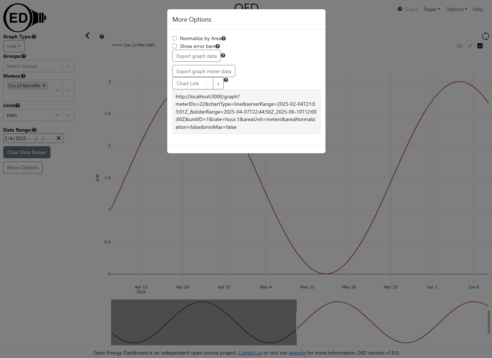

# Chart links that support showing the latest data

## Introduction

[Chart links](https://openenergydashboard.org/helpV1_0_0/chartLink/) allow someone to provide a URI that reproduces the current graphic.

Recent work on one-sided bounds [PR #1491](https://github.com/OpenEnergyDashboard/OED/pull/1491) made it so OED supports one-sided bounds. The bounds are date/time values to specify the state for getting server data and what range of values to show on a graphic (the slider value). When the server request is unbounded then the server will return all dates. For example, if the start time is unbounded then OED will return the earliest data available. When the slider range is unbounded then the entire graphic (all reading from server) are shown. The following figure shows the current status with that PR:

This image was created by moving the slider from the left (earliest time), refreshing the server data to match the slider range (clicking the circular arrows in the top, right) and then moving the slider again from the left. This means the server range has the left as bounded but not on the right. It also means the server range and slider range differ on both sides. (The slider range becomes bounded on both sides whenever the slider is moved.) This is the most general case. The unbounded right can be seen by the serverRange having nothing after the underscore (2025-02-04T21:03:01Z_) so it starts at 2025-02-04T21:03:01Z but does not have an end date/time. The Chart Link is shown because "More Options" was clicked and then the down arrow on Chart Link was clicked (down arrow is no longer visible).

The new feature for chart link will allow an admin to specify that the time ranges have the same span of time but that time range is shifted so it ends at the current time. This will only be an option if the server time is unbounded on the right but bounded on the left. Note if both are unbounded then the chart link currently uses "all" so all time will be show whenever it is used including any new readings available. This is the desired behavior. Being unbounded on the right means the current graphic goes as far as possible in time (normally current time). Note this change applies to any graphic that supports the slider (line, bar). This example may help:

The graphic shows line(s) (or bars) from 2025-03-17 at noon to the latest available data. The sliderRange in the chartLink will have 2025-03-17T12:00:00Z as the start date/time and there will be no end date/time (nothing after the _). The current date/time is 2025-03-19 at 6 A.M.so the graphic is effectively showing 1.75 days (2025-03-17 at noon to 2025-03-19 at 6 A.M.) assuming there are readings available for this entire time.  Using the new chart link feature, the link should always show 1.75 days but the end date/time will be the current time. For example, suppose someone uses this chart link on 2025-03-20 at 4 P.M. The graphic will show from 2025-03-18 at 10 P.M. to 2025-03-21 at 4 P.M. The start time is 2025-03-20 at 4 P.M. minus 1.75 days. This is the same as the current time the chart link is used minus 1.75 days.  Note that having minutes/seconds in the date/time values does not change this idea but just makes the example more complex.

If the readings did not go to the current time when the graphic was created then the actual span of time will differ from assuming it was the current time. When the user uses the chart link it may show some additional time for readings if more current ones are available. In most cases, this is a small effect so the graph creation time is used. Equally, the strange case of readings existing that are past the current time are ignored.

## Implementation

Note that moment (package OED uses for dates/times) will shift to the time zone of the web browser if a time zone is not provided. This is noted so developers are aware and can recognize if it causes issues but it hopefully will not since the values specify Z as the time zone.

A new option will be added to the Chart Link choices to support this feature. The exact name is open but maybe "Keep current". As shown in the figure above, there is currently a box next to "Chart Link" that toggles if the link hides the menus. The new chart link feature will be another option. The look needs to be worked out as just having a second box would be confusing. Any developer working on this is welcome to put forth ideas and discuss with the project. As noted above, the option is only available if the server query range is unbounded on the right. Note that both options can be used at the same time when they are available.

The chart link needs to be modified to support this new feature. It needs two new items:

1. A keyword that indicates that the keep current time should be used.
2. A value to tell now far back in time the chart should go (1.75 days in the example above).

The second value cannot be calculated from the current values in the chart link since the end date/time stamp is unbounded in the graphic creating the link and represented as an empty value (nothing after the _). What is needed is the time that the graphic was created to know when an unbounded time on the right logically corresponds to. This must happen when the graphic is created. Thus, a new value for graphs in Redux state will store the creation time. This value will be provided so the shift will be this value minus the already provided left slider range value. Overall, the new value in the chart link will be ``&currentTime=2025-03-19T06:00:00Z`` using the value in the example above but the actual current time will be used (it is the graph creation time).

When the chart link is used, the needed values are calculated as follows:

1. Get the current time (now in moment).
2. The value for the currentTime parameter has the value of the serverRange start time subtracted. In the example this is 2025-03-19T06:00:00Z -  2025-03-17T12:00:00Z for an interval (amount of time) of 1.75 days. Note moment will show the interval in a different format. This is the shift amount.
3. The start time of the readings range (queryTimeInterval in Redux state) on the left is the current time from step 1 minus the shift amount from step 2. The reading range on the right is the unbounded value.
4. The slider range (rangeSliderInterval) also needs to be set as follows:

    - If the sliderRange parameter is all then the Redux state is set to unbounded as should currently be done. Otherwise the following steps are done.
    - The current time from step 1 will have the currentTime parameter subtracted from it. This gives the amount of time that the new graphic is shifted from the old graphic.
    - The value from the previous step is added to the sliderRange parameter for both the start and end values. This is the slider range needed for the graphic so it is used to set the needed Redux state.

Hopefully this will produce the needed graphic. If one quickly uses the chart link then it should be very close to the original graphic since the current time will be similar. If there are issues then please reach out to the project for help. Something may have been overlooked in this design.

## 260208 Update

The hope is this is correct but there are a lot of details so please point out any potential issues.

This update tries to address the edge cases, some of which were noted at the end of the Introduction. These mostly revolve around the time zone and its related shift from UTC for the different systems interacting with OED or when meter data is not up to the current time. Note if all the systems are using the same time zone and meters have current data then the previous descriptions do not have issues. The potential systems are:

- The meter if it has a time zone associated with it. In unusual circumstances this could also be the OED server time zone.
- The web browser creating the chart link.
- The web browser using the chart link.

Note that for most chart links, OED uses a fixed UTC time zone so everyone using it sees the same data. The new feature tied to the current time is why there are new considerations. These are examples of the potential issues where dates are not given to make it simpler.

1. A meter being displayed has a different time zone than the web browser creating the chart link.
    a. If the meter time zone is earlier in time then its shift from UTC is smaller (if negative then a larger negative value). Assuming the meter has up-to-data readings, the time associated with the latest reading will be earlier in time than the current time for the web browser. Note this same issue happens if the meter does not have readings to the current time even if there is no difference in the time zone.
    b. If the meter time zone is later in time then its shift from UTC is larger (if negative then a smaller negative value). Assuming the meter has up-to-data readings, the time associated with the latest reading will be later in time than the current time for the web browser.

In both these cases, there is the question of what the chart link should do. In case 1.a. it may lead to having more readings when used later and in case 1.b. it may lead to having a shorter time range for displaying readings. OED is okay with case 1.a. since readings are regularly added anyway. For case 1.b., OED would like the chart link to show the larger time range when used. Note different meters may have different time zones so OED would use the meter with the latest time if it is later than the current time in the web browser time zone.

2. The web browser time zone for the creating the chart link differs from the one using the chart link. For example, the web browser time zone creating the link is UTC-08:00 and the web browser using the link is at UTC-05:00 so it is 3 hours later by the wall clock. If the link is created and then immediately used, the server range would start 3 hours later because current time is 3 hours later. The correct representation would be to give the same graphic since both were done at the same time. This would be consistent with OED using UTC for times so everyone in the world sees the same time on graphics. The solution proposed is to include the time zone where the link was created and use that when recreating the graphic.
3. In 1., it was mentioned about meters not showing readings to the current time. For example, the readings go 3 hours later than the current time in the web browser generating the link. This means the total range of time displayed for readings is longer. This is the same as saying the shift from the end time is longer. The proposed solution is to us the maximum time of the current web browser time and the  latest reading on the graphic as the time in the chart link. This will give the maximum range of points and cause a quick reuse of the link to show the same graphic. The same effect happens if the readings are behind the current web browser time but in the other direction. This can be a large effect if the meter has not gotten data recently, e.g., it is disabled. Using current in this case is is not advised since current time will shorten the points shown without showing more readings toward current time.

This gives greater details on the proposed solution. Note the following terminology is used:

- When a date/time stamp is **sliced** to a time zone then the date/time is not changed but the time zone associated with the date/time stamp is replaced. For example, if one has 08:00-05:00 (8:00 in a time zone minus 5 hours from UTC so it is 13:00 in UTC at that time where date is not shown to make it simpler) and it is sliced to UTC then it becomes 08:00+00:00 or 08:00 in UTC.
- When a date/time stamp is **shifted** to a time zone then the date/time is the equivalent time at that moment in time. For example, if one has 08:00-05:00 and it is shifted to UTC then it becomes 13:00+00:00. This is what is more commonly done in calenders, etc.

- The ``currentTime`` in the chart link will have two components:
    1. The date/time without time zone will be the latest time of the current time in the web browser creating the link sliced to UTC and the latest time for a value in the graphic (already in UTC). The current time in the web browser creating the link will have its time sliced to UTC for the comparison since all reading values are in UTC done this way. Here is how the two types of graphics will get the latest time for the graphic shown:
        - For line, it will use the latest end time stamp for any value being graphed. Note getting the value from the actual graphic points shown will not work since it shows the x-axis (time) as the average of the start and end time for the point. This value is in redux state in the line graphic for the desired query (api -> queries -> desired line). The point with the highest index for each meter should have the desired ``endTimestamp``. All meters/groups will need to be checked; note meters and groups are stored separately in Redux state. src/client/app/components/LineChartComponent.tsx gets the data for line graphics from src/client/app/redux/selectors/lineChartSelectors.ts using selectPlotlyMeterData & selectPlotlyGroupData. These may be helpful to figure out how to get the correct value.
        - For bar, it is similar to line where the Redux data is in the bar items instead and src/client/app/components/BarChartComponent.tsx & src/client/app/redux/selectors/barChartSelectors.ts have similar code.

    Note the first cut of the implementation could skip finding the latest time for a value in the graphic. It will not work as well but would demonstrate the rest of the system. Then, the graphic value could then be added in.

    2. The time zone of the web browser creating the chart link will be added to the date/time found in step 1. This means slicing the date/time to that time zone.

When the chart link is used, this is how it will be done:

1. Get the current time of the web browser.
2. The time will be **shifted** to the time zone associated with the web browser that created the chart link. The shift can be gotten from the TZ offset in the ``currentTime`` in the chart link. The idea is that the current time used is the same as the time in the web browser that created the chart link so shifts will not happen due to TZ differences.
3. The value in step 2. is sliced to UTC.
4. The ``currentTime`` in the chart link is sliced to sliced to UTC.
5. Get the max/latest time of 3. and 4. This should now be the later of the current time in the web browser and the one in the chart link. This is the server end time for the reading query.
6. Get the shift desired that was in the chart link. It is the chart link server start time - 4. (both already in UTC). This will be an interval in moment. This will normally be a negative value as it is the shift back in time from current to the start of the server time.
7. Get the server start time for the reading query. It is 5. + 6.
8. Get the shift in time between the server start time for the reading query and the server start time in the chart link. This is 7. - the server start time in the chart link. This tells how much to shift the chart link slider values so they are in the same relative position to the server times that will be used.
9. Get the slider start time. It is the slider start time in the chart link + the needed shift (8.). This will be the slider start time used for the reading query.
10. Get the slider end time. It is the slider end time in the chart link + the needed shift (8.). This will be the slider end time used for the reading query.

What follows are examples of how this would all work.

Creating a chart link:

The following values are used in this example where dates are not included to make it easier.

a. Web browser current time: 08:00-05:00.
b. Web browser current time sliced to UTC: 08:00+00:00.
c. Server start time which is in the chart link: 03:00+00:00.
d. Slider start time which is in the chart link: 04:00+00:00.
e. Slider end time which is in the chart link: 06:00+00:00.

Here is a table of examples:

| K. Note | L. max graphic time | M. max(b., L.) (step. 1 in link creation) | N. link creation time used (M. with a. offset) |
| :-----: | :-----------------: | :---------------------------------------: | :--------------------------: |
| L. is earlier than b. | 07:00+00:00 | 08:00+00:00 | 08:00-05:00 |
| L. is same as b.      | 08:00+00:00 | 08:00+00:00 | 08:00-05:00 |
| L. is later than b.   | 09:00+00:00 | 09:00+00:00 | 09:00-05:00 |

Using a chart link:

Here is a table of examples where the column header numbers correspond to the steps above:

| Note | N. link current time | 1. WB current time | 2. WB current time shifted to link TZ | 3. 2. sliced to UTC | 4. link current time sliced to UTC | 5. server end time | 6. link shift | 7. server start time | 8. link vs used shift | 9. slider start time | 10. slider end time |
| :--: | :---------------: | :----------------: | :-----------------------------------: | :-----------------: | :--------------------------------: | :----------------: | :-----------: | :------------------: | :-------------------: | :------------------: | :-----------------: |
| Same time as link creation | 08:00-05:00 | 08:00-05:00 | 08:00-05:00 | 08:00+00:00 | 08:00+00:00 | 08:00+00:00 | -05:00 | 03:00+00:00 | 0:00 | 04:00+00:00 | 06:00+00:00 |
| different time (+2:00) as link creation | 08:00-05:00 | 10:00-05:00 | 10:00-05:00 | 10:00+00:00 | 08:00+00:00 | 10:00+00:00 | -05:00 | 05:00+00:00 | 02:00 | 06:00+00:00 | 08:00+00:00 |
| Same time as link creation but different TZ | 08:00-05:00 | 10:00-03:00 | 08:00-05:00 | 08:00+00:00 | 08:00+00:00 | 08:00+00:00 | -05:00 | 03:00+00:00 | 0:00 | 04:00+00:00 | 06:00+00:00 |
| different time as link creation (+1:00) & different TZ | 08:00-05:00 | 11:00-03:00 | 09:00-05:00 | 09:00+00:00 | 08:00+00:00 | 09:00+00:00 | -05:00 | 04:00+00:00 | 1:00 | 05:00+00:00 | 07:00+00:00 |
| Same time as link creation & graphic later (+1:00) | 09:00-05:00 | 08:00-05:00 | 08:00-05:00 | 08:00+00:00 | 09:00+00:00 | 09:00+00:00 | -06:00 | 03:00+00:00 | 0:00 | 04:00+00:00 | 06:00+00:00 |
| different time (+2:00) as link creation & graphic later (+1:00) | 09:00-05:00 | 10:00-05:00 | 10:00-05:00 | 10:00+00:00 | 09:00+00:00 | 10:00+00:00 | -06:00 | 04:00+00:00 | 1:00 | 05:00+00:00 | 07:00+00:00 |
| Same time as link creation but different TZ & graphic later (+1:00) | 09:00-05:00 | 10:00-03:00 | 08:00-05:00 | 08:00+00:00 | 09:00+00:00 | 09:00+00:00 | -06:00 | 03:00+00:00 | 0:00 | 04:00+00:00 | 06:00+00:00 |
| different time (+1:00) as link creation & different TZ & graphic later (+1:00) | 09:00-05:00 | 11:00-03:00 | 09:00-05:00 | 09:00+00:00 | 09:00+00:00 | 09:00+00:00 | -06:00 | 03:00+00:00 | 0:00 | 04:00+00:00 | 06:00+00:00 |
