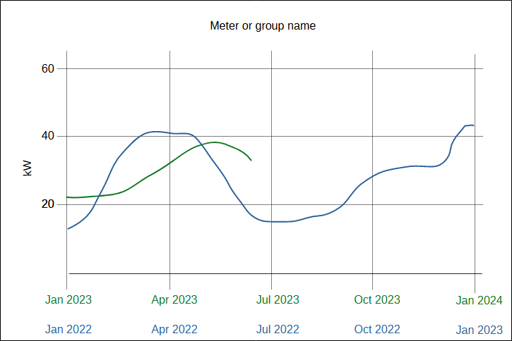

# Line compare graphic

## Introduction

There are requests to expand the range of graphics OED can display to show resource usage. One request is to do comparisons of time shifted for a single meter/group on a line graphic. Unlike the comparison graphic, this would have lots of points of comparison along the line graphic. An example is doing the current year's energy usage compared to the previous year. In this graphic you would see the current line graphic of data say from January 1, 2023 to December 31, 2023. Then you would also see a separate shifted line of usage for January 1, 2022 to December 31, 2022. The hope is you could see changes from year to year or at specific dates in the year. With the current compare graphic you see the total usage comparison over time. Thus, both have value. This is covered by [issue #953](https://github.com/OpenEnergyDashboard/OED/issues/953). Here is a sample of this line comparison graphic as just described:



A few notes:

- The exact look in Plotly may differ but this has the overall look/feel.
- In this example, it is assumed it was done at the end of June 2023 so there is no data for the second half of that year. The previous year has the full year for 2022.
- It would be good if you could zoom on the graphic as in a standard line graphic.
- There is only 1 meter or group and it is identified with its name. It is a title here but that is not essential and will be shown in the pills as described below.
- As shown, it would be nice if the color of the line and the corresponding x-axis label were the same. Not sure the best two colors to use and can be chosen during implementation.

In the general case you could shift by an arbitrary amount of time. In practice, it seems likely that people will have common shifts that are done where the starting date will relate to the shift. What this means is the starting date will be the start of the shift amount. In the example above, the shift was one year and the line begins at the start of the year. Note it may not be for the full year as in this example where you only have data through June 15 of the current year. Other common ones would seem to be shifts of a day, week, month.

## Specifying values

The look will have similarities to both the line and 3D graphic. Similar to the Line graphic page:

- Graphic Type is there with "Compare line" added. The "Compare" will be renamed "Compare bar".
- Groups, Meters, Units are there.
- The "Date Range" date picker. This will share values with the other graphic pages as it currently does for other graphics to be consistent. This is not a big issue for the user now that OED has a history function. This specifies the start and end dates for the original line. The time spanned by these dates is the length of the line.
- Normalize by Area is also there but could be done after the initial work.
- Given the similarity to line, OED will skip having the export options.
- Chart Link is there and needs to function. This may be after the initial work.

Similar to the 3D graphic page:

- The pills at the top to select a single meter or group will be present and work in a similar way. This chooses which meter or group to show on the Compare Line graphic.

The final input is to specify the shifted line. There will be two way and they work as follows:

1. There is a way to select the standard shifts of day, week, month and year. It could be done similarly to the "Bar Interval" on the bar graphic with click buttons or maybe as a dropdown given there are four choices. Right now the leaning is toward a dropdown menu to make take up less horizontal space. It would be labeled "Shifts". The start and end dates for the shifted line would be the start and end dates of the original line with the shift value subtracted (as the number of days). See below for more details. It is unclear what a good default value is so it seems best to require the user to make an initial selection, esp. given the second option might be used. The values for the date picker in 2. are set to the ones determined here what a standard selection is made.
2. There is a date picker to select the start date of the shifted line. It is unclear if the current calendar picker can do a single day; it may need to be a range. The user will be told to click twice on the same day if this is the case. The date selected or the first date if a range will be the start date of the shifted line. The end date will be set to the start date plus the length of the original line. This means that if the user entered an end value (if that is needed) then it is changed as needed and the display updated end date to the used value. Note this input allows for arbitrary day shifts including forward in time. As needed, the selection made under choice 1. above is removed even if the range corresponds to a standard shift.
    - If desired, a future enhancement could keep the two inputs in sync when standard values are used.

The placement of the two items is uncertain but maybe a slight spacings from the other items above this and these two are placed vertically so one is above the other.

Finally, the zoom below the line graphic is also present and functions the same. The redraw in the top, right would cause both lines to get new data based on the ranges for each axis that will, by definition, be the same number of days. This resets the date pickers above to these values where any fraction of a day is dropped. This can be done after the initial implementation.

Note that all strings discussed are the English ones but need to be translated.

## Considerations

### Validation

It seems unusual that the user would want the date range of the original and shifted line to overlap. If this is the case, the graphic is produced but a warning is shown about the overlap using ``showWarnNotification()`` in src/client/app/utils/notifications.ts.

After the initial work is done, it would be good to disallow (by graying out as in other menus) the standard choices that would have caused a warning. The thinking is that the standard choices should avoid this issue. Each time the date range for the original line is selected, any standard choices where the number of days is less than the length of the range are disallowed. Note that if one of the disallowed ones is the one selected then the choice is removed and the user must select again.

- Note the proposed algorithm for the shifted dates below automatically truncated the dates if the shift does not separate the original and shifted lines. Thus, it is an open question to whether this is needed.

### Aligning lines

As shown in the example in the introduction, it is possible that the length of the lines vary. It is uncertain what Plotly will do but it may be the case that the dates don't align. This needs to be tested and fixed as needed. It may be necessary to set the min/max x-axis value for both ranges to get them to align. This may be done in all cases, even if the number of days is the same.

Leap years are another issue. If the date range of either line crosses Feb. 28/29 then the number of days will vary between the lines (unless the shift aligns two leap years). Unlike above, this is internal to the line and not at the end. If Plotly does not align all the days then extra steps will need to be taken. One solution might be to split the data for the non-leap year so the first set goes to Feb. 28 and the second set starts at Mar. 1. How to get them to align with the leap year data needs to be investigated. Note it is important that the dates are as specified below where the number of days can vary when crossing this date on a leap year.

### Standard selections

Here is how the shifted start and end dates will be selected:

Day: This is straightforward and always has the shifted line start/end be 1 day before the original line dates.

Week: This is straightforward and always had the shifted line start/end be 7 days before the original line dates.

Month: This is a little trickier since the number of days in a month vary. The algorithm is as follows:

```pseudocode
shifted start = same numerical day as original start in the previous month
shifted end = shifted start + length of original range
if (shifted end >= original start) {
    // Don't allow overlap so shorten range. This also takes care of case of
    // more than a month in the original range. Alignment issues may arise.
    shifted end = original start - 1 day
} else if (original range spans a full month) {
    // The original start is the first day of the month and
    // the original end is the last day of the same month.
    if (shifted range is not the full month) {
        // The shifted month has more days so extend to full month.
        // Alignment issues may arise.
        shifted end = last day of same month as shifted start
    }
}
```

Here are some examples:

- original is 2023-03-01 to 2023-03-15 and shifted is 2023-02-01 to 2023-02-15. Here nothing special and same number of days for both.
- original is 2023-03-08 to 2023-04-02 and shifted is 2023-02-08 to 2023-03-05. Here both lengths are 26 days and don't overlap so nothing special.
- original is 2024-03-08 to 2024-04-02 and shifted is 2024-02-08 to 2023-03-04. Similar to above but shifted end one day earlier due to leap year. Moment should do this automatically and some other cases.
- original is 2023-03-01 to 2023-03-30 and shifted is 2023-02-01 to 2023-02-28. Here the initial shifted end is at least the original start so made day before original start. Same if not the first day of the month.
- original is 2024-03-01 to 2024-03-30 and shifted is 2024-02-01 to 2024-02-29. Similar to last one but shows leap year.
- original is 2023-07-01 to 2023-07-31 and shifted is 2023-08-01 to 2023-08-31. Both are full months but nothing special since same number of days in both months.
- original is 2023-02-01 to 2023-02-28 and shifted is 2023-01-01 to 2023-01-31. Here the original range was the full month so the shifted is made to be the full month since it has more days.

Year: This is mostly straightforward where the shifted line start/end is the same day of the year as original line dates. Note that if one crosses a leap day then the number of days can vary as described above and alignment must be dealt with. The one special case is if the original start or end date is Feb. 29 of a leap year. If it is the original start day then the shifted start day is made Mar 1. If it is the original end day then the shifted end day is made Feb 28. There are alignment issues in this case where they occur at the start or end of the line.

Here are some examples:

- original is 2023-01-01 to 2023-12-31 and shifted is 2022-01-01 to 2022-12-31. Nothing special here. Note if the years were 2024 & 2023 then the result is the same but the number of days in the year would differ. Also, part of a year is similar.
- original is 2023-02-29 to 2023-08-15 and shifted is 2022-03-01 to 2022-08-15. Shifted start day is modified for leap year.
- original is 2023-01-15 to 2023-02-29 and shifted is 2022-01-15 to 2022-02-28. Shifted end day is modified for leap year.

### Multiple meters/groups

For now, only one group or meter can be shown at a time in the compare line graphic. If requested, multiple ones could be added later but it is hoped that it is not necessary.

## Update

This was added in Nov. 2024 based on the implementation done in [PR #1351](https://github.com/OpenEnergyDashboard/OED/pull/1351). The high-level changes are:

- The shift is used to determine the start date of the shifted line. The end date of the shift line is the start date of the shifted line plus the number of days in the original line. This is done in all cases. The reason is that if the number of points varies then the lines do not align properly. No solution was found for this so OED tries to be avoid this situation (but see below for complications). Note the example at the top is no longer valid as it has lines of different lengths. It also changes several of the examples. For example, month shifts now can overlap.
- The slider to zoom will not be present. No way was found to make it work. It only zoomed one axis and then popped back to full range once released.
- Leap years turned out to be trickier than originally thought. This is because there may be multiple years of data so the mismatch can occur after the first year, the start date might be before or after Mar. 1 so include or miss the leap day and what happens if the start date for the original line was Feb. 29 so a shift of 1 year would not exist in the previous year (moment goes to Feb. 28 of the shifted year). Given all of this, a new approach is proposed.

There was a lot of thought about how to warn the user of aligned/misaligned readings between the original and shifted readings. This is the final summary of that:

- align in day of the week

This only happens if the the number of days shifted % 7 = 0. This happens with a week shift, one month when shifting back into a non-leap year February (exactly 4 weeks) but not for day, most month shifts and a year. It is an easy check so do as long as the number of readings is the same so if the first reading is true then all should be true. It is possible for there to be missing points that do not align but the same number so it is not true for all values so add that caveat.

- align day of month

The shift must go to the same day of the month. This happens when 1 month shift until overlap or go to a different month with differing number of days (this includes one year unless original first day is Feb. 29). It does not happen for day or week. Since longer ranges almost guarantee that the day will no longer align this is not told to the user.

- align date (month and day of month)

This is a subset of align of month when the shift is a multiple of a year unless original first day of Feb. 29. It is easy to check if the first reading of original and shifted agree and most of the time they will not. Only if they do then loop over all remaining reading (if number is the same) to see if the alignment is off at a later point to inform user. This generally happens from mismatched leap years. Given the user probably expects year(s) shift to align and it is cheap to check without adding much cost to other cases it is included.

### Determine dates for shifted line

```js
// Whenever the Date Range or Shift Date Interval (either via selection or custom) change then
// the shifted data range is updated as follows:
if (customShift) {
    // The date picker was used so the start date is one one chosen.
    shiftedStart = custom start date
} else {
    // A standard shift amount was selected. OED will shift by this amount and allow moment
    // to determine the appropriate date.
    // This assumes there is a date range for the original line. A special case is probably needed
    // if this is not true (not included).
    shiftedStart = originalStart - shift
}
// Add the number of days in the original line to the shifted start to get the end.
// This means the original and shifted lines have the same number of days.
// Let moment decide the day since it may help with leap years, etc.
shiftedEnd = shiftedStart + (originalEnd - originalStart as days)
```

### Checks/warnings on received reading data

```js
// When both the readings for the original and shifted lines are in Redux state,
// the following checks are run. It is assumed the readings are sorted by start date.

// It seems Plotly spaces each axis by the number of points (verify this is correct in all cases??).
// Given this, if the number of points differs for the original and shifted lines, the data will
// not appear at the same places horizontally.
// The time interval in the original and shifted line for the actual readings can have issues.
// While the requested time ranges should be the same,
// the actually returned readings may differ. This can happen if there are readings
// missing including start, end or between. If the number of readings vary then there is an
// issue. If not, it is unlikely but can happen if there are missing readings in both lines
// that do not align but there are the same number missing in both. This is an ugly edge case
// that OED is not going to try to catch now.
// Use the last index in Redux state as a proxy for the number since need that below.
// Need to verify all okay if no readings??
numberPointsSame = true
if (last index in original Redux readings !== last index in shifted Redux readings) {
    // If the number of points vary then then scales will not line up point by point. Warn the user.
    numberPointsSame = false
    warning: `The original line has ${originalReadingLength} readings but the shifted line has ${shiftedfReadingLength}`
        + ' readings which means the points will not align horizontally.'
}
// Now see if the original and shifted lines overlap.
if (shifted last end date > original first start date) {
    info: `The shifted line overlaps the original line starting at ${original first start date}`
}
// Now see if day of the week aligns. If the number of points is not the same then no horizontal
// alignment so do not tell user.
if (numberPointsSame && first original readings.day() === first shifted original reading.day()) {
    info: 'days of week align (unless missing readings)'
}
// Now see if the month and day align. If the number of points is not the same then no horizontal
// alignment so do not tell user. Check if the first reading matches because only notify if this is true.
if (numberPointsSame && monthDateSame(first original reading, first shifted reading)) {
    // Loop over all readings but the first. Really okay to do first but just checked that one.
    // Note length of original and shifted same so just use original.
    message = 'The month and day of the month align for the original and shifted readings'
    for (i = 1; i < original readings.length; i++) {
        if (! monthDateSame(original reading i, shifted reading i)) {
            // Mismatch so inform user. Should be due to leap year crossing and differing leap year.
            // Only tell first mistmatch
            message += ` until original reading at date ${original reading i.format('ll')}`
        }
    }
    info: message
}

// The arguments are moment objects
monthDateSame(firstDate, secondDate) {
    // The month (0 up numbering) and date (day of month with 1 up numbering) must match.
    // The time could be checked but the granulatity should be the same for original and
    // shifted readings and only mismatch if there is missing readings. In the unlikely
    // event of having the same number of points but different missing readings then
    // the first one will mismatch the month or day unless those happen to match in which
    // case it is still true that they are generally okay so ignore all this.
    return (firstDate.month() == secondDate.month() && firstDate.date() == secondDate.date());
}
```

## Implementation

The data for each line will be stored in Redux state in the same place as for line graphics. This has the advantage of not requiring significant changes and means if the user shifts between the compare line and line graphic the new graphic has the data in Redux if the dates are not changed. Going the other way may require getting the shifted line data. For now, the data for compare line will be requested as two data requests for the two different ranges. This should be fast but could be fused into one request if desired later on. As such, the accuracy of the data (raw, hourly, daily) will be the same as the current results for line readings of the same length of time for a given meter. Both lines should get the same accuracy since they are for the same number of days.

Getting this to work for a single meter could be the first step. Next is could do groups. Then dealing with the special cases could be done and the slider/redraw. The developer is advised to show the project the inputs while developing (or ideas on what will be done) so feedback can be given before too much work is done.

### Multiple x-axes in Plotly

Plotly should be able to do this. It has not been tested but these resources may be a good start on how to do it:

- [JS code for this](https://stackoverflow.com/questions/33743273/multiple-x-axes-in-plotly). Note the other axis label is at the top and maybe that is good (or at least okay).
- [Python code for multiple x & y-axes](https://stackoverflow.com/questions/74089145/plotly-multiple-x-and-y-axis).
- [JS code for multiple y-axes](https://plotly.com/javascript/multiple-axes/).
- [Python code for multiple y-axes](https://plotly.com/python/multiple-axes/) that shows more options.

## Historical

This was earlier thoughts on how the values would be input and done before OED used a date picker.

This will give the start date and end date where the length is the difference. The graphic will be defined by three values:

1. Length of time for each line.
2. Start day of unshifted line.
3. Number of days to shift for the shifted line.

These values will be input in this order as follows:

1. Length of time for each line.

The user can select day, week, month or year. They also have a way to enter a time period in number of days. The best look/feel needs to be determined.

Note it isn't clear that inputting a length that is a fraction of a day causes issues. Lets see if it could be done and then decide if it is a good idea for the UI.

2. Start day of unshifted line.

The allowed values vary by the input for the length as follows:

- If length == day or user input then any day can be entered. Might be nice if have a calendar popup and field to manually enter the value as seen on many sites.
- if length == week then the user can give the start day (Sunday) of any week in any year. Open to how this is input.
- if length == month then the user can give the start of any month including the year. Open to how this is input.
- if length == year then the user can give the year. Maybe a dropdown of all years or something else?

3. Number of days to shift for the shifted line.

If length was a standard choice (day, week, month, year), then the number of days is that amount. For day it is 1 and week it is 7. For month it is the number of days to get to the start of the previous month and similar for year (so leap years work). The compare bar code has some logic that relates to this idea. The idea is to shift back by that amount of time. Note you graph all the days in a month or year even if two differ. For example, if one month has 30 days and the other has 31 then one line has 30 points and the other has 31. While this is described in terms of the shift, the database query is likely to be by the start and end date so that may be easier to work with.
