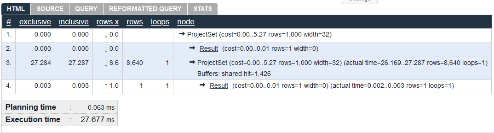
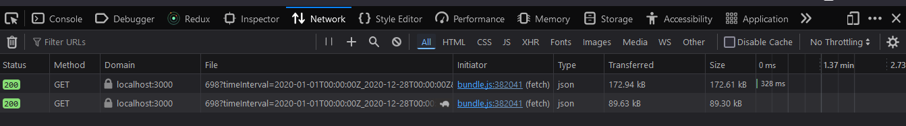
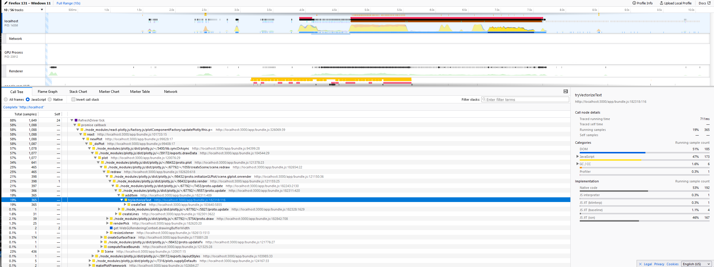

# Analyze and optimize postgreSQL queries

This is a work in progress that began in October 2024. It is anticipated that more information and results will be added as the work progresses.

## Introduction

OED's stated goal is for any standard request (some complex admin ones may be slower) to show the result to the user in one second or less. Assuming a fast network (OED minimizes the quantity of data returned so the bandwidth is normally not an issue) and web browser response, the server needs to respond in hundreds of ms. From a practical standpoint, this means postgres must respond in that amount of time. OED has already worked to met these targets through materialized views for readings but it has not systematically analyzed database usage to optimize response times.

The goal is to focus on the requests that take the most time and are commonly used. The common requests are for graphing readings so those are the first ones to consider. While an analysis is needed of the time take for all requests, it is known that some types take more time than others:

- 3D, esp. for more than 1 hour/point.
- Bar for a small number of days.
- A group is generally slower than a meter because groups sum meters to get the result.

Some queries use the same basic data sources so optimizing the primary one should optimize the others:

- Radar uses the line data.
- Compare line is two separate line data requests.
- Map uses the bar data but only looks at the last value.

Initially, the goal is to analyze and determine which requests are slow and then try to optimize them to run faster. Ultimately, all the main requests can be analyzed and optimized. While the focus is on the postgres time, checking the full time from request to response in the web browser is also valuable and may be easier to identify the best requests to focus on.

## Postgres analysis

This will mostly use 3D meter readings to show how the analysis is done. It will also use the standard developer meter of "Sin 15 Min kWh" as the example. Information on the 3D meter reading query can be found in ``src/server/models/Reading.js`` in the function ``getThreeDReadings`` and ``src/server/sql/reading/create_function_get_3d_readings.sql`` in ``meter_3d_readings_unit``.

### Query for readings

To mimic the actual request as best as possible where the ids are provided, the id of the desired meter is found:

```sql
select id from meters where name = 'Sin 15 Min kWh';
```

In this case it returned ``698``. Next, the id for the kWh unit is found:

```sql
select id from units where name = 'kWh';
```

In this case it returned ``42`. Next, the 3D readings for 24 points/day (not the query takes the hours/pt) is:

```sql
SELECT meter_3d_readings_unit (
    meter_ids_requested => '{698}',
    graphic_unit_id => 42,
    start_stamp => '2020-01-01 00:00:00',
    end_stamp => '2020-12-26 00:00:00',
    reading_length_hours => 1
);
```

This returns 8640 rows of readings. The same query can be done without naming the parameters with:

```sql
SELECT meter_3d_readings_unit ('{698}', 42, '2020-01-01 00:00:00', '2020-12-26 00:00:00', 1);
```

Multiple meters could be given as ``'{698, 696}'``. Also, ``'-infinity', 'infinity'`` can be used to readings for all time.

### Analyze performance

The [postgres EXPLAIN](https://www.postgresql.org/docs/current/sql-explain.html) will tell information about how to ran a command.

```sql
EXPLAIN SELECT meter_3d_readings_unit ('{698}', 42, '2020-01-01 00:00:00', '2020-12-26 00:00:00', 1);
```

This gives:

```text
                    QUERY PLAN                    
--------------------------------------------------
 ProjectSet  (cost=0.00..5.27 rows=1000 width=32)
   ->  Result  (cost=0.00..0.01 rows=1 width=0)
(2 rows)
```

To get additional information use:

```sql
EXPLAIN (ANALYZE, BUFFERS) SELECT meter_3d_readings_unit ('{698}', 42, '2020-01-01 00:00:00', '2020-12-26 00:00:00', 1);
```
``

This gives:

```text
                                           QUERY PLAN                                            
-------------------------------------------------------------------------------------------------
 ProjectSet  (cost=0.00..5.27 rows=1000 width=32) (actual time=26.169..27.287 rows=8640 loops=1)
   Buffers: shared hit=1426
   ->  Result  (cost=0.00..0.01 rows=1 width=0) (actual time=0.002..0.003 rows=1 loops=1)
 Planning Time: 0.063 ms
 Execution Time: 27.677 ms
(5 rows)
```

It may be easier to view the result using (https://explain.depesz.com/). Copy the output from explain and submit to get:



One can copy the URL to see again/share. In this case it is at (https://explain.depesz.com/s/t9vu).

Changing to 2 hours/point slows it down a lot from 27.677 ms for 1 hour/point to 2266.829 for 2 hours/point or almost two orders of magnitude:

```sql
EXPLAIN (ANALYZE, BUFFERS) SELECT meter_3d_readings_unit ('{698}', 42, '2020-01-01 00:00:00', '2020-12-26 00:00:00', 2);
```
``

This gives:

```text
                                            QUERY PLAN                                              
-----------------------------------------------------------------------------------------------------
 ProjectSet  (cost=0.00..5.27 rows=1000 width=32) (actual time=2266.236..2266.667 rows=4320 loops=1)
   Buffers: shared hit=1459
   ->  Result  (cost=0.00..0.01 rows=1 width=0) (actual time=0.006..0.007 rows=1 loops=1)
 Planning Time: 0.034 ms
 Execution Time: 2266.829 ms
(5 rows)
```

There are other parameters and further analysis to do.

### Line readings

This is an example query for line readings:

```sql
select meter_line_readings_unit('{698, 696}', 42, '-infinity', 'infinity', 'auto', 200, 200);
```

### Running multiple times

There will be variation in the times seen when a query is run multiple times due to variation, DB cache, etc. So far it has not been large but this needs to be tested more.

### DB size

Tests should be run where the total quantity of readings and the readings on the queried meter is greatly increased to see the effect.

## web browser analysis

This uses the same 3D meter described in the previous section for Postgres analysis. The web browser tools are accessed by inspecting the OED web page. These show Firefox results but other web browsers should be similar. The specific request used was for almost the full year of 2020 (ending slightly before Dec. 31).

### Network

This shows the network time for two requests. The first is for 24 readings/day and the second is for 12 readings/day.



The first query is for around 360 days at 24 points/day or 172,610 bytes / (360 \* 24) = 20 bytes/point. This is only approximate as there is more than just the points. For the second one of 12 points/day it is 89,300 / (360 \* 12) = 20.7 bytes/point. As expected, this slightly more due to overhead but very similar.

The timings are less important as this is on a development environment where the client and server on on the same machine. (Unsure why only first request as times.)

### Performance

Using the performance tab to record the first request gave:



There are lots of other options and the absolute speeds will depend on the machine. More analysis of what this means can be done.

## Results

```sql
LOAD 'auto_explain'; SET auto_explain.log_min_duration = 0; SET auto_explain.log_analyze = true; SET auto_explain.log_nested_statements = true;
```

Run this in the shell prior to using EXPLAIN ANALYZE. It allows one to view details of nested functions in PostgreSQL logs.

### Query:
```sql
EXPLAIN (ANALYZE, BUFFERS) SELECT meter_3d_readings_unit ('{21}', 1, '2020-01-01 00:00:00', '2020-12-26 00:00:00', 2);
```

### Resulting Log:

[Clean version in depesz](https://explain.depesz.com/s/rLK2)

```sql
2024-11-14 16:39:09.445 UTC [70] LOG:  duration: 0.036 ms  plan:
  Query Text: SELECT min(reading_frequency) FROM (meters m INNER JOIN unnest(meter_ids_requested) meters(id) ON m.id = meters.id)
  Aggregate  (cost=2.72..2.73 rows=1 width=16) (actual time=0.033..0.035 rows=1 loops=1)
    ->  Hash Join  (cost=0.23..2.70 rows=10 width=16) (actual time=0.026..0.031 rows=1 loops=1)
          Hash Cond: (m.id = meters.id)
          ->  Seq Scan on meters m  (cost=0.00..2.27 rows=27 width=20) (actual time=0.010..0.014 rows=27 loops=1)
          ->  Hash  (cost=0.10..0.10 rows=10 width=4) (actual time=0.008..0.008 rows=1 loops=1)
                Buckets: 1024  Batches: 1  Memory Usage: 9kB
                ->  Function Scan on unnest meters  (cost=0.00..0.10 rows=10 width=4) (actual time=0.005..0.005 rows=1 loops=1)

2024-11-14 16:39:09.445 UTC [70] CONTEXT:  SQL statement "SELECT min(reading_frequency) FROM (meters m INNER JOIN unnest(meter_ids_requested) meters(id) ON m.id = meters.id)"
  PL/pgSQL function meter_3d_readings_unit(integer[], integer, timestamp without time zone, timestamp without time zone, integer) line 1 at SQL statement

2024-11-14 16:39:09.445 UTC [70] LOG:  duration: 0.008 ms  plan:
  Query Text: meter_frequency_hour_up := CEIL((SELECT * FROM EXTRACT(EPOCH FROM meter_frequency)) / 3600)
  Result  (cost=0.01..0.03 rows=1 width=4) (actual time=0.007..0.008 rows=1 loops=1)
    InitPlan 1 (returns $0)
      ->  Function Scan on "extract"  (cost=0.00..0.01 rows=1 width=32) (actual time=0.004..0.004 rows=1 loops=1)

2024-11-14 16:39:09.445 UTC [70] CONTEXT:  PL/pgSQL assignment "meter_frequency_hour_up := CEIL((SELECT * FROM EXTRACT(EPOCH FROM meter_frequency)) / 3600)"
  PL/pgSQL function meter_3d_readings_unit(integer[], integer, timestamp without time zone, timestamp without time zone, integer) line 1 at assignment

2024-11-14 16:39:09.445 UTC [70] LOG:  duration: 0.015 ms  plan:
  Query Text: SELECT c.slope, c.intercept FROM meters m INNER JOIN cik c ON c.source_id = m.unit_id AND c.destination_id = graphic_unit_id WHERE m.id = current_meter_id
  Nested Loop  (cost=0.00..3.84 rows=1 width=16) (actual time=0.013..0.013 rows=1 loops=1)
    Join Filter: (m.unit_id = c.source_id)
    ->  Seq Scan on meters m  (cost=0.00..2.34 rows=1 width=4) (actual time=0.006..0.007 rows=1 loops=1)
          Filter: (id = $17)
          Rows Removed by Filter: 19
    ->  Seq Scan on cik c  (cost=0.00..1.48 rows=2 width=20) (actual time=0.005..0.005 rows=1 loops=1)
          Filter: (destination_id = $2)

2024-11-14 16:39:09.445 UTC [70] CONTEXT:  SQL statement "SELECT c.slope, c.intercept FROM meters m INNER JOIN cik c ON c.source_id = m.unit_id AND c.destination_id = graphic_unit_id WHERE m.id = current_meter_id"
  PL/pgSQL function meter_3d_readings_unit(integer[], integer, timestamp without time zone, timestamp without time zone, integer) line 1 at SQL statement

2024-11-14 16:39:09.446 UTC [70] LOG:  duration: 0.003 ms  plan:
  Query Text: SELECT CASE WHEN ts = date_trunc(interval_precision, ts) THEN ts ELSE date_trunc(interval_precision, ts + ('1 ' || interval_precision)::INTERVAL) END
  Result  (cost=0.00..0.03 rows=1 width=8) (actual time=0.002..0.002 rows=1 loops=1)

2024-11-14 16:39:09.446 UTC [70] CONTEXT:  SQL function "date_trunc_up" statement 1
  PL/pgSQL function meter_3d_readings_unit(integer[], integer, timestamp without time zone, timestamp without time zone, integer) line 1 at assignment

2024-11-14 16:39:09.446 UTC [70] LOG:  duration: 0.387 ms  plan:
  Query Text: SELECT tsrange(min(lower(time_interval)), max(upper(time_interval))) FROM daily_readings_unit WHERE meter_id = meter_id_desired
  Aggregate  (cost=17.26..17.28 rows=1 width=32) (actual time=0.385..0.385 rows=1 loops=1)
    ->  Index Only Scan using idx_daily_readings_unit on daily_readings_unit  (cost=0.15..15.40 rows=186 width=22) (actual time=0.061..0.331 rows=366 loops=1)
          Index Cond: (meter_id = $2)
          Heap Fetches: 0

2024-11-14 16:39:09.446 UTC [70] CONTEXT:  SQL statement "SELECT tsrange(min(lower(time_interval)), max(upper(time_interval))) FROM daily_readings_unit WHERE meter_id = meter_id_desired"
  PL/pgSQL function shrink_tsrange_to_meter_readings_by_day(tsrange, integer) line 1 at SQL statement
  PL/pgSQL function meter_3d_readings_unit(integer[], integer, timestamp without time zone, timestamp without time zone, integer) line 1 at assignment

2024-11-14 16:39:12.133 UTC [70] LOG:  duration: 2687.084 ms  plan:
  Query Text: SELECT hr.meter_id AS meter_id, AVG(hr.reading_rate) * slope + intercept AS reading_rate, hours.hour AS start_timestamp, hours.hour + reading_length_interval AS end_timestamp
  FROM (
    SELECT hour
    FROM generate_series(lower(requested_range), upper(requested_range) - reading_length_interval, reading_length_interval) AS hours(hour)
  ) AS hours(hour), hourly_readings_unit hr
  WHERE hr.meter_id = current_meter_id
    AND lower(hr.time_interval) >= hours.hour
    AND upper(hr.time_interval) <= hours.hour + reading_length_interval
  GROUP BY hours.hour, hr.meter_id
  ORDER BY hr.meter_id, hours.hour

  Finalize GroupAggregate  (cost=174621.47..175362.47 rows=5200 width=28) (actual time=2681.635..2686.613 rows=4320 loops=1)
    Group Key: hr.meter_id, hours.hour
    ->  Gather Merge  (cost=174621.47..175219.47 rows=5200 width=44) (actual time=2681.615..2685.514 rows=4741 loops=1)
          Workers Planned: 1
          Workers Launched: 1
          ->  Sort  (cost=173621.46..173634.46 rows=5200 width=44) (actual time=2667.606..2667.709 rows=2370 loops=2)
                Sort Key: hours.hour
                Sort Method: quicksort  Memory: 339kB
                Worker 0: Sort Method: quicksort  Memory: 335kB
                ->  Partial HashAggregate  (cost=173248.51..173300.51 rows=5200 width=44) (actual time=2666.807..2667.191 rows=2370 loops=2)
                      Group Key: hr.meter_id, hours.hour
                      Batches: 1  Memory Usage: 721kB
                      Worker 0: Batches: 1  Memory Usage: 721kB
                      ->  Nested Loop  (cost=0.00..168968.61 rows=570654 width=20) (actual time=11.196..2661.382 rows=4320 loops=2)
                            Join Filter: ((lower(hr.time_interval) >= hours.hour) AND (upper(hr.time_interval) <= (hours.hour + '02:00:00'::interval)))
                            Rows Removed by Join Filter: 18,969,120
                            ->  Parallel Seq Scan on hourly_readings_unit hr  (cost=0.00..2048.60 rows=5136 width=34) (actual time=10.560..16.968 rows=4392 loops=2)
                                  Filter: (meter_id = 21)
                                  Rows Removed by Filter: 53,585
                            ->  Function Scan on generate_series hours  (cost=0.00..10.00 rows=1000 width=8) (actual time=0.000..0.158 rows=4320 loops=8784)

  JIT:
    Functions: 35
    Options: Inlining false, Optimization false, Expressions true, Deforming true
    Timing: Generation 2.347 ms, Inlining 0.000 ms, Optimization 0.891 ms, Emission 20.336 ms, Total 23.574 ms
```

18,969,120 rows are considered and then filtered out in this query with only 4,320 rows actually being returned.

Execution time ballons at the 6th log entry with this subquery:

```sql
SELECT hr.meter_id AS meter_id,
       AVG(hr.reading_rate) * slope + intercept AS reading_rate,
       hours.hour AS start_timestamp,
       hours.hour + reading_length_interval AS end_timestamp
FROM (
  SELECT hour
  FROM generate_series(lower(requested_range), upper(requested_range) - reading_length_interval, reading_length_interval) hours(hour)
) hours(hour),
hourly_readings_unit hr
WHERE hr.meter_id = current_meter_id
  AND lower(hr.time_interval) >= hours.hour
  AND upper(hr.time_interval) <= hours.hour + reading_length_interval
GROUP BY hours.hour, hr.meter_id
ORDER BY hr.meter_id, hours.hour
```

The problematic portion:
```sql
lower(hr.time_interval) >= hours.hour AND
upper(hr.time_interval) <= hours.hour + reading_length_interval
```
- Range comparisons prevent the use of more efficient join algorithms
- Looped cross product produces a lot of rows only to eliminate most of them.
- Has to iterate over every combination of hr and hours to apply the join filter causing high computational cost.

## Gathered Data

Queries were ran on two different machines:
- Machine 1 was Windows
- Machine 2 was Mac

### Section for meter_3d_readings_unit

Queries for this section were ran on machine 1.

**Vary hours/point with year of data:**  

| Type | Query                                                                                                      | Planning Time (ms) | Exec. Time (ms) | # Rows Returned | Meter                                      | Notes                                                                                                                                                          |
|------|------------------------------------------------------------------------------------------------------------|--------------------|-----------------|-----------------|--------------------------------------------|----------------------------------------------------------------------------------------------------------------------------------------------------------------|
| 3D   | EXPLAIN (ANALYZE, BUFFERS) SELECT meter_3d_readings_unit('{21}', 1, '2020-01-01', '2020-12-26', 1);        | 0.026              | 31.256          | 8,640           | {21} - Sin 15 Min kWh                      | Accessed Cache                                                                                                                                                 |
| 3D   | EXPLAIN (ANALYZE, BUFFERS) SELECT meter_3d_readings_unit('{21}', 1, '2020-01-01', '2020-12-26', 2);        | 0.021              | 2,512.07        | 4,320           | {21} - Sin 15 Min kWh                      | Most of the time is consumed by the 6th log entry.                                                                                                             |
| 3D   | EXPLAIN (ANALYZE, BUFFERS) SELECT meter_3d_readings_unit('{21}', 1, '2020-01-01', '2020-12-26', 3);        | 0.039              | 1,741.775       | 2,880           | {21} - Sin 15 Min kWh                      | Performance breakdown is similar to previous logs. The nested loop join between `hourly_readings_unit` and the generated series of hours is the main issue.    |
| 3D   | EXPLAIN (ANALYZE, BUFFERS) SELECT meter_3d_readings_unit('{21}', 1, '2020-01-01', '2020-12-26', 4);        | 0.014              | 1,245.155       | 2,160           | {21} - Sin 15 Min kWh                      | Performance issues echo the previous queries.                                                                                                                  |
| 3D   | EXPLAIN (ANALYZE, BUFFERS) SELECT meter_3d_readings_unit('{21}', 1, '2020-01-01', '2020-12-26', 6);        | 0.038              | 724.405         | 1,440           | {21} - Sin 15 Min kWh                      | Accessed Cache                                                                                                                                                 |
| 3D   | EXPLAIN (ANALYZE, BUFFERS) SELECT meter_3d_readings_unit('{21}', 1, '2020-01-01', '2020-12-26', 8);        | 0.020              | 526.671         | 1,080           | {21} - Sin 15 Min kWh                      | Accessed Cache                                                                                                                                                 |
| 3D   | EXPLAIN (ANALYZE, BUFFERS) SELECT meter_3d_readings_unit('{21}', 1, '2020-01-01', '2020-12-26', 12);       | 0.015              | 391.18          | 720             | {21} - Sin 15 Min kWh                      | Accessed Cache                                                                                                                                                 |

**Vary hours/point with half a year of data:**

| Type | Query                                                                                                      | Planning Time (ms) | Exec. Time (ms) | # Rows Returned | Meter                                      | Notes                                                                                                                                                          |
|------|------------------------------------------------------------------------------------------------------------|--------------------|-----------------|-----------------|--------------------------------------------|----------------------------------------------------------------------------------------------------------------------------------------------------------------|
| 3D   | EXPLAIN (ANALYZE, BUFFERS) SELECT meter_3d_readings_unit('{21}', 1, '2020-01-01', '2020-06-29', 2);        | 0.027              | 1,994.978       | 2,160           | {21} - Sin 15 Min kWh                      |                                                                                                                                                                |
| 3D   | EXPLAIN (ANALYZE, BUFFERS) SELECT meter_3d_readings_unit('{21}', 1, '2020-01-01', '2020-06-29', 4);        | 0.017              | 895.48          | 1,080           | {21} - Sin 15 Min kWh                      |                                                                                                                                                                |
| 3D   | EXPLAIN (ANALYZE, BUFFERS) SELECT meter_3d_readings_unit('{21}', 1, '2020-01-01', '2020-06-29', 6);        | 0.016              | 596.478         | 720             | {21} - Sin 15 Min kWh                      |                                                                                                                                                                |

**Vary hours/point, using a year of data, and using two meters:**
- This is for testing only as using multiple meters is not actually possible in OED

| Type | Query                                                                                                      | Planning Time (ms) | Exec. Time (ms) | # Rows Returned | Meter                                      | Notes                                                                                                                                                          |
|------|------------------------------------------------------------------------------------------------------------|--------------------|-----------------|-----------------|--------------------------------------------|----------------------------------------------------------------------------------------------------------------------------------------------------------------|
| 3D   | EXPLAIN (ANALYZE, BUFFERS) SELECT meter_3d_readings_unit('{21,22}', 1, '2020-01-01', '2020-12-26', 1);     | 0.021              | 48.82           | 17,280          | {21,22} - Sin & Cos kWh                    |                                                                                                                                                                |
| 3D   | EXPLAIN (ANALYZE, BUFFERS) SELECT meter_3d_readings_unit('{21,22}', 1, '2020-01-01', '2020-12-26', 2);     | 0.015              | 6,679.271       | 8,640           | {21,22} - Sin & Cos kWh                    | Most time taken is similar to previous 3D queries.                                                                                                             |
| 3D   | EXPLAIN (ANALYZE, BUFFERS) SELECT meter_3d_readings_unit('{21,22}', 1, '2020-01-01', '2020-12-26', 3);     | 0.059              | 4,544.441       | 5,760           | {21,22} - Sin & Cos kWh                    |                                                                                                                                                                |
| 3D   | EXPLAIN (ANALYZE, BUFFERS) SELECT meter_3d_readings_unit('{21,22}', 1, '2020-01-01', '2020-12-26', 4);     | 0.030              | 3,252.553       | 4,320           | {21,22} - Sin & Cos kWh                    |   

### Section for meter_bar_readings_unit

Queries for this section were ran on machine 2.

| Type | Query                                                                                                      | Planning Time (ms) | Exec. Time (ms) | # Rows Returned | Meter                                      | Notes                                                                                                                                                          |
|------|------------------------------------------------------------------------------------------------------------|--------------------|-----------------|-----------------|--------------------------------------------|----------------------------------------------------------------------------------------------------------------------------------------------------------------|
| Bar  | EXPLAIN (ANALYZE, BUFFERS) SELECT meter_bar_readings_unit('{21}', 1, 1, '2020-01-01', '2020-12-30');       | 0.161              | 62.135          | 364             | {21} - Cos 23 Min kWh                      |                                                                                                                                                                |
| Bar  | EXPLAIN (ANALYZE, BUFFERS) SELECT meter_bar_readings_unit('{21}', 1, 1, '2020-01-01', '2020-12-31');       | 0.084              | 50.121          | 365             | {21} - Cos 23 Min kWh                      | Second query using 1 bar per day to get full year.                                                                                                             |
| Bar  | EXPLAIN (ANALYZE, BUFFERS) SELECT meter_bar_readings_unit('{21}', 1, 2, '2020-01-01', '2020-12-30');       | 0.031              | 25.547          | 182             | {21} - Cos 23 Min kWh                      | Do even numbers have more runtime for some reason?                                                                                                             |
| Bar  | EXPLAIN (ANALYZE, BUFFERS) SELECT meter_bar_readings_unit('{21}', 1, 3, '2020-01-01', '2020-12-30');       | 0.059              | 17.641          | 121             | {21} - Cos 23 Min kWh                      |                                                                                                                                                                |
| Bar  | EXPLAIN (ANALYZE, BUFFERS) SELECT meter_bar_readings_unit('{21}', 1, 4, '2020-01-01', '2020-12-30');       | 0.155              | 17.756          | 91              | {21} - Cos 23 Min kWh                      |                                                                                                                                                                |
| Bar  | EXPLAIN (ANALYZE, BUFFERS) SELECT meter_bar_readings_unit('{21}', 1, 5, '2020-01-01', '2020-12-30');       | 0.086              | 21.111          | 72              | {21} - Cos 23 Min kWh                      |                                                                                                                                                                |
| Bar  | EXPLAIN (ANALYZE, BUFFERS) SELECT meter_bar_readings_unit('{21}', 1, 6, '2020-01-01', '2020-12-30');       | 0.086              | 17.259          | 60              | {21} - Cos 23 Min kWh                      |                                                                                                                                                                |
| Bar  | EXPLAIN (ANALYZE, BUFFERS) SELECT meter_bar_readings_unit('{21}', 1, 7, '2020-01-01', '2020-12-30');       | 0.114              | 17.084          | 52              | {21} - Cos 23 Min kWh                      |                                                                                                                                                                |
| Bar  | EXPLAIN (ANALYZE, BUFFERS) SELECT meter_bar_readings_unit('{21}', 1, 10, '2020-01-01', '2020-12-30');      | 0.044              | 12.303          | 36              | {21} - Cos 23 Min kWh                      |                                                                                                                                                                |
| Bar  | EXPLAIN (ANALYZE, BUFFERS) SELECT meter_bar_readings_unit('{21}', 1, 13, '2020-01-01', '2020-12-30');      | 0.075              | 12.132          | 28              | {21} - Cos 23 Min kWh                      |                                                                                                                                                                |
| Bar  | EXPLAIN (ANALYZE, BUFFERS) SELECT meter_bar_readings_unit('{21}', 1, 14, '2020-01-01', '2020-12-30');      | 0.031              | 14.724          | 26              | {21} - Cos 23 Min kWh                      | Why are these times very consistent? Shouldn't there be some scaling as the number of rows decreases?                                                          |
| Bar  | EXPLAIN (ANALYZE, BUFFERS) SELECT meter_bar_readings_unit('{21}', 1, 21, '2020-01-01', '2020-12-30');      | 0.084              | 10.487          | 17              | {21} - Cos 23 Min kWh                      |                                                                                                                                                                |
| Bar  | EXPLAIN (ANALYZE, BUFFERS) SELECT meter_bar_readings_unit('{21}', 1, 28, '2020-01-01', '2020-12-30');      | 0.077              | 11.689          | 13              | {21} - Cos 23 Min kWh                      |                                                                                                                                                                |
| Bar  | EXPLAIN (ANALYZE, BUFFERS) SELECT meter_bar_readings_unit('{21}', 1, 30, '2020-01-01', '2020-12-30');      | 0.039              | 7.503           | 12              | {21} - Cos 23 Min kWh                      |      

### Section for meter_line_readings_unit

Queries for this section were ran on machine 2.

**Using 'auto' and altering dates**

| Type | Query                                                                                                      | Planning Time (ms) | Exec. Time (ms) | # Rows Returned | Meter                                      | Notes                                                                                                                                                          |
|------|------------------------------------------------------------------------------------------------------------|--------------------|-----------------|-----------------|--------------------------------------------|----------------------------------------------------------------------------------------------------------------------------------------------------------------|
| Line | EXPLAIN (ANALYZE, BUFFERS) select meter_line_readings_unit('{21}', 1, '-infinity', 'infinity', 'auto', 200, 200);                        | 0.101              | 18.681          | 366             | {21} - Cos 23 Min kWh                      |                                                                                                                                                                                                    |
| Line | EXPLAIN (ANALYZE, BUFFERS) select meter_line_readings_unit('{21}', 1, '2020-01-01 00:00:00', '2020-12-30 00:00:00', 'auto', 200, 200);   | 0.074              | 18.705          | 364             | {21} - Cos 23 Min kWh                      |                                                                                                                                                                                                    |
| Line | EXPLAIN (ANALYZE, BUFFERS) select meter_line_readings_unit('{21}', 1, '2020-01-01 00:00:00', '2020-06-30 00:00:00', 'auto', 200, 200);   | 0.133              | 10.498          | 181             | {21} - Cos 23 Min kWh                      |                                                                                                                                                                                                    |
| Line | EXPLAIN (ANALYZE, BUFFERS) select meter_line_readings_unit('{21}', 1, '2020-01-01 00:00:00', '2020-02-29 00:00:00', 'auto', 200, 200);   | 0.085              | 17.018          | 59              | {21} - Cos 23 Min kWh                      |                                                                                                                                          |
| Line | EXPLAIN (ANALYZE, BUit('{21}', 1, '2020-01-01 00:00:00', '2020-02-29 00:00:00', 'auto', 1440, 1440); | 0.39               | 46.382          | 1416            | {21} - Cos 23 Min kWh                      | Allowing more points turned this meter into an hourly table                                                                                                                                                                                       |
| Line | EXPLAIN (ANALYZE, BUFFERS) select meter_line_readings_unit('{21}', 1, '2020-01-01 00:00:00', '2020-01-24 00:00:00', 'auto', 1440, 1440); | 0.135              | 29.703          | 1440            | {21} - Cos 23 Min kWh                      | Meter/Reading Table                                                                                

**Using 'raw' and altering dates**

| Type | Query                                                                                                                                    | Planning Time (ms) | Exec. Time (ms) | # Rows Returned | Meter                                      | Notes                                                                                                                                                                                              |    |          |              |
|------|------------------------------------------------------------------------------------------------------------------------------------------|--------------------|-----------------|-----------------|--------------------------------------------|----------------------------------------------------------------------------------------------------------------------------------------------------------------------------------------------------|----|----------|--------------|
| Line | EXPLAIN (ANALYZE, BUFFERS) select meter_line_readings_unit('{21}', 1, '-infinity', 'infinity', 'raw', 200, 200);                         | 0.098              | 57.224          | 22,915          | {21} - Cos 23 Min kWh                      |                                                                                                                                                                                                    |    |          |              |
| Line | EXPLAIN (ANALYZE, BUFFERS) select meter_line_readings_unit('{21}', 1, '2020-01-01 00:00:00', '2020-12-30 00:00:00', 'raw', 200, 200);    | 0.546              | 20.056          | 22,789          | {21} - Cos 23 Min kWh                      |                                                                                                                                                                                                    |    |          |              |
| Line | EXPLAIN (ANALYZE, BUFFERS) select meter_line_readings_unit('{21}', 1, '2020-01-01 00:00:00', '2020-06-30 00:00:00', 'raw', 200, 200);    | 0.088              | 9.674           | 11,332          | {21} - Cos 23 Min kWh                      |                                                                                                                                                                                                    |    |          |              |
| Line | EXPLAIN (ANALYZE, BUFFERS) select meter_line_readings_unit('{21}', 1, '2020-01-01 00:00:00', '2020-02-29 00:00:00', 'raw', 200, 200);    | 0.092              | 11.953          | 3,693           | {21} - Cos 23 Min kWh                      |                                                                                                                                                                                                    |    |          |              |

**Using 'hourly' and altering dates**
| Type | Query                                                                                                                                    | Planning Time (ms) | Exec. Time (ms) | # Rows Returned | Meter                                      | Notes                                                                                                                                                                                              |    |          |              |
|------|------------------------------------------------------------------------------------------------------------------------------------------|--------------------|-----------------|-----------------|--------------------------------------------|----------------------------------------------------------------------------------------------------------------------------------------------------------------------------------------------------|----|----------|--------------|
| Line | EXPLAIN (ANALYZE, BUFFERS) select meter_line_readings_unit('{21}', 1, '-infinity', 'infinity', 'hourly', 200, 200);                      | 0.081              | 35.97           | 8784               | {21} - Cos 23 Min kWh                      |                                                                                                                                                                                                    |    |          |              |
| Line | EXPLAIN (ANALYZE, BUFFERS) select meter_line_readings_unit('{21}', 1, '2020-01-01 00:00:00', '2020-12-30 00:00:00', 'hourly', 200, 200); | 0.092              | 10.434          | 8736               | {21} - Cos 23 Min kWh                      |                                                                                                                                                                                                    |    |          |              |
| Line | EXPLAIN (ANALYZE, BUFFERS) select meter_line_readings_unit('{21}', 1, '2020-01-01 00:00:00', '2020-06-30 00:00:00', 'hourly', 200, 200); | 0.056              | 61.606          | 4344               | {21} - Cos 23 Min kWh                      |                                                                                                                                                                                                    |    |          |              |
| Line | EXPLAIN (ANALYZE, BUFFERS) select meter_line_readings_unit('{21}', 1, '2020-01-01 00:00:00', '2020-02-29 00:00:00', 'hourly', 200, 200); | 0.082              | 33.016          | 1416               | {21} - Cos 23 Min kWh                      |                                                                                                                                                                                                    |    |          |              |

**Line Queries Using 'daily' altering dates**
| Type | Query                                                                                                                                    | Planning Time (ms) | Exec. Time (ms) | # Rows Returned | Meter                                      | Notes                                                                                                                                                                                              |
|------|------------------------------------------------------------------------------------------------------------------------------------------|--------------------|-----------------|-----------------|--------------------------------------------|----------------------------------------------------------------------------------------------------------------------------------------------------------------------------------------------------|
| Line | EXPLAIN (ANALYZE, BUFFERS) select meter_line_readings_unit('{21}', 1, '-infinity', 'infinity', 'daily', 200, 200);                       | 0.093              | 20.231          | 366               | {21} - Cos 23 Min kWh                      |                                                                                                                                                                                                    |
| Line | EXPLAIN (ANALYZE, BUFFERS) select meter_line_readings_unit('{21}', 1, '2020-01-01 00:00:00', '2020-12-30 00:00:00', 'daily', 200, 200);  | 0.092              | 22.537          | 364               | {21} - Cos 23 Min kWh                      |                                                                                                                                                                                                    |
| Line | EXPLAIN (ANALYZE, BUFFERS) select meter_line_readings_unit('{21}', 1, '2020-01-01 00:00:00', '2020-06-30 00:00:00', 'daily', 200, 200);  | 0.035              | 17.527          | 181               | {21} - Cos 23 Min kWh                      |                                                                                                                                                                                                    |
| Line | EXPLAIN (ANALYZE, BUFFERS) select meter_line_readings_unit('{21}', 1, '2020-01-01 00:00:00', '2020-02-29 00:00:00', 'daily', 200, 200);  | 0.086              | 16.928          | 59               | {21} - Cos 23 Min kWh                      |                                                                                                                                                                                                    |