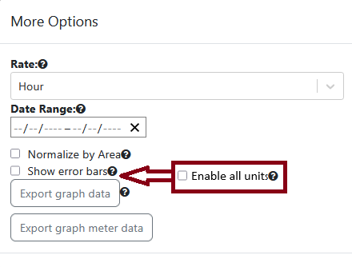

# Preferred Units

## Introduction

Each unit has a preferred display boolean that indicates if it should always be enabled. If it is true then the unit is always available but if false then the user needs to enable to use that unit. The idea is that a site with a lot of units could be too much for typical users and this would limit to the commonly used ones. OED has not implemented this to work as planned and this describes how that should happen.

This is covered by [issue #1525](https://github.com/OpenEnergyDashboard/OED/issues/1525).

## Basic change

When the "More Options"  button is clicked on a graphics page, it will be modified to add "Enable all units":

The new option will be added right below "Show error bars" as indicated by the red arrow with the new item in the red box. As usual, all text needs to be internationalized and the help icon enabled.

If this is checked then all units will be shown in the units drop down on the graphic pages as in the current system. If it is not checked then only the preferred units are shown. This does not change the behavior of which are compatible/incompatible and only changes which ones are on the drop down.

## Some details

As expected, the preferredDisplay value is in Redux state for each unit.

selectUnitSelectData in src/client/app/redux/selectors/uiSelectors.ts controls what units are shown. It is used in src/client/app/components/UnitSelectComponent.tsx for this purpose.

The admin unit pages already have all the needed capabilities for preferred unit.

## Other changes

The standard developer test data and the standard loaded data needs to be checked for the displayable and preferred display for each unit. It may be desired to modify some of these values given this change.
