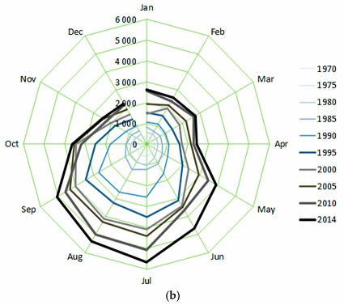

# Radar graphic

## Introduction

There are requests to expand the range of graphics OED can display to show resource usage. Doing a radar/clock graphic is one of these per [issue #208](https://github.com/OpenEnergyDashboard/OED/issues/208). Here is an example from [a publication](https://www.researchgate.net/publication/318084549_Modeling_of_Monthly_Residential_and_Commercial_Electricity_Consumption_Using_Nonlinear_Seasonal_Models-The_Case_of_Hong_Kong):

This shows a type of usage by each month of the year. Some people like it since it can be easy to see variations. In this example, the usage increases toward July, stays fairly constant until September when it decrease to the end of the year. The months are the angle in polar coordinates and the usage is the distance in polar coordinates. In the usage for OED, the angle will be a date/time and the distance will be the usage. The obvious, standard items for the date/times would be:

- every hour for one day
- every day for one month
- every month for one year
  - It is an open question if we should do 4 week increments (as elsewhere in OED) to give constant number of days. However, this means 13 points around the radar graphic instead of each month that is more common usage. Maybe both?

Other possibilities would be:

- every day for one year (if points are visible)
- arbitrary time range with an increment that is a multiple of the reading frequency or hour or day where the total number of points would be below a set limit
  - The best limit for this case is unclear and may depend on how it looks via testing
  - We chose those increments since they should be relatively fast from the database

## Implementation

The first cut would be to create a graphic that showed the first set of possibilities. This would be a new graphic page in OED. This will mean getting the data from the database (hopefully current routes can return the needed data), putting into Redux state and graphing. The choices could be buttons as on the bar graphic to choose 1 day, 1 week or 4 weeks but with the above type labels. However, given the likely number of choices, it may be best to use a dropdown menu. OED also needs to get the day, week or month to graph. This would be tricky/pain using the slider on the line graphic so having some sort of entry such as a popup calendar would be good where it would also be input via the keyboard. The exact look is open to do the different ones.

If this goes well, then the next step would be to try the other possibilities. For the last option, the time range would initially be set via slider on the line graphic page as is done to set the time  range for other graphic pages. However, it could be changed by the user - how depends on what was done above and makes sense. The increment would be set via a different menu (or button) selection. Part of this effort is to see the speed which is believed to be fast. See the [3D graphic design](../3DGraphic/3DGraphic.md) for a discussion of the speed of doing raw data graphics over longer time ranges.

Once this is finalized, the chart links should be updated so it would properly recreate the graphic shown on the radar page.

A final step would be allowing the admin to set the default behavior for these graphic pages as done for other graphics.
