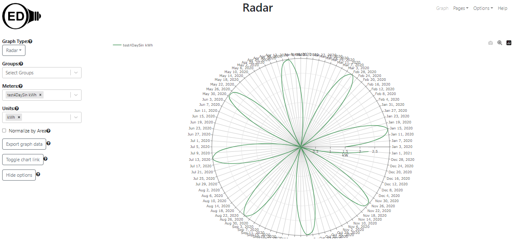

# Radar graphic

## Introduction

There are requests to expand the range of graphics OED can display to show resource usage. Doing a radar/clock graphic is one of these per [issue #208](https://github.com/OpenEnergyDashboard/OED/issues/208). Here is an example from [a publication](https://www.researchgate.net/publication/318084549_Modeling_of_Monthly_Residential_and_Commercial_Electricity_Consumption_Using_Nonlinear_Seasonal_Models-The_Case_of_Hong_Kong):

This shows a type of usage by each month of the year. Some people like it since it can be easy to see variations. In this example, the usage increases toward July, stays fairly constant until September when it decrease to the end of the year. The months are the angle in polar coordinates and the usage is the distance in polar coordinates. In the usage for OED, the angle will be a date/time and the distance will be the usage. The obvious, standard items for the date/times would be:

- every hour for one day
- every day for one month
- every month for one year
  - It is an open question if we should do 4 week increments (as elsewhere in OED) to give constant number of days. However, this means 13 points around the radar graphic instead of each month that is more common usage. Maybe both?

Other possibilities would be:

- every day for one year (if points are visible)
- arbitrary time range with an increment that is a multiple of the reading frequency or hour or day where the total number of points would be below a set limit
  - The best limit for this case is unclear and may depend on how it looks via testing
  - We chose those increments since they should be relatively fast from the database

## Implementation

The first cut would be to create a graphic that showed the first set of possibilities. This would be a new graphic page in OED. This will mean getting the data from the database (hopefully current routes can return the needed data), putting into Redux state and graphing. The choices could be buttons as on the bar graphic to choose 1 day, 1 week or 4 weeks but with the above type labels. However, given the likely number of choices, it may be best to use a dropdown menu. OED also needs to get the day, week or month to graph. This would be tricky/pain using the slider on the line graphic so having some sort of entry such as a popup calendar would be good where it would also be input via the keyboard. The exact look is open to do the different ones.

If this goes well, then the next step would be to try the other possibilities. For the last option, the time range would initially be set via slider on the line graphic page as is done to set the time  range for other graphic pages. However, it could be changed by the user - how depends on what was done above and makes sense. The increment would be set via a different menu (or button) selection. Part of this effort is to see the speed which is believed to be fast. See the [3D graphic design](../3DGraphic/3DGraphic.md) for a discussion of the speed of doing raw data graphics over longer time ranges.

Once this is finalized, the chart links should be updated so it would properly recreate the graphic shown on the radar page.

A final step would be allowing the admin to set the default behavior for these graphic pages as done for other graphics.

### Partial implementation

This work was started with these notes: Two big issues we came across when considering the goals in this document:

1. The line SQL will not work for all the data we need in the radar graph. Line SQL only has hourly and daily data, radar requires these and monthly data as well. Yes, we can probably calculate monthly in the frontend but it's better to just give radar its own SQL to avoid future issues.
2. The radar graph cannot handle as much data as the bar or line graph. The radar graph has a fixed diameter and can only bring points closer to each other. This causes the labels to start overlapping. This means we have to limit the user's options when viewing data.

More testing and analysis is needed to see exactly what is left to do.

The repo is [here](https://github.com/Elias0127/OED/tree/radar_graph). See below for a more recent version of the code.

#### Steve's thoughts on the partial implementation

I merged in development and put a version on myGithub repos. See the [radar_graph branch](https://github.com/huss/OED/tree/radar_graph) and this should be used as the starting point for future work.

- Since this effort began the 3D graphic was done. (3D should be available sometime in September 2023 via development and is available from a fork otherwise. The 3D code should be valuable for both the date picker but also have samples for limiting dates, etc.) We can use the date picker from this graphic to choose a range of dates. I'm not sure the number of days that should be allowed but we could try 1440 which is the limit for the number of points returned by a line graphic. Looking at the graph produced has shown that a year is clearly visible so we can try longer to see what it looks like.
- After the general dates are done we may want to add buttons for the standard cases listed above where they would go from the last date that is currently being used to the time in the past that is requested.
- The data gotten currently is the default for line. It needs to be the correct time increment and not the automatic one chosen by line. For example, if you have a meter that has limited time range then it currently returns the meter readings or raw values and it should return either hourly or daily depending on what is appropriate. The following figure shows two points for June 2nd because that is the raw data.

It also needs to deal with the case when the meter frequency is greater than the desired display frequency. For example in the figure a little below it only has data every 4 days and that is what should be graphed instead of daily since OED does not want to interpolate data that does not exist in reality. We need to think about how this will be done and what is the proper labels. Normally we do this in the database so we may need separate code for radar.

- The current graphic labels the dates for each point. We need to label it according to the frequency in the description of cases above. For example, if you are doing yearly then it should be each month in the year. The following figure shows that with four day data it puts a label every four days. It also shows that the labels are being cut off at the top and bottom of the graphic. Also note that the labels do not change appropriately with the language selection as is done in other graphics.

- Given that it appears a large number of points can be graphed, it may make sense to allow the user to display the meter readings directly instead of hourly when they are looking at a single day.
- Groups are not working with radar.
- While it appears the Redux state was set up it is not being used for the radar graphics and line state is being used since this was a demonstration.
- The web browser console is showing a warning. It begins "Selector unknown returned a different result when called with the same parameters". I think this started showing up due to radar but have not checked it out.
- Chart links for radar has not been started.
- At least some of the text for radar has not been internationalized.
- OED probably will not support export of radar data so that button can be removed from the radar graphic page as it is on several other graphic pages.
- Need the help link and the help file for radar (Steve will do when the work is mostly done).
