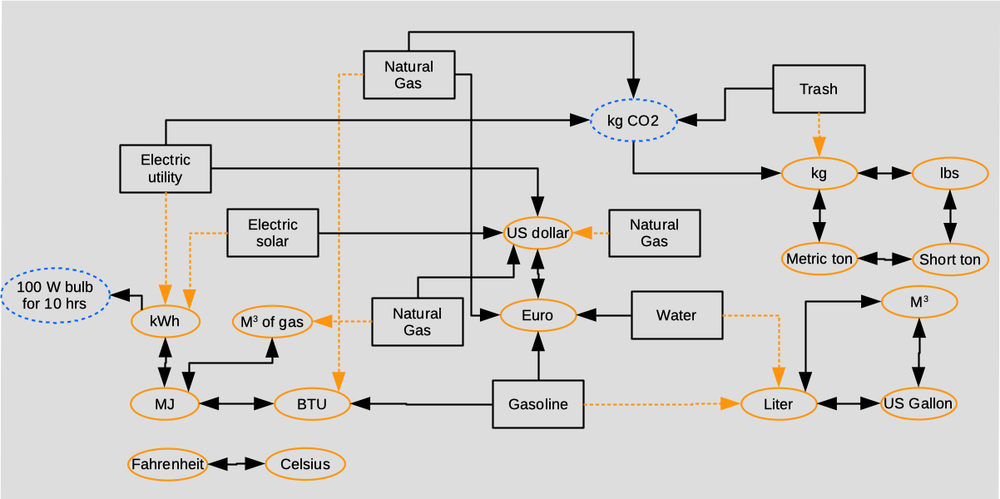
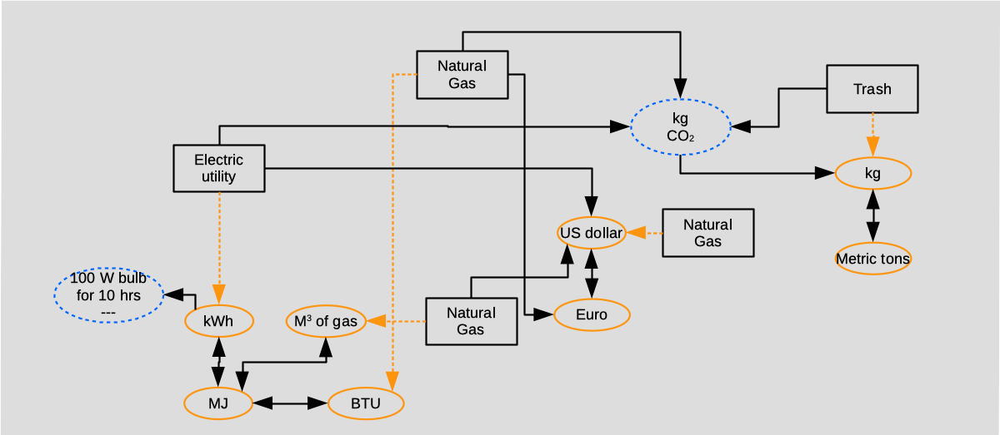
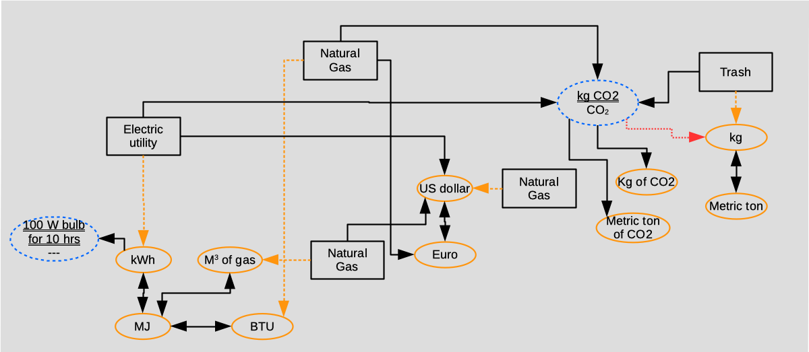
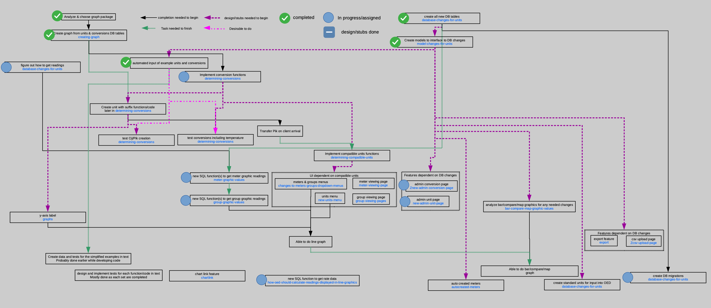

# oed-resource-generalization

This is a very large document that can be intimidating. Developers can review the earlier part and then, in general, read the other section(s) that apply directly to what they are trying to do. There are undoubtedly omissions and mistakes in this document so it is expected and appreciated if you asked questions and suggest changes.

## items-that-need-to-be-addressed

- See all the places with a TODO and address.

**Please use care in editing the document so the ideas stays intact until a final decision is made and nothing bad is done to the document. Having said that, this is a living document that you can edit.**

This is a working document (started Nov 2020 but includes previous work/ideas) that gives ideas and details on how to generalize OED resources from electricity to most types. The previous document when we thought we would use a unit conversion package is [available](unitPackageIdeas.md) but is now obsolete.

Note: The equations in this document should render in Visual Studio Markdown Preview window. They are in LaTex format. Unfortunately, you have to use a URL and cannot use $ on GitHub (yes, it works in Visual Studio). This is how it is done in this document but note there is no background set so if you use dark mode they are basically invisible. I'm sorry to say you need to turn that off to see the equations. Also note that a heading must be lowercase and words separated by - to allow links so this is used throughout this document.

# important-note-for-developers

## **All work on resource generalization will be done from the resourceGeneralization branch. You should branch from resourceGeneralization and do pull requests back to the branch on the main OED repository. This is done to avoid the changes impacting other developers during the extensive work that will be done. A message was posted to the Developer Discussion Area about this.**

## table-of-contents

- [overview](#overview)
- [units-and-conversions-overview](#units-and-conversions-overview)
- [sample-conversions](#sample-conversions)
- [examples](#examples)
- [notation](#notation)
- [determining-units-that-are-compatible-with-a-meter-or-group](#determining-units-that-are-compatible-with-a-meter-or-group)
- [supporting-structure-for-units](#supporting-structure-for-units)
- [determining-compatible-units](#determining-compatible-units)
- [graph-details](#graph-details)
  - [vertices](#vertices)
  - [edges](#edges)
  - [creating-graph](#creating-graph)
  - [determining-conversions](#determining-conversions)
- [default_graphic_unit](#default_graphic_unit)
- [database-changes-for-units](#database-changes-for-units)
- [model-changes-for-units](#model-changes-for-units)
  - [unit](#unit)
  - [conversion](#conversion)
  - [meter](#meter)
  - [group](#group)
- [oed-page-changes](#oed-page-changes)
  - [new-units-menu](#new-units-menu)
  - [new-graphic-rate-menu](#new-graphic-rate-menu)
  - [changes-to-meters-groups-dropdown-menus](#changes-to-meters-groups-dropdown-menus)
  - [meter-viewing-page](#meter-viewing-page)
  - [group-viewing-pages](#group-viewing-pages)
  - [new-admin-unit-page](#new-admin-unit-page)
  - [new-admin-conversion-page](#new-admin-conversion-page)
  - [csv-upload-page](#csv-upload-page)
  - [export](#export)
  - [chartlink](#chartlink)
  - [multiple-edits](#multiple-edits)
- [other-code-changes](#other-code-changes)
  - [autocreated-meters](#autocreated-meters)
  - [graphs](#graphs)
- [other-database-considerations](#other-database-considerations)
  - [unit-display](#unit-display)
  - [how-oed-should-calculate-readings-displayed-in-line-graphics](#how-oed-should-calculate-readings-displayed-in-line-graphics)
  - [bar-compare-map-graphic-values](#bar-compare-map-graphic-values)
  - [meter-graphic-values](#meter-graphic-values)
  - [group-graphic-values](#group-graphic-values)
- [implementation-plan](#implementation-plan)
- [possible-ways-to-store-unit-graph](#possible-ways-to-store-unit-graph)
  - [JavaScript-npm-packages](#JavaScript-npm-packages)
  - [postgresql](#postgresql)
- [testing](#testing)
  - [tests-while-developing](#tests-while-developing)
  - [mocha-chai-tests](#mocha-chai-tests)
- [issues-to-consider](#issues-to-consider)
  - [unusual-units](#unusual-units)
- [Potential-future-enhancements](#Potential-future-enhancements)
- [db-generalize-info](#db-generalize-info)
- [information-resources](#information-resources)
## old-conversion-code

## overview

OED started by working with electrical data as a proof of concept and to support the resource requested the most. With that complete, OED is generalizing to support most resource types such as natural gas, water, steam (see limitations below), recycling, temperature, etc. Instead of addressing these as individual cases, OED is being modified to store information about compatible resources (energy, power, volume, temperature, etc.) and how to convert between them. This will allow OED to address several feature requests with this single change including:

- Allow most resource units (natural gas, energy, power, etc.).
- Allow sites to choose the unit for graphical display where the most common requests were for English vs. metric units.
- Allow OED to display usage in units not associated with resource consumption such as CO2, cost, equivalent miles of driving a car, etc., which may be more natural to some users and allow for common sustainability units to be used.
- Allow OED sites to add new units to the system that are not automatically supplied with OED including local monetary unit.

The idea behind the system is that all compatible resources can be converted from one to the other via a linear transformation. For example, 1 BTU is 2.93x10-4 KWh. While most conversions are multiplicative factors, temperature is the one notable exception where Fahrenheit = 1.8 * Celsius + 32. Putting the BTU calculation into this type of formula gives BTU = 2.93x10-4 KWh + 0.

Note that even though we are the Open Energy Dashboard, this generalization will allow for non-energy units such as volume, temperature, money, power, etc. At this time, OED will not be able to work with measurements that come from multiple read values that require a non-linear transformation. See [unusual-units](#unusual-units) for some examples and how OED might deal with them. The bottom line is that OED can accept these values if the calculation is done before the value is put into the meter of OED. This means the system logically provides the combined unit such as a steam system giving the energy used or power. This will most likely come directly from the site or somehow combined by OED in software before it is stored (cannot do the later now).

The GitHub issues #[211](https://github.com/OpenEnergyDashboard/OED/issues/211), #[214](https://github.com/OpenEnergyDashboard/OED/issues/214) & #[164](https://github.com/OpenEnergyDashboard/OED/issues/164) relate to units/generalization in a very general way. Displaying by cost is related to issue #[61](https://github.com/OpenEnergyDashboard/OED/issues/61). This may also relate to the request to negate meters (issue #[161](https://github.com/OpenEnergyDashboard/OED/issues/161)) as this is a special case of a linear transformation. It is planned that completion (at least to a reasonable degree) of this work will be OED release 1.0 as a fully functional dashboard. The current plan is for this to happen sometime in 2022 with the middle of the year being the desired target.

## units-and-conversions-overview

The heart of the system is allowing for conversions between compatible units. Compatible units are ones that can be aggregated because they can all be converted to the same unit. See [examples](#examples) for sample conversions and [unit compatibility section](#determining-units-that-are-compatible-with-a-meter-or-group) for more on what compatibility means.

While most conversions are multiplicative factors, temperature is a linear transformation. Thus, we will use linear transformations/conversions (ax + b or the same slope * x + intercept) in OED. This document will refer to the multiplicative factor as the slope and the additive factor as the intercept as is done for linear equations in mathematics. Almost all the conversions of interest have intercept = 0. We will need to think about whether we should optimize the case of intercept = 0 or if it does not make any practical difference when readings are converted.

To simplify what conversions must be input by an admin, we will allow what we call chained conversions. This means that you have conversions from a → b and b → c and the user wants to get a → c. With chained conversions, OED will be able to figure out a → c from the other two. Without this the admin would be required to input a direct, one-step transformation for any desired conversion. With chained conversions the system may figure out allowed conversions that admins were not thinking of and allow them as options; [Example](#examples) #9 shows this. An advantage of chained conversions is it is much simpler to store meters in their original units because they can automatically be converted to other compatible units for grouping or display. It also allows one to specify kg ⟷ lb ⟷ short ton, etc. one time and then reuse for all mass units that are linked to any one of these. (This document uses a double-ended arrow (⟷) when the conversion can go both ways.)

Users will want to define their own units and conversions. For example, they need to enter the cost of kWh, BTU, water, etc. since it varies by site. They will also want to define display units such as CO2 (we will likely supply this one) and energy usage equivalent to driving a car, pizza deliveries, etc. We don’t know everything people will want so we should allow them to enter new ones.

## sample-conversions

As discussed in more detail in the [compatibility section](#determining-units-that-are-compatible-with-a-meter-or-group), the problem of determining compatible units is the same as seeing if a path exists from the starting to the desired (or ending) unit. The following graphic shows a graph with units where the allowed conversions are the edges:

Notation in figure: W is Watts, kWh is kilo-watt-hour, BTU is British Thermal Unit, MJ is megajoules. The black rectangles are meters, the orange ovals are basic units and the blue ovals are units that are different. Note the two types of units are the same in terms of the graph but shown in different colors to indicate that the linking is different. More details are [elsewhere](#vertices).

The double-ended arrow to/from MJ and BTU indicates that you can convert from MJ to BTU and BTU to MJ. The single dashed orange arrows indicate the unit of a meter, e.g., Electric utility to kWh means the meter is reporting to OED in kWh. The single solid black arrow from Trash to kg CO2 indicates you can only convert from Trash to CO2 (there is a standard conversion for CO2 from Trash). If the arrow went the other way then you could take CO2 and create trash which is not allowed. An example of a chained conversion is taking the Trash meter that collects in kg and displaying it in Short ton. You would do the sequence of conversions of Trash → kg → lb → Short ton meaning first you convert the Trash meter reading to kg then kg to lb and then the lb to Short ton. You could also do Trash → kg → Metric ton → Short ton. The result would be the same and OED will arbitrary choose which one to use since the path length is the same.

It may seem strange in the example just done that you first do the Trash → kg conversion. This conversion is actually the identity conversion (slope = 1, intercept = 0) so it does not change the values and this is normally the case. That is part of the reason the arrow is dotted and orange. The need for meters is shown by having Electric utility and Electric solar meters. When you are working with energy, you first convert to kWh as shown and this is similar to the conversion of Trash to kg. Note, that both Electric utility and Electric solar have conversions to US dollar and they are different lines so produce different values. This makes sense because the cost of creating electricity is different for these two sources. This is one example of why meters are decoupled from the unit they collect in. Note that two different electric meters that both measure kWh coming from the utility can both use the Electric utility unit since the conversion to US dollar is the same for both.

There are units for cubic meters of gas and cubic meters (M3). While they both may seem to be volume, they are not. Cubic meters of gas is an energy unit and represents the amount of energy that a given volume of gas represents. It is a standard unit of measure. Cubic meters is a volume measurement. If you used cubic meters for both and had a conversion from cubic meters to energy (say BTU) that would lead to a weird conversions. Since we allow chained conversions, you could take Water → liters → cubic meters → BTU and that makes no sense since water is not energy. The different units remove this issue.

There are three meters for Natural Gas that receive data in three different units:

1) cubic meters of gas that measures the amount of gas for energy
2) BTU meters that also measure energy
3) US dollar meters to measure cost.

This was done to show the generality of the system. For the first unit type, a site may have a meter to measure the quantity of gas consumed (Natural Gas in cubic meters). For the second unit type, a site might have a different meter on a different line to measure the quantity of Natural Gas in BTU. Both the Natural Gas in cubic meters and BTU record energy. This shows a site can have meters that measure in different units for the same type of item (natural gas here). This setup allows recording the original values in a simple way so special software is not needed to convert meter data to required OED units that are the same for all meters of the same type (energy here). It also means that meter data exported from OED will be the original meter data values. For the third unit type, the site may also manually load in cost data for the natural gas (Natural Gas in US dollar). This would be the actual cost from the utility and not a set cost (such as the conversion of Natural Gal in cubic meters to US dollar). The former is likely to be more accurate and may include fixed costs. Note the conversions given still allow the other two Natural Gas meters for energy to be converted to cost at a fixed rate. Though it might not be common at a site, the one in BTU converts to Euro and the one in cubic meters converts to US dollar. Though it is likely the cost for both types of meters would lead to the same overall cost for a given quantity of gas, this is not required. Since another conversion from US dollar ⟷ Euro is given, you can combine these two as either US dollar or Euro using chained conversions.

Note sites may want to convert money between units but it is noted that this will likely vary with time and the values in OED do not change unless updated by the admin. OED has thought about conversions that change with time but it is unclear if/when that would happen.

## examples

Here are some examples that show how conversions can and cannot happen with the given example/system. They show use cases for actual use in OED.

1. Determine total energy usage in MJ from meters that are both Electric utility in kWh & Natural gas in cubic meters. You do the conversion Electric utility → kWh → MJ and Natural Gas → cubic meters → MJ. You can do this for as many meters that are associated with each starting unit. Once all the meter values are in MJ you can sum them up to get the total MJ for all such meters desired. Note that including meters that measure in Natural Gas BTU is not fundamentally different. They would be converted by Natural Gas → BTU → MJ and then combined with the other two. Note that displaying each meter separately is the same except you do not do the final summing. This is true in all examples.
2. Determine total cost in US dollar for meters that are Electric utility, Electric solar, Natural Gas in cubic meters, Natural Gas as BTU & Water. This is not fundamentally different than example #1. You do each conversion to US dollars and then sum them. The needed conversions are: Electric utility → US dollar, Electric solar → US dollar, Natural Gas as cubic meters → US dollar, Natural gas as BTU → Euro → US dollar & Water → Euro → US dollar.
3. Determine total CO2 as Short ton from Natural Gas as BTU & Trash in kg. Convert Natural Gas as BTU → kg CO2 → kg → lb → Short ton & Trash in kg → kg CO2 → kg → lb → Short ton and then sum. Note you could add Electric utility meters since there is a conversion to kg CO2 but you cannot do it for Electric Solar nor Natural Gas as cubic meters since neither has a conversion to kg CO2. kg CO2 is an example of a unit that is linked to other units in only one direction but is the same in other respects. A real site may want to add these.
4. Determine total volume as liters of Natural Gas as cubic meters and water as liter. This request does not make sense even though both seem to have a common unit of volume. This is not possible since there is no path from Natural Gas as cubic meters to liter so it does the right thing. See the [sample conversions](#sample-conversions) for why this is not allowed and the unit types.
5. Determine total cost as Euros for Natural Gas as cubic meters and water as liter. This is done by Natural Gas as cubic meters → US dollar → Euro and Water → Euro and summing. This shows that even though the last one was properly excluded, this one does work.
6. Display total energy usage as 100 watt bulb for 10 hrs (1 kWh) for both Electric solar as kWh and Natural Gas as BTU meters. This is done by Electric solar as kWh → kWh → energy usage as 100 watt bulb for 10 hrs and Natural Gas as BTU → BTU → MJ → kWh → 100 watt bulb for 10 hrs and then sum. This is very different but shows an example with a unit with only links into it. This is also an example of a user defined unit as OED will not be providing this.
7. Display Natural Gas as BTU along with the temperature in Celsius. This is interesting since heating costs vary with temperature. These are not compatible units and there is not a desire to combine them. What the user wants is two lines on the same graph. This requires OED to display two y-axis units (one for BTU and one for temperature). We need to have a way to determine when the user is asking for aggregation (sum) vs. two separate lines/values. Note that if we wanted something other than BTU for the energy then that would be a transformation to do first before displaying. See [potential future work](#potential-future-enhancements) for dealing with this.
8. Display Natural Gas in cubic meters from US dollars. This request does not really make sense as the dashboard should not be buying things. It cannot happen because the conversion can only go the other way.
9. Determine total volume as liters of Gasoline and Water meters. This is allowed because both meters are linked to liter. However, you really don't want to do this since they are very different types of liquids. Here are thoughts:
    1. You can graph them both as separate meters each with its own line. If you understand what it means then this is okay.
    2. If you put both types of meters into a group then you will get a line with the sum. This is probably a bad idea. The way around this is for the admin not to put them in a group and that is what you would expect.
    3. Create a new type of liter Gasoline that is not linked to the provided volume units such as liter. Then link the Gasoline meter to this unit. This unit has the same links as the current figure with Gasoline (to BTU and Euro). Now you cannot group it with water and cannot graph it with water. The two negatives are that you need to create this unit and you cannot automatically convert it to other volume units because there is no link to liter. To get other units you need to create other Gasoline units and link them to allow conversion. This is all okay but needs to be documented for admin/user. Note kg CO2 is somewhat similar and the solution given below [graph-details](#graph-details) and [creating-graph](#creating-graph) for it will also work similarly for this case.
10. While power units are not shown, they will act the same as energy units where there are not links between power and energy.

## notation

OED generally uses the database id (integer) to identify objects in the system including their storage in Redux state. This document will use that same convention unless noted otherwise. When referring to an attribute of an object, this document uses the . syntax. For example, a meter's name would be meter.name. If the pseudocode has

    for each meter M in array whatever {
      // referring to M here means M is the meter id
      // referring to M.name is the meter name
    }

It is assumed that the attribute referred to is either in Redux state or will be transferred to Redux state as needed.

## determining-units-that-are-compatible-with-a-meter-or-group

Finding whether two units are compatible is the same as determining if a path exists in an unweighted, directed graph. Each vertex is a desired type of unit or meter in OED. If an edge exists then there is a conversion between the two vertices/types. If source is the starting meter and destination is the ending unit (meters can only be a source) then if destination is reachable, e.g., there is a path from source, then there is a conversion from source to destination. This means source is compatible with destination. Since this is a directed graph, this does not mean there is path from destination to source and this is very important to avoid unwanted conversions. The problem of determining if multiple meters are compatible with a unit can be determined by seeing if the unit is reachable by every meter. Determining if a path exists and the actual path is the shortest path algorithm from source or one or all possible vertices. Given OED will probably have less than 100 units, this is a very practical solution.

## supporting-structure-for-units

OED needs to figure out if a set of meters is compatible with a given unit. In the case of a group, the set of meters is all the underlying meters of the group. This is a recursive process where any included groups must then be analyzed (groups can contain groups). A meter is a special case where the set has only one member, the unit associated with the meter. How the overall conversion from one unit to another is done is [discussed below](#graph-details) and for now we assume we have this information.

OED will have a 2D array of conversions between units that we will call Cik where i is the row and k is the column. It represents taking each path in the graph and reducing it to a direct path. For example, if the graph finds a path from a → b → c → d, then the row representing a and the column representing d (Cad) would be the path from a → d with the overall conversion for that path. This is what OED needs to know to convert from one unit to another. By analyzing the graph and storing the information in Cik, OED saves all the path analysis work each time it needs to do a unit conversion. This works well because the graph rarely changes and only an admin can do this. Thus, the graph is assumed not to change while a regular user is interacting with OED until they reload OED.

There are several further optimizations of Cik. The first is to note the allowed rows and columns in Cik. OED isn't interested in every possible path in the graph. OED needs to convert from readings to the desired graphic unit that is the unit the user wants to see on the y-axis. Readings come from meters and meters can only have units associated with a meter as described in [graph vertices](#vertices). This means the rows of Cik are limited to the meter vertices in the graph. These are the black rectangles in the sample graph. Note that you can and often do have multiple meters that are storing readings that point to the same meter unit in the graph. For example, a site might have 10 meters that collect kWh for electricity. They all have Electric utility as their unit and all convert to other units in the same way. Thus, the single Electric utility vertex in the graph handles many meters in the system. Overall, this means that the number of rows in Cik is very likely to be much smaller than the number of meters when you have a site with lots of meters. First, this means that OED only needs to determine paths from meters vertices to unit vertices. This will substantially reduce the number of paths that need to be found (compared to the all vertices to all vertices path problem). Second, the work to create Cik will be substantially reduced as will its size. Third, adding a new meter of a type already in OED does not change the graph (the meter has a reference to its meter type in the graph).

A second optimization is to note that not all vertices can be destinations of paths so the number of columns of Cik is substantially less than the number of vertices. As described in [graph vertices](#vertices), meter vertices can only have outgoing edges. This means that a meter vertex can never be a destination and is never a column in Cik. The graph algorithm finding the paths will naturally figure this out since no path exists from a meter vertex to another meter vertex.

These two optimizations mean that the # rows and # columns in Cik are substantially less than the might be expected. The # rows + # columns = # of vertices in the graph (assuming all meter vertices are used and all units are displayable and can be converted to as is likely). Since the work is # rows x # columns, the reduction of both means a substantial reduction in overall work. The [edges section of graph details](#edges) discusses the creation and maintenance of the Cik array but is suffices to note here that it will not change very often and is thus a useful structure to speed up the calculations around units. Further optimizations are also given there.

The conversion stored in Cik is specified as a pair of real values of (slope, intercept) so the conversion is unitk = slope * uniti + intercept. As described above, the unit represented by i cannot be the same as the unit represented by k. However, the unit conversion will sometimes be the identity with slope = 1 and intercept = 0. For example, the Trash meter collects in kg so the Trash meter vertex points to the kg unit vertex. There is no conversion needed to display these readings in kg since the readings are in kg so it would store the identity conversion.

If there is no possible conversion from unit i to unit k then slope = intercept = NaN so you have (NaN, NaN). (Note, earlier it was consider to use slope of 0 but if you are converting solar energy to CO2 you might use this value because solar generation does not create CO2.) If there is no conversion then slope and intercept could be any distinguishing value (such as unknown for the variable) but using NaN makes products give the desired result (see below). It isn't clear that is a big win so another value could be chosen.

There are circumstances outlined later where the OED software only needs to know if a link exists between a source vertex (meter) and a destination vertex (unit). To reduce the effort of the check and the size of the array involved, OED will create another array called Pik (P is to reflect it tells if a path exists) as follows:

Pik = false if Cik slope is NaN and true otherwise

Thus, checking if Pik is true tells if there is a path between source i and destination k where Cik will provide the actual conversion for the path.

A set of units is compatible with a given unit d if every unit in the set has a conversion to d. This is true if and only if

where  is the slope of the conversion stored at index Cid. If this produce is NaN then unitd is not compatible with the set of units. This is true since NaN as either operand in arithmetic operations results in a NaN so the product is NaN if any of the slopes are NaN. It isn't clear if OED will use this in the actual code.

When this structure is used by OED, it will often start from a meter name. The name of the meter can be used to get the values associated with the meter (already provided in OED software). One of the new values will be the unit that the meter receives data and the corresponding index in Cik.

The details for constructing Cik and Pik are given next.

## determining-compatible-units

In what follows, the graphic unit will sometimes be set to "no unit". Rather than include "no unit" logic in determining compatibility and in the following pseudocode, it is always treated as a separate case. This was chosen since other items were either all compatible or not compatible so all the work to perform the tests could be avoided. As such, "no unit" is not considered one of the units but a placeholder for special unit situations that are treated separately.

The details of when compatible units are needed is given later but OED needs to determine what units are compatible with a set of meters. For example, this would allow you to know all the possible units you can use to graph this set of meters including the meters in a group. To do this analysis, we start with a set with only one meter. The set of compatible units are all units that are compatible with the type of unit that the meter collects. This can be gotten from Pik by getting the unit_index from the meter name and then looking across row unit_index of Pik to find all allowed conversions where the value is true. This is the same as the product idea above. Now, if you have a set of meters to find compatible units for, it is all the units that are compatible with all meters in the set. This is the intersection of all the sets of compatible units for each meter. A concrete example that is used in [Example](#examples) #3 above is (sets are surrounded by { }):

- units compatible with Natural Gas as BTU are {BTU, kWh, MJ, cubic meters of gas, US dollar, Euro, kg CO2, kg, Metric ton, lb, Short ton}
- units compatible with Trash are {kg CO2, kg, Meter ton, lb, Short ton}
- units compatible with Electric Utility are {kWh, MJ, cubic meters of gas, BTU, 100 W bulb for 10 hrs, US dollar, Euro, kg CO2, kg, Meter ton, lb, Short ton}
- units compatible with Solar Electric are {kWh, MJ, cubic meters of gas, BTU, 100 W bulb for 10 hrs, US dollar, Euro}

where compatible units are any that can be reached in the graph starting from the meter's unit of collection as shown with the examples. They are the values in Pij that are true. For example, for the row with Trash, the columns for kg CO2, kg, Meter ton, lb, Short ton are true. Given Pij, these are determined by the function unitsCompatibleWithUnit below where you pass the unit_id of the meter (the row in Pij that corresponds to this meter type) and it returns the set of units (as ids) shown above.

Now, say we want to graph Natural Gas as BTU meter(s) and Trash meter(s). The function unitsCompatibleWithMeters is passed the set containing both the meters and will return the units we can use in the graph. It will do:

{BTU, kWh, MJ, cubic meters of gas, US dollar, Euro, kg CO2, kg, Meter ton, lb, Short ton}

∩ (intersection)

{kg CO2, kg, Meter ton, lb, Short ton}

which gives {kg CO2, kg, Meter ton, lb, Short ton} (just happens to be the same as the units compatible with Trash). The first set in the intersection is what unitsCompatibleWithUnit returns as the compatible units for Natural Gas as BTU and the second set is for Trash. As stated in Example #3, you can graph Natural Gas as BTU meter(s) and Trash meter(s) as CO2 as Short ton and this is shown valid because that unit is in the intersection set but more details are given below in how this happens. We also know we could graph it in kg CO2, kg, Meter ton and lb since they are also in the set returned.

Note adding a Electric utility meter would mean finding the intersection of the three sets of units compatible with Natural Gas as BTU meter(s), Trash meter(s) and Electric utility. This does not change the result since the Electric utility set of compatible units has all the ones found before.

Now, what happens if we look at Natural Gas as BTU meter(s), Trash meter(s) and Electric solar meter(s). That would calculate:

{BTU, kWh, MJ, cubic meters of gas, US dollar, Euro, kg CO2, kg, Meter ton, lb, Short ton}

∩ (intersection)

{kg CO2, kg, Meter ton, lb, Short ton}

∩ (intersection)

{kWh, MJ, cubic meters of gas, BTU, 100 W bulb for 10 hrs, US dollar, Euro}

and this gives { } so there are no compatible units for these three meters. As the example states, you cannot graph these three.

We note that parts of this example will not be how OED ultimately works. You will not be able to graph mass units with CO2 units so, for example, graphing Natural Gas as BTU meter(s) and Trash meter(s) as Short ton could not be done. The details are given in [determining conversions](#determining-conversions).

    // Takes a set of meter ids and returns the set of compatible unit ids.
    function Set unitsCompatibleWithMeters(Set meters) {
      // This function needs a database connection conn either passed or gotten here.
      // The first meter processed is different since intersection with empty set is empty.
      boolean first = true
      // Holds current set of compatible units
      Set compatibleUnits
      // Loop over all meters
      for each meter M in meters {
        // Get row in P_ik associated with this meter
        integer m = Unit.getUnitIndex(M, conn) // or in Redux state
        // Set of compatible units with this meter.
        Set meterUnits = unitsCompatibleWithUnit(M.unit_id)
        // meterUnits how has all compatible units.
        if (first) {
          // First meter so all its units are acceptable at this point
          compatibleUnits = meterUnits
          first = false
        } else {
          // Do intersection of compatible units so far with ones for this meters
          compatibleUnits = compatibleUnits ∩ meterUnits
        }
      }
      // Now have final compatible units for the provided set of meter
      return compatibleUnits
    }

    // Return a set of units ids that are compatible with this unit id.
    function Set unitsCompatibleWithUnit(integer unit) {
      // Get the row index in of this unit
      row = unit.unit_index
      // The compatible units are all columns with true for p_ik where i = row.
      // unitSet starts as an empty set
      Set unitSet = {}
      // Loop over all columns of P_ik in row
      for k = 0 to # columns in P_ik - 1 {
        // true indicates they are compatible
        if (P[row][k]) {
          // unit at index k is compatible with meter unit so add to set.
          // Convert index in Pik to unit id
          unitSet += unitFromPRow(k)
        }
      }
      return unitSet
    }

    // Utility function to return the unit id given the row/meter in Pik.
    function integer unitFromPRow(integer row) {
      // Code could find entry in units database table that holds row in unit_index.
      // Since we will be working a lot with units, probably should put in Redux state.
      // Work out this detail to decide if server will send the mapping or client gets the
      // needed DB values.
      // The database call would be Unit.getByUnitIndexMeter(row, conn) where need to get or pass conn
      // This assume row(unit) is this value.
      return row(unit)
    }

    // Utility function to return the unit id given the column/unit in Pik.
    function integer unitFromPColumn(integer column) {
      // Code could find entry in units database table that holds column in unit_index.
      // Since we will be working a lot with units, probably should put in Redux state.
      // Work out this detail to decide if server will send the mapping or client gets the
      // needed DB values. 
     // The database call would be Unit.getByUnitIndexUnit(row, column) where need to get or pass conn
    return column(unit)
    }

The compatible units of a group can be determined by the above function by determining all the child meters recursively and creating a set of the unique meters. Start with this function:

    // Returns the set of meters ids associated with the group_id used 
    // by the OED software and in the database for the group.
    function Set metersInGroup(integer group_id) {
      // This function needs a database connection conn either passed or gotten here.
      meters = Group.getDeepMetersByGroupID(group_id, conn)
      // Make the ids into a set. Not needed if already a set.
      Set metersSet = meters as a set
      return metersSet
    }

One reason this is made into a function even though there is an easy way to get the needed ids is that this will take a modest amount of time for each group and it will take more if there are lots of included groups, recursively. If it is too slow then OED can either precalculate the meters of the group (maybe even storing in DB and loaded when OED starts) or use dynamic programming to only calculate the first time and then store the result. If stored in DB then need to update appropriately. That would make this an O(1) operation excluding the initial calculation. This would also allow OED to easily display all the meters associated with a group as requested in [issue #591](https://github.com/OpenEnergyDashboard/OED/issues/591). The first shot should just do the function as is to see it works properly and then the OED team can discuss the optimization.

The compatible units of a group is then unitsCompatibleWithMeters(metersInGroup(group_id)).

The function unitsCompatibleWithUnit takes O(# units) and unitsCompatibleWithMeters takes O(# meters in Set meters x # units). Since the set of meters passed to unitsCompatibleWithMeters changes with user selection, it cannot easily be precalculated. If the overall process takes too long, OED can optimize as proposed above for metersInGroup. However, the outer function will still get the same result and may dominate the overall time. The first shot implementation will not do this.

The functions in this section will be used below when changes to the graphics, meter and group pages are described.

## graph-details

### vertices

The graph will have three types of vertices. The graph store program probably will not know this so it is enforced via software. The vertex type will impact how it is used in the graph. The three types are:

1. unit. When edges are added using this vertex, the vertex can be the source and/or destination vertex. When both the source and destination vertex is of a fundamental unit (SI units and similar ones), then it is common for the link to go both ways (bidirectional) where the conversion in one direction must be the inverse of the conversion in the other direction. Obviously, only compatible units should be linked. In the example, the orange ovals are this type of unit, e.g., BTU can be converted to MJ and MJ can be converted to BTU. For certain units, esp. ones defined by the site, the link only goes one way. In the example, the blue dashed ovals are this type of unit. In the case of CO2, the arrow goes from CO2 to kg with the identity conversion (1, 0). This allows the quantity of CO2 to be converted to any of the mass units (lb, Metric ton, etc.). In the case of 100 W bulb for 10 hrs, the arrow goes from kWh to 100 W bulb for 10 hrs. The conversion happens to be the identity since 100 W x 10 hrs is 1 kWh. Another example would be creating the custom unit for liter Gasoline ([see Example](#examples) #9) with links to BTU and Euro.

    Why do the units have these different types of arrows? If you are dealing with fundamental units that can be interchanged back and forth and the new unit makes sense then it is bidirectional. In the case of CO2, it is not a fundamental unit. If the arrow went both ways to include kg to CO2, then you could do Trash → kg → CO2 kg so trash would be shown as kg of CO2. This is not desirable so this direction of the arrow is not included. Now, why does the arrow go the other way? We want to allow the user to select any mass unit for CO2 so it could be kg, lb, etc. The arrow in this direction permits these conversions. In the case of 100 W bulb for 10 hrs, we want the user to be able to display in this unit so the arrow only goes into this unit. While it would not cause issues, having the arrow go in both directions would allow converting from 100 W bulb for 10 hrs to other energy units. In this case we really need to label this bulb and have the unit be 1 kWh (100 W x 10 hours). Then we could convert the kWh to other energy units but then you have bulb kWh, bulb BTU, etc. and users don't think of bulbs in this way. Thus, the arrow does not have 100 W bulb for 10 hrs as the source.

    How do units get the correct type of links? The majority will be provided by OED and be correct. Others, such as adding a new unit of money can follow the recommendations given. In other cases, the admin adding the unit needs to analyze the situation to get the correct type of link. A mistake should not lead to incorrect results but will allow for displaying of funny units.
2. meter. When edges are added using this vertex, the vertex must be the source and cannot be the destination. Thus, a meter vertex can be converted to another unit type but other unit types cannot be converted to a meter. These are expected to be used to represent a meter. By default, the suffix will be blank. The need for a meter type of vertex is discussed in [sample-conversions](#sample-conversions).
3. suffix. Are units created by OED as part of analyzing suffix units (such as CO2) and described in [determining-conversions](#determining-conversions).

### edges

Edges represent a conversion between the units of two vertices (it really is the reading value for the meter when the source is a meter). The constraint on edges is given in the [vertices](#vertices) section. The graph is unweighted and the conversion factors are not stored in the graph. They are found from the path of the shortest path algorithm run on the graph as described the section on [determining-conversions](#determining-conversions). Note that it is possible to have multiple paths leading from one source to one destination. Fundamental units with bidirectional links should not be an issue since all their conversions should be consistent. For units with only incoming links this cannot happen. When there outgoing links that are not bidirectional, it could pose an issue. However, it is unclear that any such use will be useful in OED and seems to come from a misuse/problem. Thus, this issue is considered settled. The graph algorithm will provide the shortest one (or one of the shortest ones if multiple of the same length so in that last case of potentially inconsistent paths a consistent value will be displayed). This will be a little more efficient for OED to deal with the path but does not matter in principle since all paths have equivalent conversions. The trash example in [sample-conversions](#sample-conversions) shows one of these where you can get to Short ton through two paths with the same overall conversion.

### creating-graph

When OED needs to create the graph, it will do the following:

1. For each unit U in the units table, create a vertex in the graph that is somehow linked back to the row in in the units table that it represents. How this is done will depend on the package used. The best would be U.id but U.name is also unique and more logical for the vertex name (if cannot store other values in the graph vertex).
2. For each conversion C in the conversions table, create an edge from C.source_id to C.destination_id. The id can be used to get any other needed information about the unit representing the two vertices in the edge (such as name). If U.bidirectional is true then an edge from C.destination_id to C.source_id is also created. As with a vertex, each edge needs to linked back to the row in the conversion table that it represents.

The [example](#examples) used so far will now be simplified so less information is contained but the important ideas/cases are present for describing how the code will operate. The simplified example is:

For this image, the units table for this example is shown next. id is set by the database and some values are arbitrary to show different cases. The note field is not shown.

| id    |        name        |      identifier       |  type_of_unit  |  unit_index  |  suffix  |  displayable  |  alwaysDisplay  |
| :---: | :----------------: | :-------------------: | :------------: | :----------: | :------: | :-----------: | :-------------: |
|   1   | Electric_utility   |                       |     meter      |              |          |      none     |        F        |
|   2   | Natural_Gas_BTU    |                       |     meter      |              |          |      none     |        F        |
|   3   | kWh                | kWh                   |     unit       |              |          |      all      |        T        |
|   4   | MJ                 | MegaJoules            |     unit       |              |          |      admin    |        F        |
|   5   | BTU                | BTU                   |     unit       |              |          |      all      |        T        |
|   6   | M3_gas             | cubic meters of gas   |     unit       |              |          |      all      |        F        |
|   7   | 100 W bulb         | 100 W bulb for 10 hrs |     unit       |              |          |      all      |        F        |
|   8   | Natural_Gas_M3     |                       |     meter      |              |          |      none     |        F        |
|   11  | Natural_Gas_dollar |                       |     meter      |              |          |      none     |        F        |
|   9   | US_dollar          | US $                  |     unit       |              |          |      all      |        T        |
|   10  | Euro               | €                     |     unit       |              |          |      all      |        T        |
|   12  | kg CO2             | kg CO2                |     unit       |              | CO2      |      all      |        F        |
|   13  | Trash              |                       |     meter      |              |          |      none     |        F        |
|   14  | kg                 | kg                    |     unit       |              |          |      all      |        F        |
|   15  | Metric_ton         | Metric ton            |     unit       |              |          |      all      |        F        |

Note that if type_of_unit is meter then displayable must be none. A few comments on the values:

- The name is what is used internally and by the admin whereas the identifier is what is displayed to the user.
- One unit was set to displayable of admin. This is to show that a unit can be hidden from most users and only shown to the admin. Overall, displayable has the following use:

  - A value of all means any user can see this unit.
  - A value of admin means only the admin can see this unit.
  - A value of none means no user can see this unit.

  Note that the restriction on viewing a unit only applies to that unit. For example, the setting for MJ to admin does not impact the ability of BTU to transform through MJ to kWh. Thus, an admin needs to set the displayable for each unit if they wish to restrict viewing of that unit.

- Since type_of_unit of meter is never displayed, identifier is never shown and was left blank here.
- The unit_index is set later by OED.
- The order was set to make some logical sense. As shown, meters and units can be intermixed and the items can be in any order. As shown, the id is not necessarily in order.
- Any character should show up so the Euro symbol is a good example/test.

The conversion table for this example is:

| source_id | destination_id | bidirectional |   slope   | intercept |             note             |
| :-------: | :------------: | :-----------: | :-------: | :-------: | :--------------------------: |
|    3      |       4        |        T      |    3.6    |     0     | kWh → MJ                     |
|    4      |       6        |        T      |   2.6e-2  |     0     | MJ → M3_gas                  |
|    4      |       5        |        T      |   947.8   |     0     | MJ → BTU                     |
|    3      |       7        |        F      |    1      |     0     | kWh → 100 W bulb for 10 hrs  |
|    1      |       3        |        F      |    1      |     0     | Electric Utility → kWh       |
|    1      |       9        |        F      |   0.115   |     0     | Electric Utility → US dollar |
|    1      |       12       |        F      |   0.709   |     0     | Electric Utility → CO2       |
|    2      |       5        |        F      |    1      |     0     | Natural Gas BTU → BTU        |
|    2      |       10       |        F      |   2.6e-6  |     0     | Natural Gas BTU → Euro       |
|    2      |       12       |        F      |   5.28e-5 |     0     | Natural Gas BTU → CO2        |
|    8      |       6        |        F      |    1      |     0     | Natural Gas M3 →  M3 of gas  |
|    8      |       9        |        F      |   0.11    |     0     | Natural Gas M3 → US dollar   |
|    9      |       10       |        T      |   0.88    |     0     | US dollar → Euro             |
|    11     |       9        |        F      |    1      |     0     | Natural Gas $ → US dollar    |
|    12     |       14       |        F      |    1      |     0     | CO2 → kg                     |
|    13     |       12       |        F      |  3.24e-6  |     0     | Trash → CO2                  |
|    13     |       14       |        F      |    1      |     0     | Trash → kg                   |
|    14     |       15       |        T      |    1e-3   |     0     | kg → Metric ton              |

The cost ones vary with time but a typical value was chosen and OED does not allow multiple conversion values. The other values are hopefully correct, standard conversions.

### determining-conversions

It is assumed that the shortest path algorithm on the graph will return the edges associated with the path between the source and destination. It is also assumed that the information returned will allow OED to look up the conversion represented by each edge in the path and the information on the vertices involved. For example, it is possible to return a tree where the source is the root, the leaves are reachable destinations and each node passed through represents a vertex (unit) on the path. Each pair of vertices in a path from the root to the leaf would give OED the source and destination to look up the conversion and vertex information. The exact details will depend on the graph software used and how we store the conversion/node information in OED.

First we present how to conceptually create Cik and then will give the pseudocode.

Let's say you want to know the conversion from source vertex a to destination vertex e where the path goes through all the inclusive letter vertices so it is a → b → c → d → e. For each edge i → k, there is an associated conversion in the conversion table in the database. The following pseudocode specifies how to get the needed conversion where the use of suffix is described below:

    // Given a sourceUnit id and a destinationUnit id
    // return the slope & intercept for the conversion from sourceUnit
    // to destinationUnit and suffix of the destination unit for it.
    function structure conversionValues(integer sourceUnit, integer destinationUnit) {
      // This function needs a database connection conn either passed or gotten here.
      // Values to return
      double slope, intercept
      string suffix
      // See if there is a conversion from source to destination.
      Conversion desiredConversion = Conversion.getBySourceDestination(sourceUnit, destinationUnit, conn)
      // Need to do actual pgp code to look at row.
      if (desiredConversions is empty) {
        // Did not find it. Since conversion should exist, it must be the other way around and bidirectional.
        Conversion desiredConversion = Conversion.getBySourceDestination(destinationUnit, sourceUnit, conn)
        if (desiredConversion is empty or desiredConversion.bidirectional = false) {
          // This should never happen. It should have been in the table one way or the other.
          generate error to log and throw error to stop process.
        }
        // We need to invert the conversion since it needs to go the other way from how stored.
        {slope, intercept} = invertConversion(desiredConversion.slope, desiredConversion.intercept)
        // Since we inverted the conversion, we use the suffix from the destination.
        suffix = Unit.getByID(sourceUnit, conn).suffix
      } else {
        // We found it in the desired order.
        slope = desiredConversion.slope
        intercept = desiredConversion.intercept
        suffix = Unit.getByID(destinationUnit, conn).suffix
      }
      // Note this is not a set but three items put into one object
      return {slope, intercept, suffix}
    }

    // Returns the inverted conversion of one provided as a slope and intercept
    function structure invertConversion(double slope, double intercept) {
      // What is stored for this entry in the units table:
      // destination_value = slope * source_value + intercept
      // Invert this equation to give:
      // source_value = (1/slope) * destination_value - (intercept / slope)
      // which means the conversion for this edge from the source value to the destination value
      //   (for source and destination in the graph) is
      // slope_to_use = 1 / slope_in_units_table
      // intercept_to_use = - (intercept_in_units_table / slope_in_units_table)
      double convertedSlope = 1.0 / slope
      double convertedIntercept = - (intercept / slope)
      // Note this is not a set but two items put into one package
      return {convertedSlope, convertedIntercept}
    }

The next step is to determine the conversion along a path. This is done by determining how the conversion is modified as each new edge is added to the path. The following pseudocode does that

    // Returns the updated overall conversion given a new conversion to add at the end.
    // The current conversion is origSlope, origIntercept and the conversion to add at the end is
    // newSlope, newIntercept
    function structure updatedConversion(double origSlope, double origIntercept, double newSlope, double newIntercept) {
      // The current conversion is:
      // conv(unit, origSlope, origIntercept) = origSlope * unit + origIntercept
      // We need to update unit for the new conversion so compose with that:
      // conv(conv(unit, origSlope, origIntercept), newSlope, newIntercept))
      // = conv(origSlope * unit + origIntercept, newSlope, newIntercept) 
      // = newSlope * (origSlope * unit + origIntercept) + newIntercept
      // = (newSlope * origSlope) * unit + (newSlope *  origIntercept + newIntercept)
      double slope = newSlope * origSlope;
      double intercept = newSlope *  origIntercept + newIntercept
      return {slope, intercept}
    }

The final step is to put the conversions for each conversion along the path together to get the overall conversion along a path:

    // Given a path from the graph algorithm, determine the overall conversion information:
    // slope, intercept & suffix.
    function structure pathConversion(path) {
      // Initial values so the starting conversion is the identity. Thus, when the first edge on the path
      // is processed you get its conversion.
      slope = 1
      intercept = 0
      // The suffix is blank by default.
      suffix = ""
      // Loop over the path
      for each edge E in path {
        // Get the source and destination for edge E in terms of unit ids.
        // This means relating them to the entries in the units table
        // in the database. These are the values used in the conversions table.
        // TODO Figure out how to encode this info in the graph and get it back.
        edgeSourceId = the unit id for the source of E
        edgeDestinationId = the unit id for the destination of E
        {newSlope, newIntercept, newSuffix} = conversionValues(edgeSourceId, edgeDestinationId)
        // Update the path conversion for this new edge
        {slope, intercept} = updatedConversion(slope, intercept, newSlope, newIntercept)
        // Update the suffix for this new edge
        if (newSuffix != "") {
          // The destination does not have an empty suffix so record it
          suffix = newSuffix
        }
      }
      return {slope, intercept, suffix}
    }

For most OED conversions, intercept = 0 so the process is simplified. For example, to do cubic meter of gas (id is 6) → MJ (id is 4) → BTU (id is 5) you do the following steps:

1. Convert from cubic meters of gas → MJ

    1. The conversions table does not have an entry for source_id = 6 and destination_id = 4.
    2. The conversions table does have an entry for source_id = 4 and destination_id = 6 so it needs to be inverted. The conversion in the table is (2.6e-2, 0). invertConversion gives (1/2.6e-2, -(0 / 2.6e-2)) = (38.46, 0)

2. Add the conversion of MJ → BTU

    1. The conversions table has an entry for source_id = 4 and destination_id of 5 which is (947.8, 0).
    2. updatedConversion gives (947.8 * 38.46, 947.8 * 0 + 0) = (3.64e4, 0)

Now let's do one with an intercept. The conversion of temperature C → F is (1.8, 32). Just for testing, let's make up a temperature unit for C → Z is (2, -111). If you start with 212 F that becomes 100 C. The 100 C becomes 89Z. Doing it with the code gives:

1. Convert from F → C. Only have C → F so invert to get (1/1.8, -(32 / 1.8)) = (0.55555, -17.777).
2. Add the conversion C → Z which has a conversion of (2, -111). This gives the overall conversion of (2 * 0.55555, 2 * (-17.777) -111) = (1.1111, -146.55)).
3. For the example this gives 1.1111 * 212 - 146.55 = 89.

We now discuss a complication in how units will be determined for display. For most units, when you convert to another unit the graphic should label the y-axis with that unit. In [example #2](#examples), several different meter units are converted to US dollar. It does not matter what the original units are, OED should label the y-axis as US dollar. Most units work this way including units that have bidirectional links. The units with one directional links, esp. where the arrow is away from that unit, can be different. In the case of kg CO2, you can do the conversion kg CO2 → kg → lb. Using the method just described, the label would be lb and you would lose the association to CO2. One way considered to fix this was to have a unit for each type of CO2 so you have units for kg CO2, lb CO2, Metric ton CO2, etc. There were two main drawback in doing this. First, the admin had to enter all of these units and keep them up to date with any desired mass unit. This would be even trickier because OED would prefer to provide some of the CO2 conversions and then the admin would need to know to fix them if they added a mass unit. Second, the graph allows chained conversion for the reason that you don't need to add conversions for every pair of units but only between enough to create the relationships needed. That is why the current example links kg CO2 to kg and then allows to convert to lb. It also means that if we add another mass unit that links to, say, lb, you can convert from kg CO2 to the new mass unit via a chained conversion without updating CO2 related units.

To keep the same basic graph and allow chained conversions, each unit will have a suffix value. In the case of kg CO2 is will be CO2 but in most cases it will be blank. When the [path is determined](#determining-conversions) as shown above, the suffix to use for display is equal to the last suffix that is not blank. (It seems unlikely that two units on the path will have suffixes but we cover that case by selecting the last one.) If they are all blank then it is blank. The graphic unit is the name of the final unit of the conversion in most cases. If the suffix is not blank then it is the name of the final unit of conversion followed by the suffix with " of " between. In [example #3](#examples), the final unit is "Short ton of CO2" because all suffixes are blank along each vertex except for kg CO2 with the suffix of CO2. Since the final unit along the path is "Short ton" and the suffix was "CO2", the y-axis label would be "Short ton of CO2". In examples without CO2, the suffix would be blank so the y-axis would be labeled with the final unit.

While the conceptual idea works, there is an issue in keeping track of the units labeled from ones created by a path through a unit with a suffix. First, it is possible for two paths to get to the final destination unit with different y-axis labels and conversion value. In the sample graph this happens because:

1. Trash → kg has the label "kg" since there are no suffixes along the path. The conversion is the identity.
2. Trash → kg CO2 → kg has the label "kg of CO2" because the kg CO2 unit in the graph has the suffix of CO2. The conversion is not the identity but the kg of CO2 produced by a kg of trash.

At the graph level this is happening because there are one direction edges into and out of kg CO2. (The original design did not allow this but this use case pushed us to allow them.) At a fundamental level this is happening because there are two different units involved. Recall from above, one option considered was to make the admin create a unique unit for each CO2 unit desired. This would create two different units: one for kg of mass for displaying Trash and one for kg of CO2. Another problem is that kg of CO2 is not in the unit table so OED would not easily know to show the user that graphic unit for display. To correct this situation given the graph provided, OED needs to generate the second set of units, conversion and fix up the graph. The figure below shows the final result of the process where this aspect can be seen by the two new units named kg of CO2 and Metric ton of CO2 in the orange ovals.

The original suffix unit is now no longer needed. In many regards it is similar to a meter in the sense that it accepts data but is not displayed. This is the case since we just created all the units based on that unit which acted as the template. We need to leave it in the database so the next time we recreate the graph it is included. For example, if you add another unit that can be reached from the suffix unit then a new unit would be created. To avoid anyone seeing the suffix unit, it becomes hidden. An admin should never have a unit that has a suffix but cannot get to another unit as it will be hidden without another unit created. This type of unit does not make sense. Note a hidden vertex in the graph can still be transitioned through to create paths. Also as part of this, the conversion of the hidden unit is removed from the graph. This means the conversion/link from the unit with the suffix to the other unit is removed. In the figure below, the red dotted line with an arrow that replaced the original black one represents doing this. The edge has actually been removed from the graph so the red dotted line is just for illustration.

The final part is to add the necessary conversions to the database table. For each unit added, the link from the suffix unit to that unit is added. It has the slope and intercept of the conversion for the path in the original graph (before removing  or adding links). In the figure below, these are the black line with arrows: kg CO2 → kg of CO2 and kg CO2 → Metric ton of CO2. Note the other entries for this conversion will be added later.

When this is done, the updated graph looks like:

The values for unit_index in the unit table need to be set. It would be nice if any current values could be left the same but there is a requirement that they go from 0 to the # of rows/columns - 1 and changes, esp. deletions from the table mean that renumbering is best. First, any entry that has displayable of none cannot be seen or used so it does not need to be in Cij. Thus, these are not given a unit_index. The units with type_of_unit of meter form the rows and type_of_unit of unit form the columns where each start at 0.

The units table after the complete process is shown next. It assumes the unit_index is set by going down the rows in order but another order could happen and would be fine. The displayable of MJ was made admin just to show that.

| id    |        name        |      identifier       |  type_of_unit  |  unit_index  |  suffix  |  displayable  |  alwaysDisplay  |
| :---: | :----------------: | :-------------------: | :------------: | :----------: | :------: | :-----------: | :-------: |
|   1   | Electric_utility   |                       |     meter      |       0      |          |      none     |        F        |
|   2   | Natural_Gas_BTU    |                       |     meter      |       1      |          |      none     |        F        |
|   3   | kWh                | kWh                   |     unit       |       0      |          |      all      |        T        |
|   4   | MJ                 | MegaJoules            |     unit       |       1      |          |      admin    |        F        |
|   5   | BTU                | BTU                   |     unit       |       2      |          |      all      |        T        |
|   6   | M3_gas             | cubic meters of gas   |     unit       |       3      |          |      all      |        F        |
|   7   | 100 W bulb         | 100 W bulb for 10 hrs |     unit       |       4      |          |      all      |        F        |
|   8   | Natural_Gas_M3     |                       |     meter      |       2      |          |      none     |        F        |
|   11  | Natural_Gas_dollar |                       |     meter      |       3      |          |      none     |        F        |
|   9   | US_dollar          | US $                  |     unit       |       5      |          |      all      |        T        |
|   10  | Euro               | €                     |     unit       |       6      |          |      all      |        T        |
|   12  | kg CO2             | kg CO2                |     unit       |              | CO2      |      none     |        F        |
|   13  | Trash              |                       |     meter      |       4      |          |      none     |        F        |
|   14  | kg                 | kg                    |     unit       |       7      |          |      all      |        F        |
|   15  | Metric_ton         | Metric ton            |     unit       |       8      |          |      all      |        F        |
|   16  | kg of CO2          | kg of CO2             |     unit       |       9      |          |      all      |        F        |
|   17  | Metric_ton of CO2  | Metric_ton of CO2     |     unit       |      10      |          |      all      |        F        |

The conversions added by this process are (the rest remain the same):

| source_id | destination_id | bidirectional |   slope   | intercept |             note             |
| :-------: | :------------: | :-----------: | :-------: | :-------: | :--------------------------: |
|    12     |       16       |        F      |     1     |     0     | kg CO2 → kg CO2              |
|    12     |       17       |        F      |   1e-3    |     0     | kg CO2 → Metric ton CO2      |

All of these ideas are in the following pseudocode:

    // Need to create or get passed a database conn.
    // Create the needed units for ones created by units with a suffix.
    // Get all units that have a suffix
    suffixUnits = Unit.getSuffix(conn)
    // Check each unit out
    for each suffixUnits S {
      // Use the graph to determine all the reachable units from this suffix unit S.
      // This assumes you identify a vertex by the id of the unit in the graph.
      // If using a graph where find from S to a specific vertex then need a loop as shown in creating Cik.
      paths = use a graph algorithm to get shortest path to every reachable vertex from vertex S
      // Analyze each path
      for each paths P {
        // Get the final vertex on this path and then get id & name for that unit
        destination = final vertex's destination on P
        // If graph gives the id of the unit then this is unneeded
        destinationId = get the database id of unit that is associated with destination from the graph
        // Same for first vertex on path
        source = first vertex on P
        sourceId = get the database id of unit that is associated with source
        // Find the conversion from the start to end of path.
        {slope, intercept, suffix} = pathConversion(path)
        // The name of the needed unit is the last unit name on the path + " of " and the suffix of the path.
        String unitName = destinationId.name + " of " + suffix
        // See if this unit already exists. Would if this was done before where this path existed.
        Unit neededSuffixUnit = Unit.getByName(unitName, conn)
        if (neededSuffixUnit does not exist) {
          // Add this as a new units where: name and identifier is unitName, type_of_unit is Unit.type.suffix,
          // displayable and alwaysDisplay is the same as destination.
          // Note a type_of_unit of suffix is different than a unit with a suffix string.
          // Note the admin can later change identifier, displayable and alwaysDisplay to something else
          // since OED does not recreate the unit if it exists so those changes will stay.
          Unit newUnit = new Unit(undefined, unitName, unitName, unused, <sec_of_unit of source>, Unit.type.suffix, -1, "", <displayable of destination>, <alwaysDisplay of destination>, "suffix unit created by OED")
          newUnit.insert(conn)
          // We now need to add the conversion for the new unit.
          // Create the conversion from the prefix unit to this new unit.
          Conversion newConversion = new Conversion(sourceId, destinationId, false, slope, intercept, "created by OED for unit with prefix")
          newConversion.insert(conn)
          // Add this conversion to the graph
          use the graph software to add vertex associated with neededSuffixUnit
          use the graph software to add an edge from S to neededSuffixUnit
        } else {
          // Verify that the conversion has not changed.
          Conversion currentConversion = getBySourceDestination(sourceId, destinationId, conn)
          if (currentConversion.slope != slope or currentConversion.intercept != intercept) {
            // While unlikely, the conversion changed so update
            currentConversion.slope = slope
            currentConversion.intercept = intercept
            currentConversion.update(conn)
          }
        }
      }
      // Hide the suffix unit since we added the units based on it if not previously done
      if (S.displayable != Displayable.type.none) {
        S.displayable = Displayable.type.none
        // Put updated suffix unit into database
        S.update(conn)
      }
      // Remove the edge from S to the next vertex that existed before the new units were added
      // since it is no longer needed as the units above will
      // have the needed edges (conversions). The created units have the type_of_unit be suffix so don't
      // delete those. There is probably only one edge but remove them all just in case.
      for each paths P {
        secondVertex = second version on path P
        secondVertexID = get the database id of unit that is associated with secondVertex from the graph
        Units unit = Unit.getByID(secondVertexID, conn)
        if (unit.typeOfUnit = Unit.type.suffix) {
          // It is possible that the vertex was removed from another path so need to deal with that case.
          // How depends on what the graph software does.
          use graph software to remove edge from first vertex on path to second vertex on path
        }
      }
    }

The following pseudocode will create the Cik array:

    // This code creates Cik from scratch. For now, OED will always do this on any change.

    // need a database conn object.
    // Get the vertices associated with the sources (meters) and destinations (units) that can be displayed
    // to some user. admin covers everyone.
    sources = Unit.getVisibleMeter(Displayable.type.admin, conn)
    destinations = Unit.getVisibleUnitOrSuffix(Displayable.type.admin, conn)
    // Size of each of these.
    integer numSources = size of sources
    integer numDestinations = size of destinations
    // Create an array to hold the values. Each entry will have double slope, double intercept.
    c = new array[numSources, numDestinations]
    // Now set up and store the mapping of the row/column in Cik with the unit involved.
    // Set the row index in Cik. Start with first one and increase each loop iteration.
    integer row = 0
    for each sources S {
      // Store the row index in the units table entry
      S.unitIndex = row
      S.update(conn)
      // Next source means next row
      row++
    }
    // Set the column index in Cik. Start at first one and increase each loop iteration.
    integer column = 0
    // Loop over all columns/destinations
    for each destination D {
      // Store the column index in the units table entry
      D.unitIndex = column
      D.update(conn)
      // Next destination means next column
      column++
    }
    // Loop over all the rows/sources
    for each sources S {
      for each destination D {
        // The exact details of this depends on the package used
        // Use the graph to determine the shortest path from vertex S to vertex D.
        // If the graph can return all paths from a given source then the D loop would likely change.
        // If the graph can return all paths from all sources to all destinations then the S would likely change.
        // How S and D are given to the graph depend on the package.
        path = graph algorithm for path from S to D
        if (path is empty/does not exist) {
          // This entry tells there is no path
          C[S.unitIndex][D.unitIndex] = {NaN, NaN, ""}
        } else {
          {slope, intercept, suffix} = pathConversion(path)
          // All suffix units were dealt with above so all units with suffix have displayable of none.
          // This means this path has a suffix of "" (empty) so it does not matter.
          // The name of any unit associated with a suffix was already set correctly.
          // Thus, we can just use the destination identifier as the unit name.
          cTemp[S.unitIndex][D.unitIndex] = {slope, intercept, D.identifier}
        }
      }
    }
    // The table in the database for the logical Cik needs to be wiped and these values stored.
    // This code will be added once the database table for using it to get readings is set.

Note in the actual code we may want to create types for {slope, intercept} and {slope, intercept, suffix} since they are used a lot.

The conversion table Cik for this example is:

|       Meter        | row # |    kWh     |     MJ     |     BTU    |   M3_gas   | 100 W bulb |  US_dollar |    Euro    |     kg     | Metric ton |  kg of CO2 | Metric_ton of CO2|
| :----------------: | :---: | :--------: | :--------: | :--------: | :--------: | :--------: | :--------: | :--------: | :--------: | :--------: | :--------: |    :--------:    |
|     column #       |       |     0      |     1      |     2      |     3      |     4      |     5      |     6      |     7      |     8      |     9      |        10        |
| Electric_utility   |   0   |     1      |    3.6     |    3412    |   9.36e-2  |     1      |   0.115    |    0.1     |     NaN    |     NaN    |    0.709   |      7.09e-4     |
| Natural_Gas_BTU    |   1   |   2.93e-4  |   1.06e-3  |     1      |   2.74e-5  |   2.93e-4  |   2.96e-6  |   2.6e-6   |     NaN    |     NaN    |   5.28e-5  |      5.28e-8     |
| Natural_Gas_M3     |   2   |    10.7    |    38.5    |   3.64e4   |     1      |    10.7    |    0.11    |   9.7e-2   |     NaN    |    NaN     |    NaN     |       NaN        |
| Natural_Gas_dollar |   3   |     NaN    |     NaN    |     NaN    |     NaN    |     NaN    |     1      |    0.88    |     NaN    |    NaN     |    NaN     |       NaN        |
| Trash              |   4   |     NaN    |     NaN    |     NaN    |     NaN    |     NaN    |     NaN    |     NaN    |      1     |    1e-3    |   3.24e-6  |     3.24e-9     |

The value in the table is the slope. The intercept is 0.0 for all these entries. The column Meter does not exist in Cik and is shown to make it easier to tell meter involved. The header row does not exist in Cik. However, its value is the unit associated with the conversion in that column. This can be found by taking the column number (name it column here) and doing unitFromColumn(column).identifier. The column "# row" and the row "# column" are for reference to see the indices more easily and do not exist in Cik.

Here is how some different types of values are determined as a sample:

- C[0[][0] is Electric_utility → kWh. Since the meter collects in kWh it is the identity conversion. In this example, all the orange arrows have the identity conversion since the meter collects in the unit is it attached (as is generally the case).
- C[0][2] is Electric_utility → BTU. The picture of the graph shows the path would be Electric_utility → kWh → MJ → BTU. The conversion entries in the table above give Electric_utility → kwH is (1, 0), kwH → MJ is (3.6, 0) & MJ → BTU is 947.8. The total slope is the product of each slope in the path so it is 1 * 3.6 * 947.8 = 3412.
- C[1][5] is Natural_Gas_BTU → US_dollar. The graph shows the path is Natural_Gas_BTU → Euro → US_dollar. The conversion entries in the table are Natural_Gas_BTU → Euro is (2.6e-6, 0) & US_dollar → Euro is (0.88). The US_dollar → Euro has the source and destination reversed so we need to invert this conversion by doing the reciprocal of the slope to give 1.14. The overall slope for the conversion is 2.6e-6 * 1.14 = 2.96e-6.
- C[4][10] is Trash → Metric_ton of CO2. The graph shows the path is Trash → kg CO2 → Metric_ton of CO2. The conversion table has Trash → CO2 as (3.24e-6, 0) & kg of CO2 → Metric_ton of CO2 as (1e-3, 0). The overall conversion is 3.24e-6 * 1e-3 = 3.24e-9. This conversion is an example of having a suffix. Note the original graph has Trash → kg CO2 → kg → Metric_ton. This gives the same conversion as 3.24e-6 * 1 * 1e-3 = 3.24e-9 but had the issue with unit labels and multiple paths.

The creation of Pik is easy. For each entry in Cik that is NaN then that entry in Pik is F and T otherwise. For the example this gives:

|       Meter        | row # |    kWh     |     MJ     |     BTU    |   M3_gas   | 100 W bulb |  US_dollar |    Euro    |     kg     | Metric ton |  kg of CO2 | Metric_ton of CO2|
| :----------------: | :---: | :--------: | :--------: | :--------: | :--------: | :--------: | :--------: | :--------: | :--------: | :--------: | :--------: |    :--------:    |
|     column #       |       |     0      |     1      |     2      |     3      |     4      |     5      |     6      |     7      |     8      |     9      |        10        |
| Electric_utility   |   0   |     T      |     T      |     T      |     T      |     T      |     T      |     T      |     F      |     F      |     T      |        T         |
| Natural_Gas_BTU    |   1   |     T      |     T      |     T      |     T      |     T      |     T      |     T      |     F      |     F      |     T      |        T         |
| Natural_Gas_M3     |   2   |     T      |     T      |     T      |     T      |     T      |     T      |     T      |     F      |     F      |     F      |        F         |
| Natural_Gas_dollar |   3   |     F      |     F      |      F     |     F      |     F      |     T      |     T      |     F      |     F      |     F      |        F         |
| Trash              |   4   |     F      |     F      |      F     |     F      |     F      |     F      |     F      |     T      |     T      |     T      |        T         |

When does Cik and Pik need to be calculated? They need to be created (note recreate when updated) in the following circumstances:

- OED starts up on the server. The server should cache the value for both arrays for future use. Note we now are going to store a representation of Cik in the database so it can likely be used instead of using the graph.
- A new unit is created via the [admin unit page](#new-admin-unit-page). All the current values stay the same but a new row/column is added where every value indicates that no path since no conversions have been added. Normally an admin would not add a unit without a conversion but it might happen (at least for a while) so this avoids bad cases in the code.
- If a conversion is changed (except note) including being added on the [admin unit page](#new-admin-unit-page). It is possible an admin will make a series of unit changes so we should have a save button to put any number of changes into the database. Right after that happens, OED needs to recalculate these values just as it did at startup to get the new values.
  - If only the slope and/or intercept is changed then we could skip doing the graph algorithm since the paths do not change. For now, we ignore this optimization and just redo everything.

It is not expected that these will happen very often. Users will delay seeing the unit changes until the reload OED into the web browser. For a regular user that is not an issue. An admin needs to reload OED in the web browser to see the changes for graphing.

The plan is to calculate Cik and Pik on the server. This should be faster as it is closer to the database. The server should cache these arrays for future use. Each time a new client starts up/refreshes, we will now send Pik to store in the Redux state. The rationale is discussed in [the structure of the arrays](#supporting-structure-for-units) and note that Pik is sufficient to do all calculation needed on the client side. (As a historical note, there were discussions of where to do the unit transformation early on: client or server. Given the current design it made most sense to do it on the server. While that could change, it isn't likely.) As noted in the pseudocode above, a version of Cik is needed in the database and changes must be stored each time it changes. OED can easily calculate Pik on startup.

## default_graphic_unit

There is a startup consideration in determining the graphic unit. When no meter or group has been selected for graphing, it is unclear what unit to use when one is selected since, in general, there are multiple choices. Note the same situation occurs if the user later deselects all meters and groups. OED could make the user decide by either selecting the unit in advance or choosing a compatible one once the meter is selected. First,  this might confuse the user and be overly complicated to decide the best unit. Second, the admin who created the meter/group may have thoughts on the best default unit the user will see. Thus, OED will have the admin choose the default graphic unit for the meter and group and it will be stored with the meter/group. This unit will be used when the first meter or group is selected and will be made the graphic unit. For further meter/group additions to the graphic, this unit will be used unless updated.

The admin can make the default graphic unit be any unit that is compatible with that meter or group. Note that the default graphic unit does not change the compatibility units of the meter/group but is consistent with them. OED thought about forcing the admin to select a default graphic unit but chose to make it optional but encouraged. In the case of meters, the default graphic unit is the unit associated with the meter if none is selected by the admin. In the case of groups, it is not clear what the default should be. Thus, it is "no unit"; this is the same value taken by the graphic unit by default. How OED deals with "no unit" is described in other sections that deal with this value. Note that a group that has a default graphic unit of "no unit" cannot be used if the graphic unit is "no unit" since there is no obvious way (other than random) to select the graphic unit.

## database-changes-for-units

- need unit_type as enum of values unit, meter, suffix
- need displayable_type as enum of value all, admin, none
- need unit_represent_type as enum of quantity, flow, raw, unused (unused is for when it is a unit_type other than meter)
- new table named units that has columns:
  - integer id that auto increments and is primary key
  - string name that is unique (name of unit for identification)
  - string identifier that is unique (display name of unit, often similar/same as name)
  - unit_represent_type unit_represent tells how the data is fetched for readings. It is only really needed for the meter type.
  - integer sec_in_rate gives how many seconds there are in the unit associated with flow (rate) units. The default value is 3600 which represents per hour. This only really applies for flow and raw but is available for all unit types.
  - unit_type type_of_unit tells if this is a unit, meter or suffix type
  - integer unit_index is the row/column index in Cik/Pik for this unit. If the type_of_unit is a meter then it is the row index and if the type_of_meter is a unit then it is the column index.
  - string suffix default '' ([see for description](#vertices))
  - displayable_type displayable (whether it can be seen/used for graphing by anyone, admin or nobody)
  - boolean always_display (If this unit is always displayed. If not, then it is only displayed if the user asks to see. To be used in a future enhancement.)
  - string note that holds comments by the admin or OED inserted
  - note type_of_unit and unit_index are unique in combination
- new table named conversions. The primary key is the source_units_id, destination_units_id. Need to make sure the source_units_id is not the same as destination_id in any row to avoid self conversion. (See src/server/sql/group/create_groups_tables.sql for using "CHECK (source_units_id != destination_units_id parent_id") It has columns:
  - source_id that is foreign key of id in units table
  - destination_id that is foreign key of id in units table
  - boolean bidirectional not NULL
  - floating point slope
  - floating point intercept
  - string note that holds comments by the admin or OED inserted
- meters table needs the following new column:
  - unit_id that is foreign key to id in units table. We need to be sure that the type_of_unit for the supplied unit_id is meter. This is the unit that the meter receives data in and is the one pointed to by the meter in the graph. Note this can be null so a meter with unknown unit (such as from automatic creation) can be added without losing readings.
  - integer default_graphic_unit not NULL that is foreign key to id in units table. Note, unlike a group, this must have a unit that is real.
- groups table needs new column:
  - integer default_graphic_unit that is foreign key to id in units table and null if no unit.
  - string note that holds comments by the admin or OED inserted (not directly related to units changes but consistent)
- see [database readings changes](#how-oed-should-calculate-readings-displayed-in-line-graphics) for other database changes.
- src/server/sql/reading/create_compressed_reading_views.sql has compressed_group_readings_2 & compressed_bar_group_readings_2 that appear to first get all the meter ids and then sum the result of querying over all the meters to get the readings to display. Since we need, in general, to now apply different unit transformations to the different meters in a group these will need to be changed. (Let's create new functions with better names and leave these for now during the conversion.)
- Need to load all the predefined OED units and conversions in those tables. The note for each should be set to indicate it was preloaded by OED. The examples have some and other ideas are:
  - Energy units: kWh, BTU, therm (100,000 BTUs), cubic feet of natural gas, cubic meters of natural gas, gallon of gasoline (?) [see list of conversions](conversionFactors.xlsx)
  - Volume (not equivalent to power): liters, gallons, cubic feet, Mcf (thousands of cubic feet), Ccc (hundreds of cubic feet)
  - Power: kW, BTU/hr
  - Temperature: degree Celsius, degree Fahrenheit
  - Weight/mass: lb, kg, ton (2000 lb), metric ton (1000 kg)
  - A few money units not linked together to allow easy addition for sites to money and as examples: US dollar, Euro, Mexican Peso (any others?)
  - CO2 is in terms of mass but need [conversions](https://www.epa.gov/energy/greenhouse-gases-equivalencies-calculator-calculations-and-references) from kWh, gasoline (ga), diesel (ga), BTU, natural gas (therms or Mcf)
  - TODO figure out complete list

- When we migrate a current DB we need to set some default values:
  - For meters, the unit_id should correspond to kWh since all current meters are that.
  - For groups, the default graphic unit is also kWh since that is the current usage.

## model-changes-for-units

Note that we really want to use Redux state when getting database values. This specifies how to get the values if not yet in Reudx.

The models in src/server/models need to be updated for the database changes and for places where subsets of the data is needed from the database for the pseudocode proposed in this document. Every model will have a constructor, createTable, mapRow, insert, delete and getAll as exist in current models. Each new function needs to be added to the SQL code in addition to the model. Changes for specific database changes are:

### unit

Unit is a new model. Functions needed:

- create Unit.type, Displayable.type & UnitRepresent.type enums for the new enum needed. If on client side so similarly to src/client/app/types/items.ts and any others like it. If on server side the similar to src/server/models/Meter.js.
- getVisibleMeter(DisplayableTypesEnum user, conn): return all units of type_of_unit meter that are visible to user. If user is all then displayable of all; if user is admin then displayable of all or admin.
- getVisibleUnitOrSuffix(DisplayableTypesEnum user, conn): return all units of type_of_unit Unit.type.unit or Unit.type.suffix that are visible to user. If user is all then displayable of all; if user is admin then displayable of all or admin.
- getTypeMeter(conn): return all units where type = meter
- getTypeUnit(conn): return all units where type = unit
- getByID(integer id, conn): for given unit id return the associated unit object
- getByName(string name, conn): for given unit name return the associated unit object. Return special value if does not exist.
- getByUnitIndexMeter(integer unitIndex, conn): given a unit_index of a Unit.type.meter, return the associated unit id.
- getByUnitIndexUnit(integer unitIndex, conn): given a unit_index of a Unit.type.unit, return the associated unit id.
- getSuffix(conn): return all units where suffix != ''
- unitObject.update(conn): updates all other values for the id where all values are provided by the unitObject

### conversion

Conversion is a new model.

- getBySourceDestination(integer source, integer destination, conn): returns the conversion object associated with given source and destination. Returns null if the conversion does not exist.
- conversionObject.update(conn): updates all other values for the source and destination where all values are provided by the conversionObject
- delete(integer source, integer destination, conn): removes this conversion from the database

### meter

Meter exists but needs to be changed for new columns.
getUnitIndex(id, conn): for the meter id provided, return the unit_id meaning the row/column index in Cik/Pik. To do this the unit_id for the desired meter is used to reference the units table and the entry's unit_index is returned.

### group

- Group exists but needs to be changed for new columns.
- Whenever the default_graphic_unit is stored/fetched, the "no unit" value of -99 must be switched with null to avoid a foreign key violation. This mean that when fetching, null is changed to -99. When storing, -99 is changed to null.
- getDisplayable(conn): returns all groups that are displayable

## oed-page-changes

What follows are the changes needed on specific OED web pages.

### new-units-menu

Each graphics page (line, bar, compare, map) will have a dropdown menu that shows the graphic units for graphing (and "no unit"). It will probably go right below the groups: and meters: dropdown menus and have a similar look with title and then the menu. This dropdown has some similarities to the map dropdown for meters/groups that are filtered based on the selected map. The default menu value is "no unit" when the page is first loaded and this is set before the algorithm below is run so there is already a selected unit. Since the algorithms use an id to identify all values, the entry "no unit" will be encoded with -99 since the id should always be positive for real units. Using the value -99 makes it stand out more. Note the meters/groups menus must be updated to the compatible units as [described](#changes-to-meters-groups-dropdown-menus). Also note that if the current unit is "no unit" then once the first meter/group is selected then its default graphic unit becomes the default graphic unit for the selected meter/group. If "no unit" is selected by the user then all meters and groups are deselected since none could have been selected with this choice. Note this is an easy way to restart the graphing process. It would be good to warn the user if "no unit" is selected but there are selected meters/groups so they can either continue or cancel to avoid accidentally removing all meters/groups. A graphic unit is defined as follows:

1. Only units in the units table that are of type unit or suffix (so not meter) can be a graphic unit.
2. Only units displayable to this user are displayed. Always if displayable is all, only user admin if displayable is admin and never if displayable is none.
3. If every meter and group that is already selected for graphing is compatible with a graphic unit then it is shown in the usual dropdown font. Note if no meter/group is yet selected then this is all units displayable to this user.
4. If the unit does not pass step 3 then it is shown in grayed out font and are not selectable. These are all the units that would make some displayed meters and/or groups be undisplayable and change the graphic. OED has decided not to allow this since it can confuse the user and it is harder to implement. The user must remove all incompatible meters/groups to change to one of these selections. This could be changed if people feel this is a bad choice for the UI.

Each time the graphic unit is changed the y-axis graphic values need to change. See the section below for [unit-display](#unit-display) for information on how this is done. The selected unit is the graphic unit choice.

The following pseudocode will create the graphic unit menu (see [determining-compatible-units](#determining-compatible-units) for functions). As usual, all meters, groups and units use their id for the value.

    // need database conn
    // Holds all units that are compatible with selected meters/groups
    Set compatibleUnits = {}
    // Holds all units that are not compatible with selected meters/groups
    Set incompatibleUnits = {}
    if (the currently selected unit is no unit (-99)) {
      // Every unit is okay/compatible in this case so skip the work needed below.
      // Can only show unit types (not meters) and only displayable ones.
      // <current user type> is either all (not logged in as admin) or admin
      compatibleUnits = Unit.getVisibleUnitOrSuffix(<current user type>, conn)
    } else {
      // Some meter or group is selected
      // Holds the units compatible with the meters/groups selected.
      Set units
      // The first meter or group processed is different since intersection with empty set is empty.
      boolean first = true

      // Get for all meters
      for each meter M that is selected {
        // {M} means turn M into a set.
        Set newUnits = unitsCompatibleWithMeters({M})
        if (first) {
          // First meter/group so all its units are acceptable at this point
          units = newUnits
          first = false
        } else {
          // Do intersection of compatible units so far with ones for this meters
          units = units ∩ newUnits
        }
      }
      // Get for all groups
      for each group G that is selected {
        Set newUnits = unitsCompatibleWithMeters(metersInGroup(G))
        if (first) {
          // First meter/group so all its units are acceptable at this point
          units = newUnits
          first = false
        } else {
          // Do intersection of compatible units so far with ones for this meters
          units = units ∩ newUnits
        }
      }

      // Loop over all units (they must be of type unit or suffix - case 1)
      for each unit U in units where type_of_unit is unit or suffix {
        // Control displayable ones (case 2)
        if ((U.displayable is all) or (U.displayable is admin if user is admin)) {
          if (U is in units) {
            // Should show as compatible (case 3)
            compatibleUnits += U
          } else {
            // Should show as incompatible (case 4)
            incompatibleUnits += U
          }
        }
      }
    }
    // Ready to display unit. Put selectable ones before unselectable ones.
    For each compatibleUnit C add name C.identifier to unit menu in alphabetically sorted order in regular font for case 3
    For each incompatibleUnit I add name I.identifier to unit menu in alphabetically sorted order as grayed out and not selectable for case 4

### new-graphic-rate-menu

This menu only applies to the line graphic. Currently, OED always graphs kW which is effectively kWh/hour. OED will now return to the client Quantity/hour for any line graphic. For example, it might be liters/hour, kg of CO2/hour, etc. The user might want to display the rate in another unit, e.g., liters/minute. To allow this, there will be a new menu on the line graphic page below the new units menu with the name "graphic rate". It will be a dropdown menu (it could be click options similar to the length of bars on the bar graphic page if people think that is better) with the following entries:

| user choice |     value associated     |
| :---------: | :----------------------: |
| per second  |           1/3600         |
| per minute  |           1/60           |
| per hour    |           1              |
| per day     |           24             |

The default value will be per hour and selected when the menu is first shown.

Each time the graphic rate is set, the values on the line graphic must be recalculated. The values from the database (in Redux state) are per hour. Each reading must be multiplied by the value associate with the user choice. For example, if the reading in the Redux state is 5 quantity/hour and the graphic rate is per day then the graphic value becomes 5 quantity/hour * 24 hour/day = 120 quantity/day. The same factor is applied to every readings from every meter and group that is being graphed. Note that the server is not contacted as part of this process since the meter/group was already selected so its values are in the Redux state (but the usual check will be made via Redux to verify this). If the user selects per hour then the values are not actually changed by this process and this could be a special case. Note the values in the Redux state are not changed; only the values displayed on the line graphic change.

Note that readings of type raw are not impacted by this menu. They display the average for the time range of the point displayed. In the longer-term, it would be nice to remove this menu in this case but for now it can stay with no effect.

### changes-to-meters-groups-dropdown-menus

The possible meters/groups in the dropdown menu will be in two potential states that relate to the units menu [discussed above](#new-units-menu).

1. If the meter/group is [compatible](#determining-units-that-are-compatible-with-a-meter-or-group) with the graphic unit then it is in the usual dropdown font. Note when you first go to the graphics page the graphic unit is set to "no unit" (-99) and this means that every meter/group is compatible. Just listing them all is much faster than checking each one and is done in the pseudocode below.
2. Otherwise (not compatible) the meter/group is shown in grayed out font. This is the same look as the map page where meters/groups that cannot be graphed on the selected map are grayed out. Choosing one of these would mean either changing the graphic unit or it would not show up. We don't want either of these to happen.

This does not change the current situation that hides some meters/groups if they are not displayable to a user. All meters/groups for case 1 are displayed first and then the ones for case 2 where the items in each set are in alphabetically sorted order. (As separate work not part of resource generalization, we should probably make maps sort this way too.)

As [discussed above](#new-units-menu), both the meters and groups dropdown menus must be updated whenever the graphic unit is updated. The algorithm for updating the meter menu is:

    // need database conn
    // Get all the meters that this user can see.
    Meters visibleMeters
    if (admin) {
      // Can see all groups
      visibleMeters = Meter.getAll(conn)
    } else {
      // regular user or not logged in so only displayable ones
      visibleMeters = Meter.getDisplayable(conn)
    }
    // meters that can graph
    Set compatibleMeters = {}
    // meters that cannot graph.
    Set incompatibleMeters = {}
    if (graphicUnit = -99/no unit) {
      // If there is no graphic unit then no meters/groups are displayed and you can display all meters.
      //  Also, if not admin, then meters not displayable are not viewable.
      // admin can see all.
      compatibleMeters = visibleMeters
    } else {
      // If displayable is false then only admin.
      for each visibleMeters M  {
        // {M} means turn M into a set.
        Set units = unitsCompatibleWithMeters({M})
        if (graphicUnit is in units) {
          // The compatible units of the meter have graphic unit so can graph (case 1)
          compatibleMeters += M
        } else {
          // Case 2
          incompatibleMeters += M
        }
      }
    }
    // Ready to display meters in menu. Note you display the identifier and not the id.
    For each compatibleUnit C add name C.identifier to meter menu in alphabetically sorted order in regular font for case 1
    ForAdd each incompatibleUnit I add name I.identifier to meter menu in alphabetically sorted order as grayed out and not selectable for case 2

The algorithm for groups is similar where doing displayable for groups partly addresses [issue #414](https://github.com/OpenEnergyDashboard/OED/issues/414) where the other part is addressed in [group viewing page](#group-viewing-pages):

    // need database conn
    // Get all the groups that this user can see.
    Groups visibleGroups
    if (admin) {
      // Can see all groups
      visibleGroups = Group.getAll(conn)
    } else {
      // regular user or not logged in so only displayable ones
      visibleGroups = Group.getDisplayable(conn)
    }
    // groups that can graph
    Set compatibleGroups = {}
    // groups that cannot graph.
    Set incompatibleGroups = {}
    if (graphicUnit = -99/no unit) {
      // If there is no graphic unit then no meters/groups are displayed and you can display all groups
      // that have a default graphic unit that user can see (if displayable is false then only admin)
      for each visibleGroup G {
        if (G's default_graphic_unit = no unit) {
          // If the graphic unit is no unit and group has no default graphic unit then cannot graph
          incompatibleGroups += G
        } else {
          compatibleGroups += G
        }
    } else {
      for each visibleGroups G {
        // Get the meters associated with this group.
        Set meters = metersInGroup(G)
        // Get compatible units for all these meters
        Set units = unitsCompatibleWithMeters(meters)
        if (graphicUnit is in units) {
          // The compatible units of the group have graphic unit so can graph
          compatibleGroups += G
        } else {
          incompatibleGroups += G
        }
      }
    }
    // Ready to display meters in menu. Note you display the identifier and not the id.
    For each compatibleUnit C add name C.name to group menu in alphabetically sorted order in regular font for case 1
    For each incompatibleUnit I add name I.identifier to group menu in alphabetically sorted order as grayed out and not selectable for case 2

### meter-viewing-page

If an admin is viewing the page then the new items in the [database schema](#database-changes-for-units) for meters should be displayed where the ids are converted to identifier for the units. These values are editable and are displayed with a dropdown menu where it is set to the current value when loading this page. The values listed in the unit_id menu are any unit in the unit table with type_of_unit = unit (not meter or suffix). The values for the [default_graphic_unit](#default_graphic_unit) are the list of all units compatible with the current unit_id unit. This can be found by:

    Set allowedDefaultGraphicUnit = unitsCompatibleWithUnit(unit_id)

The menu will contain the identifier associated with each id in allowedDefaultGraphicUnit.

Whenever either value is changed then it needs to be stored into the meter table in the database. In addition, these actions need to happen whenever the unit_id is changed:

- The set of compatible units of the new unit_id are calculated as above. If the current value of default_graphic_unit is not in this set then it is changed to the new unit_id and the admin is notified of this change.
- update groups that contain this meter if editing
  - TODO probably similar to analysis of editing a group member but need to figure get pseudocode done

A change in a meter's graphic unit will likely change the graphable meters and groups. While it could be handled in real-time, this is only for admins and these changes are not likely to be done very often. Thus, the admin will be told that they need to reload OED to see the change. A user will see the change the next time they reload and that delay is fine.

A feature that would be desirable is to list all compatible units for the meter as is suggested for groups. As with groups, this isn't strictly necessary as a similar workaround will get the needed information. This would be viewable by any user and not just admins.

### group-viewing-pages

The group page needs to have the [default_graphic_unit](#default_graphic_unit) added as was done for meters. Note in this case it is both on the viewing page for edits and on the group creation page and only applies when the admin is logged in. One other difference is the menu will also include the "no unit" option and that will be the default value on group creation unless the admin chooses another value. Finally, the way to determine the values to display on the default graphic unit menu is different than for meters as [described elsewhere](#determining-compatible-units):

    Set allowedDefaultGraphicUnit = unitsCompatibleWithMeters(metersInGroup(group_id))

and "no unit" is also added (with id -99). When this needs to happen is described below. Note that "no unit" for the default graphic unit will be stored as null in the database.

As long as this page is being updated, it will be modified so non-admins can only see displayable groups.  This partly addresses [issue #414](https://github.com/OpenEnergyDashboard/OED/issues/414) where the other part is address in [group graphic menus](#changes-to-meters-groups-dropdown-menus).

When the admin edits a group, the default graphic unit can be set via a dropdown menu and has the current value selected when created.

When an admin creates a group, there is a dropdown to select the default graphic unit as with editing a group where "no unit" is selected. Before saving the group, an admin should (but is not required to) choose a default graphic unit to eliminate "no unit" since [this restricts certain graphing choice](#default_graphic_unit).

Allowing an admin to select/add/remove multiple meters and/or groups at a time during creation and editing means incompatible changes between these meters/groups is possible. As a result, OED will be removing this feature. When there was only one unit in OED this was not an issue. The meter and group menus will remain as they are on the group admin pages but as soon as a new choice is selected the menus on the page must be updated. The create page looks the same where the selected item is then displayed at the top and removed from the menu choices. For the edit page, a select causes that meter/group to immediately go to the other menu of that type. This means the meter/group switches between left column of Child meter/group and the right column of Unused meter/group. For example if an unused meter is selected, it is no longer unused and becomes part of the Child meters and its menu. After this, all menu choices must be updated as described below. As a result, the arrows will be removed from the groups pages for creating and editing and this eliminates [issue #413](https://github.com/OpenEnergyDashboard/OED/issues/413) once completed.

The compatible units of a group has impacts as discussed below. Note this only applies to admins since they are the only ones who can make changes. This will naturally happen since the page only displays these items if an admin. There are two cases:

1. A meter/group is removed from the group. This either leaves the compatible units of the group the same or adds compatible units. This case does not cause any of the problems below so the checks are not needed.
2. A meter/group is added to the group. This could reduce the compatible units of the group and can lead to the issues described below. Thus, the following checks only need to be done on adding a meter/group.

The dropdown menus of meters and groups will change so they are listed as follows (note all units are compatible with the default graphic unit if it is "no unit" (-99).):

1. Adding this meter/group will not change the compatible units for the group. This also means the default graphic unit is not required to change. In this case the meter/group is shown in normal font and can be selected. In this case the meter/group will not alter the attributes of this group.
2. Adding this meter/group will change some of the compatible units of the group but there is still at least one compatible unit for this group. This is the same as saying that this meter/group's compatible units overlap the group's current compatible units but some do not overlap. This means that the possible graphic unit choices is reduced but the group would still be graphable. This has two subgroups:

    1. The meter/group is compatible with the default graphic unit. This is equivalent to saying that one of the compatible units of the meter/group is the default graphic unit. This means the graphic unit options for this group will be reduced but OED does not need to make any other change to the group. These meters/groups will be shown in a different font/label that needs to be determined and it is selectable.
    2. The meter/group is not compatible with the default graphic unit. This is equivalent to saying that one (of maybe several) of the units removed from the compatible units for the current group by adding this meter/group is the default graphic unit. In this case the admin is warned when this choice is made that the default graphic unit has been reset to "no unit" and they should (but are not required to) choose a new default graphic unit. These meters/groups will be shown in a different font/label and different than the font/label in 2.1. that needs to be determined. These choices are selectable.

3. The meter/group will cause the compatible units for the group to be empty. This means it would be impossible to graph this group and OED does not want such groups since they are not interesting to OED. Thus, this meter/group is grayed out and cannot be selected.

The pseudocode for setting the meter/group menus is (see [compatible unit code](#determining-compatible-units) on functions called) follows. The value gid is the group id of the group being worked on.

    // need database conn
    // Determine compatibility of meter/group to the current group being worked on (currentGroup)
    // Get the currentGroup's compatible units.
    Set currentUnits = unitsCompatibleWithMeters(metersInGroup(gid))
    // Current group's default graphic unit (via Redux)
    integer currentDefaultGraphicUnit = gid.default_graphic_unit
    // Now check each meter
    meters = Meter.getAll(conn)
    for each meters M {
      // Get the case involved
      integer case = compatibleChanges(currentUnits, M, DataType.meter, currentDefaultGraphicUnit)
      // If case 4 then won't display. Otherwise use the correct "font" or whatever need to show as desired.
      if (case != 4) {
        add M.identifier to meter menu with "font" howToDisplay(case)
      }
    }
    // Now check each group
    groups = Group.getAll(conn)
    for each groups G {
      // Get the case involved
      integer case = compatibleChanges(currentUnits, G, DataType.group, currentDefaultGraphicUnit)
      // If case 4 then won't display. Otherwise you the correct "font" or whatever need to show as desired.
      if (case != 4) {
        add G.name to group menu with "font" howToDisplay(case)
      }
    }

    // Returns the state (see groupCase function) for meter or group provided by id and
    // otherUnits where type is either DataType.Meter or DataType.Group
    function integer compatibleChanges(Set otherUnits, integer id, DataType type, integer defaultGraphicUnit) {
      // Determine the compatible units for meter or group represented by id
      Set newUnits = compatibleUnits(id, type)
      // Determine case
      integer case = groupCase(otherUnits, newUnits, defaultGraphicUnit)
      return case
    }

    // Finds all compatible units for this id based on if meter or group. See compatibleChanges for parameter.
    function Set compatibleUnits(integer id, DataType type) {
      if (type = DataType.Meter) {
        newUnits = unitsCompatibleWithUnit(id.unit_id)
      } else {
        // It's a group
        // Note we would do this once for each time we check all groups so place to optimize if needed.
        newUnits = unitsCompatibleWithMeters(metersInGroup(id))
      }
      return newUnits
    }

    // Returns case covered above as 1, 21, 22 or 3 for cases 1, 2.1, 2.2 or 3.
    // currentUnits should be the units already in group
    // newUnits should be the units that will be added
    function integer groupCase(Set currentUnits, Set newUnits, integer defaultGraphicUnit) {
      // The compatible units of a set of meters or groups is the intersection of the compatible units for each.
      // Thus, we can get the units that will go away with:
      Set lostUnits = currentUnits ∩ newUnits
      // Do the possible cases.
      if (lostUnits.size = 0) {
        // 1. no change
        return 1
      } else if (lostUnits.size = currentUnits.size) {
        // No compatible units left.
        return 4
      } else if (defaultGraphicUnit != -99 (no unit) and lostUnits contains defaultGraphicUnit) {
        return 22
      } else {
        // If the default graphic unit is no unit then you can add any meter/group so check above covers this.
        return 21
      }
    }

    // Returns the way to identify this item in a meter or group menu given the case.
    // Just the outline and not what it will actually return.
    function somethingLikeFont howToDisplay(integer case) {
      // Maybe you want to use a switch statement :-)
      if (case = 1) {
        return regular font
      } else if (case = 21) {
        return case 2.1 font
      } else if (case = 22) {
        return case 2.2 font
      } else {
        // If case 4 of anything else then should not display.
        return whatever
      }
    }

If this group is contained in another group (recursively) then either possibility of 2) chosen by the admin could change the compatibility units of the other group. The cases here are the same as the ones just described but the action taken is different:

1. The change in this group's compatible units does not change the compatible units of the other group. This is a safe change so nothing needs to be done.
2. The change in this group's compatible units does change the compatible units of the the other group. This has two subgroups:
    1. The change does not impact the default graphic unit of the other group. The admin is warned but the change is okay.
    2. The change makes the default graphic unit of the other group to become invalid and OED would need to change the default graphic unit of the other group to "no unit". The admin is warned but the change is okay.
3. The change causes the other group to have no compatible units. The change is rejected and the admin is told this and informed they must change the other group before making this change.

This check is made before the selected meter/group is changed but after the checks within the group (has gid as its id in pseudocode below). The pseudocode for the second set of choices is:

    // Determine if the change in compatible units of one group are okay with another group. Warn admin if changes.
    // All admin messages are grouped together and a popup is used where the admin can copy the items since the
    // number of messages could be long.
    // It may be possible to avoid some of this work if done while the meter/group menu changes are being done
    // but this has not been checked out.
    // Get the unit for the meter/group that is going to change, e.g. selected, and get its compatible units
    // depending on if meter or group.
    Set currentGroupUnits = compatibleUnits(gid, DataType.group)
    // This will hold the overall message for the admin alert
    msg = ""
    // Tells if the change should be cancelled
    cancel = false
    // This can be found via getDeepGroupsByGroupID in src/server/models/Group.js.
    // The returned groups will not change while this group is being edited.
    for each group G containing gid {
      // Get the case for group G if current group is changed.
      integer case = compatibleChanges(currentUnits, G, DataType.group, G.default_graphic_unit)
      if (case = 21) {
        msg += Group G.name will have its compatible units changed by the edit to this group\n
      } else if (case = 22) {
        msg += Group G.name will have its compatible units changed and its default graphic unit set to no unit by the edit to this group\n
      } else if (case = 4) {
        msg += Group G.name would have no compatible units by the edit to this group so the edit is cancelled\n
        cancel = true
      }
      // case 1 requires no message.
    }
    if (msg is not blank) {
      if (cancel) {
        msg += \nTHE CHANGE TO THE GROUP IS CANCELLED"
        display msg with only okay choice
      } else {
        msg += \nGiven the messages, do you want to cancel this change or continue?
        display msg with cancel and continue choices
        if user clicks cancel then set cancel variable to true
      }
    }
    if (cancel) {
      don't apply change and undo anything needed
    } else {
      apply change to group
      update all impacted groups. This is the loop above except instead of message you do what is stated. It may be possible to save the needed results from above to avoid most/all of the work.
    }

If this turns out to be expensive and takes time then the second set of checks can be done after all selections are made and when the changes are saved if any meter/group was added. This will make it harder for the admin to know the overall impact since they could overlap. It may also be the case that the changes from one add will conflict with another change and overlap, be wrong and other potential problems. Thus, it would be best to avoid doing this. For the first shot, we will do each time, esp. given this only applies to admin edits and not something done all the time. If needed, after the initial implementation, a better idea is to cache the compatible units of all groups that contain this group when the check is first done and reuse on subsequent checks. Note that setting up the menus should already have all the group info but it needs to be updated per changes and that is similar to this code. This assumes OED has not already stored this information. There are some notes in the pseudocode about where this might be done but don't need to go into actual code.

Note that changing the underlying meters of a group can make groups currently displayed on a graphic become undisplayable since they are no longer compatible with the graphic unit. The same effect happens to groups changed indirectly. Since the changes are stored to the database, it is possible a user will make a request that is not longer valid. This shouldn't happen very often and will be cleared up on a page reload. Given there is no easy fix, the admin documentation should note this and esp. warn that it is much easier for this to happen to the admin.

A feature that would be desirable is to list all the compatible units for a group on the group viewing page (for everyone). As with the desired feature to see all the underlying meters of a group, this will make it easier for any user to figure out allowed combinations for graphing. Note this should be the same as when the user selects just this group and then sees the allowed graphic units so it is not absolutely required but would be nice at some point.

### new-admin-unit-page

OED needs to allow an admin to see all units as a table. There would be a column for each [column in the database](#database-changes-for-units) except unit_index that is not shown. There is a row for each unit. This will be very similar to the meter and map admin pages. The admin cannot change id and unit_index nor can they change a type_of_unit from prefix. Changing displayable if the type_of_unit is meter will have no impact so maybe disable.

There should be a button to delete any unit. There needs to be a check if the unit shows up as either the source or destination for any conversion. If so, admin is told and delete is rejected. It is also rejected if any meter uses this unit (which should effectively include groups and default graphic units.)

OED allows admins to add a new unit. An "add unit" button would be available on this page that would then reveal the needed input items. This could be very similar to editing a unit. The id and unit_index will not be set by the admin but filled in by OED later. A "save" button would put the changes into the database. The default values are:

- suffix is an empty string ("")
- displayable is all
- alwaysDisplay is true
- sec_in_rate is 3600

The column for sec_in_rate should take any integer value that is > 0. If possible, it would be nice if it could also take the following words that are converted to an integer:

| input word | value stored in database |
| :--------: | :----------------------: |
|   second   |           1              |
|   minute   |           60             |
|   hour     |           3600           |
|   day      |           86400          |

If another way such as clicks for these four choices and an area to enter a value (similar to bar lengths but that has a slider) then that is okay too.

The admin should be clearly told in the help documentation that the identifier of a unit should be the quantity associated with the unit. For a unit of unit_represent_type of quantity that makes sense. For flow it might be less obvious. For example, a rate of liter/hour has an identifier of liter. Note the name could be liter/hour. The same is true for raw but that seems more intuitive.

If a unit is changed (really only applies if type_of_unit, suffix and/or displayable is changed) by edit, creation or deletion then cause Cik to be updated as described in [determining-conversions](#determining-conversions). 

### new-admin-conversion-page

OED needs to allow an admin to see all unit conversions as a table. There would be a column for each [column in the database](#database-changes-for-units) and a row for each conversion. As usual, ids are converted to the name. This will be very similar to the meter and map admin pages. All values but the id can be changed by the admin. The destination_id cannot have type_of_unit of meter. Also, the source cannot be the same as the destination. The default values are:

- bidirectional is false
- slope = 1
- intercept = 0

There should also be a button to delete any conversion/row.

OED allow admins to add a new conversions. An "add conversion" button would be available on this page that would then reveal the needed input items. This could be very similar to editing a conversion. If bidirectional is chosen, make sure the other direction of destination to source is not in the conversion table; if it does then report to admin and don't allow the change. A "save" button would put the changes into the database. If a conversion slope, intercept or bidirectional is changed (by edit, created or deleted) then cause Cik to be updated as described in [determining-conversions](#determining-conversions). While optimizations could be made, for the first shot just redoing the array from scratch seems best.

Note we need to be sure that whenever the source_unit or destination_unit is modified then they are not the same for any row but this should be checked by the database.

### csv-upload-page

The readings tab/page needs to have a dropdown menu with all allowed units and "use meter value" (default selected when menu first displayed). This value is only normally set if the option to create a new meter is being used. In this case it defines the unit of the new meter created (or error if invalid). If not creating a new meter then it causes an error if it does not match the value on the meter.

Note that equivalent parameters need to be created for a URL request to upload a CSV. It acts the same as above. Open to ideas but maybe:

- unit=value for the unit value. It will match by the name of the unit displayed on the unit page. The default value if the parameter is not given is "use meter value".

The CSV upload for meters needs to be updated so it can take the new meter values. If no default graphic value is given then it is set to the meter unit. Note this can fail if the value is not consistent with the meter unit. In this case the default graphic type becomes the meter unit and a warning message is sent back.

### export

TODO work out

When reading data is exported, it needs to contain the unit associated with it. This is part of [issue #599](https://github.com/OpenEnergyDashboard/OED/issues/599).

### chartlink

The chart link that appears on each graphic page needs to be enhanced to include the unit of graphic display and the flow unit if appropriate.

### multiple-edits

OED has never protected against two different admin pages simultaneously changing the same item or items that could be in conflict. Some conflicts are relatively benign such as both changing a preference where the last one would stay. Some might cause an internal error, such as deleting a group that another page tries to access but probably would not hurt OED in the long-term. Some, not analyzed, might cause OED issues in what is in the database. The chance of this happening now seems greater given the added complexities of units. For now, admins will be warned not to do this to avoid potential issues. How easy a good fix will be and if it is needed is left for the future.

## other-code-changes

### autocreated-meters

MAMAC and Obvius meters can be automatically created. The code needs to be updated so the unit associated with the meter can be added as part of creating the meter. Note if there is no appropriate unit then it would be nice to create it but we could choose to reject the request.

### unit-display

Currently OED uses kW on line graphics and kWh on bar and compare, and kWh/day on map graphics. As such, the line graphic is a rate, the bar and compare graphic is usage and the map is usage/time and a kind of rate. With the ability to do lots of units, y-axis label needs to be more general. However, since all meters/groups are graphed with the same value, it can be the y-axis value for any of the conversions used.

At this point OED needs to support three types of units for readings:

1. Quantity that represent something physical and can be consumed. In OED these are energy (kWh, BTU, ...), volume, mass, etc. Note a number of other units used fall into this including CO2 as mass, money, gasoline (volume), etc. This is how the current code and DB code gets readings and that will continue to work for units other than kWh that currently done. This has unit_represent in the units table in the database of quantity.
2. Rates that are typically quantity/time. In OED these are power (watt, ...), gallons/min, etc. OED needs to change how it gets readings for this to work (see below). This has unit_represent in the units table in the database of flow. The admin help page needs to tell them to make the identifier be the quantity with the rate unit. For example, liter/min has the identifier of liter.
3. Quantities that are not consumable and do not have a rate of usage associated with them. The only one at this time is temperature. Unlike the other two, it does not make sense to sum these to get a total quantity. For example, summing temperatures (except for finding the average) does not really make sense. Thus, these can only be shown on a line graph where the unit is the original quantity but often averaged. Thus, the y-axis label is the unit identifier. It will get the line value in the same way as rates. This has unit_represent in the units table in the database of raw.

The first two cases (quantity and rate) are labeled the same way (case three was discussed above):

- For a line graphic, the y-axis label will be "&lt;graphic unit identifier&gt;/&lt;graphic rate value&gt;". For example, the quantity of liter asked to graph at a rate of minute would have a y-axis label of liter/minute. A meter rate using liter/day but requested at a time period of min would still be labeled the same because its identifier should be the same way and the software will convert the rate to liter/minute. Note that kWh will be labeled kWh/hour rather than kW. This is not usual and we could make a special case for this if we want. Not sure if other dashboard have this same idea but none known at this time.
- For a bar or compare graphic, the y-axis label will be  "&lt;graphic unit identifier&gt;" as these are quantities.
- For the map graphic, it will replace the kWh with the "&lt;graphic unit identifier&gt;". Thus, a liter unit might have "liter/day", "liter/week", etc. based on the user choice for length of time for each circle on the map graphic page. As such it looks similar to the line case.
## other-database-considerations

### how-oed-should-calculate-readings-displayed-in-line-graphics

compressed_readings_2 in src/server/sql/reading/create_compressed_reading_views.sql returns the desired points for graphing readings for the meters selected for the first case above (physical units that are consumed). It uses the values in daily_readings and hourly_readings materialized views. These use the following formula (done cleverly in Postgres SQL):

In the current code the units are: . This is a unit of power which is what you want for the line graphic.

One reason this formula is so complex is to deal with the case where a reading value does not lie completely within the desired time frame of a point for graphing. For example, suppose you have a meter that reads every 23 minutes so the reading would cover 0-23, 23-46, 46-69, etc. Suppose you are graphing points every hour. The second point to graph goes from 60-120 minutes. In this case, the third reading has 9 minutes (60-69) within the second graphic point. For what follows, assume the reading value is 10kWh. What this formula does is:

1. Converts the reading value of kWh to kW with: . For the example this is: .
2. The multiplication of this by "number of seconds of reading needed" only includes the energy that this point has within the desired point time frame. For the example, this gives: . Note this is the same as . The second way might be clearer as it is the fraction of the reading time converted to seconds.
3. Now divide by the total time for the time frame in seconds. This gives for the example: . In this case you get the same value as step 1 but the sums in the actual formula would often be over multiple readings with different values so this would not be the case. Also note that we would need to do steps for the readings from 69-92, 92-115 and 115-138 (the 5 minutes that are within 60-120) and then divide by the sum of all these point's time within the interval (60 minutes) in step 3.

It might seem unnecessary to have the sum in the denominator in the formula at top and just use the known time frame for the point. However, consider what happens if there are gaps between the readings. In this case the time summed over in the numerator is only for the time the readings actual cover. Thus, the denominator must only use the sum of these times and not the total time frame that is already known. For example, suppose the reading for time 92-115 was lost so there are 23 less minutes of time in the sums. Note the sums also account for readings of different lengths.

The formula could be simpler if readings did not cross the time frame boundaries so they were always within the time frame and there are never gaps between readings. In this case the "reading length in hours" is the same time as the "number of seconds of reading needed" (ignoring that one is hours and one is seconds) so they cancel except for the conversion of hours to seconds. The denominator can be simplified since the sum is now the time frame for the point which is the same for all points. The algebra shows the final formula is:

where the units are (sec/hour * kWh) / sec = kW as expected. Note you could just work in hours if you wanted to avoid the conversion of 3600. This formula sums the energy and divides by the time it took to use that energy to get the average rate/power over the time interval of the point. It is probably easier to see what it means from this formula than the one that deals with special cases.

Now let's discuss the second case of rates. The formula for case one can be simplified in this case since you already have the rate and that is part of what the numerator is calculating. Thus, the formula becomes:

The units of each reading for electricity is watts which is power. Note watts are joules/sec or J/sec. Thus, the overall units are:  which is a rate just as in the first case. Note this will work for any rate unit but OED needs to know the rate unit (per hour, per minute, etc.) so it can properly label and calculate values. See [new-graphic-rate-menu](#new-graphic-rate-menu) for how this will be done. Note OED will store the values of rates in the original rate from the meter in the database. This means the raw data will be in meter units. When rates are sent to the client, they will always be converted to a quantity/hour. If the user wants to graph in a different rate unit then that conversion will be done on the client side. Thus, the only change is in what is returned for reading points for rates and not what is stored in the readings, daily_readings nor hourly_readings table from the formula above. Each unit for a meter will have a sec_in_rate that that gives how many seconds are in the unit as explained in [database-changes-for-units](#database-changes-for-units). The value stored in each database table for rates is Quantity / unit time. The value returned by the table is converted to the standard rate unit of 1 hour by:

If you work out the units you get Quantity/hour. This means the reading is multiplied by the second term before being returned. Note if quantities have sec_in_rate set to 3600 then this conversion has no effect as desired.

Finally, let's consider case 3 of something like temperature. In this case you want to graph the average value. If you look at the formula for rates, it is just calculating the average over the time frame. That is why it starts with readings with a rate (such as J/sec) and finishes with a rate (such as J/sec). Thus, this case can use the same formula as case two. The sec_in_rates should be 3600 so no rate conversion is made.

See [unit table changes](#database_changes_for_units) for other database changes.

### bar-compare-map-graphic-values

Units of raw type cannot be graphed this way.

All quantity units are stored as per hour in the daily and hourly readings tables so they should all act the same as the current code. The raw readings are converted by compressed_readings_2 so they are also okay.

Rate quantities return the value as rate/hour. However, the current code in src/server/sql/reading/create_compressed_reading_views.sql for compressed_barchart_readings_2 and compressed_barchart_group_readings_2 assume a rate/hour and this may not be the case rates. The conversion is the same as described in [how-oed-should-calculate-readings-displayed-in-line-graphics](#how-oed-should-calculate-readings-displayed-in-line-graphics).

Maps and comparison graphics need to be analyzed to see if they properly use the readings for all types.

### meter-graphic-values

The database function discussed above also has logic for determining the time frame for each point based on the total date ranges to be graphed. Thus, the x-axis values are part of this function and do not change based on the unit being graphed. The y-axis values depend on the unit being graphed. To minimize changes and make it fast, the database will do this calculation. A table equivalent to the Cik array will be stored and used by the database to do the conversion. A new value needs to be sent from the client to server when requesting readings that is the graphic unit. This value will then be passed on to the database function. Note this means that every time the graphic unit is changed to something new the readings are gotten from the database (unless already in Redux state).

The Redux state for readings now needs to include a category for the graphic unit.

### group-graphic-values

Since groups have multiple underlying meters, in general, OED needs to apply different unit transformations to each meter in the group. The database functions will determine the underlying meters and then use the meter function (described above) to get the readings in the desired graphic unit. As such, they work similarly to how they do it now. As with meters, the desired graphic unit will be passed to the server and database functions. Also as with meters, the Redux state needs to include the graphic unit category.

## implementation-plan

The implementation of the resource generalization has many independent pieces of varying importance. The following graphic (hopefully) shows the main dependencies in this effort. A group of tasks are indicated by the rectangular boxes. An arrow from a rectangle to another indicates it must be completed in some way before the other item. The different type/color arrows indicate different types of dependencies as the legend describes. Tasks higher in the figure either need to be done to get other tasks done and/or are of higher priority. The link for an item is into a section of this document. The plan is to use this graphic to understand the items in the [resource generalization project board](https://github.com/orgs/OpenEnergyDashboard/projects/1/views/1) which tries to have tasks to do sooner higher on the list. The image is shown next where the [PDF](implementingDependencies.pdf) includes the links.

The following list has most of the tasks in the graphic. It sometimes has a more complete list of the needed work. It is mostly historical for helping to create the graphic.

- Analyze & choose graph package (in progress by Don)
- Implement compatible units functions in [determining-compatible-units](#graphic of interdependencies of tasks)
  - compatibleUnits
  - unitsCompatibleWithUnit
  - unitFromPRow, unitFromPColumn
  - metersInGroup
- Create graph from units & conversions DB tables in [creating-graph](#creating-graph)
- Implement conversion functions in [determining-conversions](#determining-conversions)
  - conversionValues
  - invertConversion
  - updatedConversion
  - pathConversion
- Create unit with suffix functions/code later in [determining-conversions](#determining-conversions)
  - after graph of simplified example and adjacent code
  - Cik code
- [database-changes-for-units](#database-changes-for-units) section
  - create all new DB tables
  - create DB migrations
  - figure out how to get readings
  - create standard units for input into OED
- [other-database-considerations](#other-database-considerations) section
  - new SQL function to get rate data in [how-oed-should-calculate-readings-displayed-in-line-graphics](#how-oed-should-calculate-readings-displayed-in-line-graphics)
  - new SQL function(s) to get meter graphic readings in [meter-graphic-values](#meter-graphic-values) (design decisions need to be made)
  - new SQL function(s) to get group graphic readings in [meter-graphic-values](#meter-graphic-values) (design decisions need to be made)
  - analyze bar/compare/map graphics for any needed changes in [bar-compare-map-graphic-values](#bar-compare-map-graphic-values)
- Create models to interface to DB changes in [model-changes-for-units](#model-changes-for-units)
- Web page changes under [oed-page-changes](#oed-page-changes)
  - units menu [new-units-menu](#new-units-menu)
  - meters & groups menus [changes-to-meters-groups-dropdown-menus](#changes-to-meters-groups-dropdown-menus)
  - meter viewing page [meter-viewing-page](#meter-viewing-page)
  - group viewing page [group-viewing-pages](#group-viewing-pages) (complex)
  - admin unit page [new-admin-unit-page](#new-admin-unit-page)
  - admin conversion page [new-admin-conversion-page](#new-admin-conversion-page)
  - csv upload page [csv-upload-page](#csv-upload-page)
  - export feature [export](#export) (needs design)
  - chart link feature [chartlink](#chartlink)
- auto created meters [autocreated-meters](#autocreated-meters) (needs some more details)
- y-axis label in [graphs](#graphs)
- testing
  - Create data and tests for the simplified examples in text (some automated and some for developers for coding tests)
  - automated input of example units and conversions (use models)
  - test conversions including temperature in [determining-conversions](#determining-conversions)
  - test Cij/Pik creation in [determining-conversions](#determining-conversions)
  - design and implement tests for each function/code in text

## possible-ways-to-store-unit-graph

### JavaScript-npm-packages

Right now we are planning to use a JS package. The final decision was to use ngraph since it is supported and has lots of features.

We need to see how to create the graph to be sure what we store in unit and conversion tables is all that is needed. We also need to figure out what algorithm(s) within the graph package will be used to create the needed paths to create Cik. Finally, how the graph labels relate to the unit and conversion table must be determined. The pseudocode needs to be updated once we have functions to do the graph operations and relationships to the database values.

ngraph appears to be able to create a graphical representation of a graph. In the future we should see what it looks like and if we should allow admins (and maybe any user) to see it.

This is a very incomplete list that was created to show it could be used:

- [Graphlib](https://github.com/dagrejs/graphlib/wiki/API-Reference) is interesting but no longer maintained.
- [ngraph](https://github.com/anvaka/ngraph) seems okay and still has developers
- [@datastructures-js/graph](https://www.npmjs.com/package/@datastructures-js/graph) is interesting but a single person
- [js-graph-algorithms](https://www.npmjs.com/package/js-graph-algorithms) is fine but one person and not updated in many years

### postgresql

PostgreSQL graph packages have some appeal but it isn't clear that they are ready for usage in OED. It may also be the case that this is more complex. Given we have determined that the graph will not be looked at too often, it isn't clear this is a better solution. These are just here for reference in case we want to consider these in the future (maybe get rid of our homemade graph for groups?).

- [AGE](https://age.apache.org/) is very interesting but may not yet be ready for usage
- [AgensGraph](https://wiki.postgresql.org/wiki/AgensGraph) is what AGE is based on but it is older and seems to be a fork of Postgres but unsure.

## testing

This is a first shot. There will be more tests to run and think about.

### tests-while-developing

1. The simplified example in [graph creation](#creating-graph) should have its units and conversions entered into the database. For the first shot the values should be directly entered via the models. The code/script should be placed in repo for others to use.
2. These values can be used to do the following tests
    - Verifying the values are correct in the database units and conversions tables.
    - Creating the graph via the graph software by getting values from the database.
    - Verify that the graph, units and conversions tables are properly updated for the suffix CO2 unit. If it works the first time then redo to make sure it does not cause an issue.
    - Verify the Cik and Pik tables are properly created with these values. This will be an indirect test of a number of the pseudocode examples. They can be tested individually if there is an issue or if ready early.
3. Create sample data based on the current test data that represents different units. This can probably be the same data but labeled for different units. Another useful set of values would be step functions as is used in some of the website graphs. The value can be  chosen to be the desired daily value * # days the reading spans so the daily average comes out to the desired value. If this is an easy value (such as an integer) then the final value after transformation is easy. Either way, this means getting meters and readings changed. Try to have 2 meters for each unique type in the examples from step 1. Load this data into the database as done with the test data. The code/script should be placed in repo for others to use. Ultimately when CSV upload is modified it can be done that way.
4. Create interesting groups based on the meters. See the examples for ideas. See devDocs/website/websiteSetup.sh and websiteData.sql for how it creates meters/groups.
5. The new test data can be used in the following tests:
    - Check unitsCompatibleWithMeters. Try called functions if there are issues. The examples have some cases that should be checked. Write up description of test cases as they can be used for checking if menus work correctly.
6. Test all the new menus by trying cases and write up what tested. This includes both the graphing ones and the ones for admin groups, etc.
7. Test the graphing of all types when ready.
8. We need to have rate data and examples to test. It will be similar to the examples in the text but the units are different and disjoint in the graph. Also test that rate and quantity units don't mix improperly.
9. We will need to test the later features developed as we do them: export, chart links, etc.

### mocha-chai-tests

There are likely similar types of testing done in other parts of OED that can serve as templates for this testing.

1. Each new function of pseudocode needs to be tested for regular and unusual cases. It would be best if done before the code is merged into OED.
    - We need to include some temperature examples such as those in [determining-conversions](#determining-conversions).
2. Each function in the models needs to be tested. Hopefully done when models created.
3. The new routes need to be tested for good and bad values.

## issues-to-consider

### unusual-units

1. Some meters or a group of meters provide the values needed to determine usage. For example, steam needs multiple values. How will we deal with this? If we store the raw meter values then need to combine when requested or in advance (maybe in a way similar to the daily aggregation). Here are some older notes on unusual types
    1. Fuel oil - proposal can deal with this one
        1. Gallons (volume) but has equivalent energy value
        2. We will do this by having a conversion from a volume of fuel oil to energy or cost. The example for gasoline given is the same idea.
    2. Steam - is this energy or something else?
        1. Believe need pressure, temperature and flow. It seems these calculations are not trivial as seen in some of the [steam resource](#information-resources) and other that can be found. It appears these are not just linear transformations but are the product of two values measured (and often combined with other values). The proposed unit conversion will not deal with this. We might be able to do by allowing a multiplication instead of addition for groups but it would be other work too. For now, unless someones figures out that it isn't this simple, OED will need to have a software that either converts as all the needed values come in (can we get from multiple meters at the same time?) or does something special to create a meter or group from the multiple meters read. This seems a nontrivial problem so putting it off for now. The other option is that the data comes to OED as energy in which case we can deal with it as any other value.
        2. CEED gives gallons but unsure what that means.
    3. Heated water
        1. Can be demand (flow) or usage (volume)?
        2. If want the usage then we can do the same as water. If you want the energy then it involves the temperature too and this probably falls into the same as steam (later or given energy from meter).
    4. Chilled water
        1. CEED does TonHr which is a normalized BTU/hr (1 ton hr about 12,000 BTU)
        2. If the meter gives us energy then can do. If not, may be like steam.

## Potential-future-enhancements

We may want to think about these in case they impact how we plan to do the current work.

- On all graphics pages and the unit page, add a click box "display all" that is unchecked by default. It will go next to the units dropdown menu on graphics pages and somewhere appropriate on the unit page. The units displayed will be limited to alwaysDisplay units. If the "display all" box is checked then all displayable units are listed except for admins on the unit page. The idea is that there may be a lot of units so limiting to the common ones by default is valuable. Sites not wanting this can make all units alwaysDisplay of true. We are adding the values to the database and admin page to plan for this.
- Allowing CSV input/export of units and conversions.
- Groups have an area field. We probably want one for meters too. Also, the unit is unclear and should probably be connected to the new units.
- Should OED allow multiple y-axis units so could graph more than one type of unit at a time?  
From [Examples](#examples): Display Natural Gas as BTU along with the temperature in Celsius. This is interesting since heating costs vary with temperature. These are not compatible units and there is not a desire to combine them. What the user wants is two lines on the same graph. This requires us to display two y-axis units (one for BTU and one for temperature). We need to have a way to determine when the user is asking for aggregation (sum) vs. two separate lines/values. Note that if we wanted something other than BTU for the energy then that would be a transformation to do first before displaying. See [potential future work](#potential-future-enhancements) for dealing with this.
- Some of the conversions may vary with time. Examples are cost, size of buildings, probably others. Concretely, the cost of an energy type (electrical rates, etc. vary with time). Do we want to do this (would be nice)? We need a way to store time varying values in the database and how to label ones that apply for all time before/after the given time. We also need to decide how to efficiently implement this. Breaking up the meter date ranges for each time range of change might be a pain and slow the system down. One idea that needs to be looked at is using dummy meters with limited points that span the time ranges where meters could be multiplied or maybe linearly transformed (not just added) to get the final result.
- We have wanted to allow scaling (at least +/- but general linear would be nice) when a meter is combined into a group. This might fit in with this work. (issue #[161](https://github.com/OpenEnergyDashboard/OED/issues/161)). The current design seems to support doing the transformation as a unit conversion and then using that in the group. This might also support making some meters generation vs consumption if the slope is -1. We can also likely do a baseline that does not vary with time by doing a linear transformation where slope = 1 and intercept is the negative of the baseline to remove that value from every reading.
- Energy usage in buildings varies by size, number of occupants and the weather conditions. To allow sites to better understand how their energy usage compared to expectations and across buildings, we will allow the data presented to be normalized for these considerations. This requires normalizing data based on values in the database (except for weather where the data often comes from a weather service and hooking this up for some systems is part of this work). This is more important now that we have map graphics. Note area and no. people that does not vary with time is close to the unit conversions but the value of the conversion comes from the database.  
Here are [some ideas/plans from 2018 GSoC](./GSoc/normalize.md)  
Here are some other ideas for normalizing:
  1. Sq feet or cubic feet (area)
      1. Can vary with time
  2. no. people in building
      2. Will vary with time
  3. Weather: degree heat/cooling days, sunny/shady, wind
      3. Old work to get national weather service data
      4. [http://www.degreedays.net/](http://www.degreedays.net/) for degree days in CSV to correct data for weather, normalize data on 68 degree day is 0 for normal
- Should a site be able to set a default graphic unit that would be chosen as default when OED is first loaded? Unclear if needed. Also seems risky if used this to set default meter value as likely to lead to mistakes.

## db-generalize-info

1. [Energy Star DB Schemas](./otherSources/EnergyDatabaseStarSchema.pdf) show how they do it and it might be useful in the future.
2. There is some info on other systems on Steve's computer

## information-resources

- Good calculator at [EIA](https://www.eia.gov/energyexplained/units-and-calculators/energy-conversion-calculators.php) & [CO2](https://www.eia.gov/environment/emissions/co2_vol_mass.php) but it seems to round to a few digits and direct conversions give slightly different answer than direct.
- [conversionFactors.xlsx](./conversionFactors.xlsx) has a list of ways to relate one resource unit to another with the conversions. We may want to preload OED with some/all of these. They are separated by resource type/compatibility.
- An [older doc](./1711DBGeneralize.docx) with resource generalization thoughts including a number of details that may be valuable.
- [Anthony Database Resource Generalization Thoughts.odt](./AnthonyDatabaseResourceGeneralizationThoughts.odt) has thoughts on doing this and code that needs to be changed. A lot was already integrated into this document.
- [https://www5.eere.energy.gov/manufacturing/tech_deployment/amo_steam_tool/#Properties](https://www5.eere.energy.gov/manufacturing/tech_deployment/amo_steam_tool/#Properties) has lots of conversion information
- The [info from other sources folder](./otherSources/) has stuff found that might be useful, including:
  - [APPA key metrics poster](./otherSources/APPAKeyMetrics.jpg) with info on what they think are essential information
  - [Central building analysis with graphs](./otherSources/CentralBuildingProfiles.xlsx)
  - [Macalester energy analysis spreadsheet](./otherSources/Macalester_2015_2016_Campus_Energy_Rpt_Wkbk.xlsx)
  - [Macalester electric analysis spreadsheet](./otherSources/Macalester_Aggregated_Elec_Totals.xlsx)
  - [Getting energy on chilled water](./otherSources/HowToCalculateBTU_sOnCHWSystem.pdf)
  - [Steam flow info](./otherSources/steam_flow_measurement.pdf)

## old-conversion-code

The [zip of GitHub clone on conversion branch](old-conversion-branch.zip) has work for 4-5 years ago on starting the code for conversions. It isn't likely to be useful but might help with some setup if we roll our own conversions.
