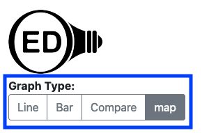
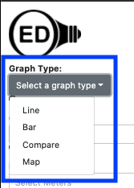
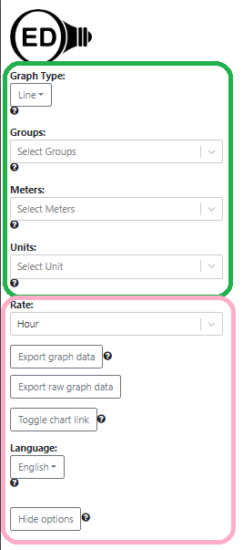
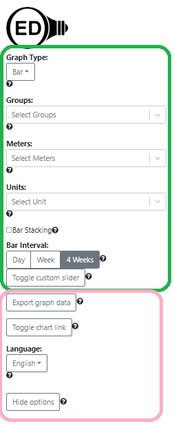
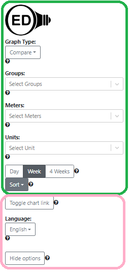
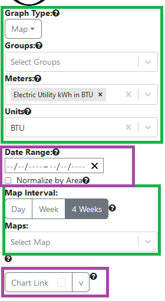
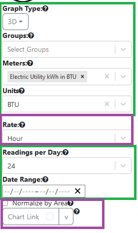
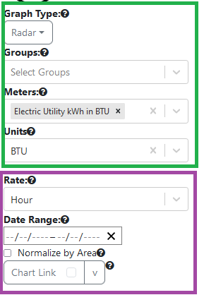

# Reduce options on main graphic page

## Introduction

As OED has added features, there are more options for the user to choose. As a result, OED has changed its look at least twice from buttons to menus:

- The original buttons for choosing a graph type:

became a dropdown menu:

A similar change was made to the page choices in the top, right of the OED screen that went from buttons to a dropdown menu due to the growing number of choices. In both these cases, the growing number of buttons led to formatting issues.

Another place where the number of choices has increased is options on the left side of the OED screen on the graphic pages. The basic idea of the proposed changes is to move less used options to a modal popup, esp. since OED went to a modal look with version 1.0. This is covered by [issue #900](https://github.com/OpenEnergyDashboard/OED/issues/900).

## Overview of change

The OED line graphic page currently has these options on the left where some are not always visible:

The items in the green rectangle will remain on the page as is. The items in the purple rectangle will move to a modal popup. An additional button will be placed below the green rectangle area that will say "More options" (in English and to be internationalized as are all the strings described that are shown to the user). When this is clicked, the modal popup with the moved items will appear. There should be a new help icon for this button (OED will provide the needed text so the implementor can put something short for the help popup that indicates the text is needed.) This modal will also have a "Close" button at the bottom to close the modal.

The bar graphic page will be similar as shown in this image:

The compare graphic page will be similar as shown in this image:

The map graphic page will be similar as shown in this image:

The 3D graphic page will be similar as shown in this image and note the Date Range does remain because 3D limits the allow range:

The radar graphic page will be similar as shown in this image:

This is [issue #900](https://github.com/OpenEnergyDashboard/OED/issues/900).
