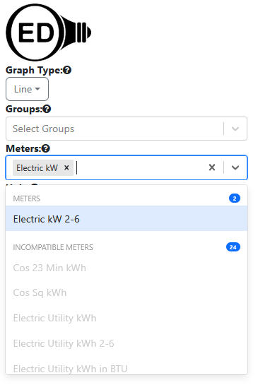

# OED UI Testing

**Note this is a living document of UI testing in OED. It is expected that it will be updated with more information as OED develops its processes. Please feel free to suggest changes and to use this document with its status in mind.**

OED has selected [cypress](https://www.cypress.io/) to do UI testing. An earlier team worked out how to install, utilize and run cypress UI testing for OED (see section below for details). This work did some types of UI tests as examples. Further work is need (see section below for details) to standardize the UI testing and demonstrate across the full range of UI tests desired.

This is covered by [issue #1419](https://github.com/OpenEnergyDashboard/OED/issues/1419).

The first major section below describes the current plans for work and the second describes how to setup and run UI testing.

## Plans for UI testing work

Ultimately, OED would like to do UI testing across the entire application. The hope is that the basic types and methodologies will be worked out first and then the complete UI testing can be done following the work already completed. This section details the work that is desired to demonstrate how to do all the types of tests and create a methodology to run UI tests in a systematic and repeatable way.

Developers should look at the current code in src/cypress to see the current work. Thoughts on improving the current code are welcome and encouraged.

### Standardized testing data (repeatability)

In OED's unit tests that use Chai/Mocha, OED wipes the database before each test to guarantee that the state is known and only contains the desired information (see src/server/test/common.js). This is done by using a test database (oed_testing) so as not to impact normal usage. This system also guarantees that tests are independent so one test does not impact another.

The current UI setup uses the standard (oed) database and also assumes it only contains unchanged developer test data. The following changes are desired:

- Use a test database instead. It is probably fine to use oed_testing but a unique one for UI testing could also be used. This will allow for manipulation without impacting a normally running OED and allow for setup/changes as desired.
- The test DB used should be wiped and then loaded with the desired test data. This will probably be related to the standard OED test data (see npm testData command for how this is done).
  - Note the DB may be modified and/or reset during the testing process as needed to get the desired data.

### Generalize existing tests

Some of the existing tests assume very specific setups and values. It is desired to generalize this to use in other tests as well as to allow for easily updating the test data. For example, src/cypress/e2e/line.cy.ts assumes 10 items, a specific meter and specific axis values. Passing or defining these values would be better.

More generally, it would be nice to see if functions could be created for common tests where arguments define the specific test. The hope is these could be used to test many similar UI elements across OED.

### Redux state testing

OED already has extensive tests to verify that server graphic requests return the correct data. OED wants to now verify that the Redux state in the client has the correct values. This will take the testing a step closer to knowing the displayed graphics are correct. Unlike the server testing that does many cases, verifying the Redux state will be done for each unique graphic with one (or a few) cases since the state creating is the same across different requests for the same type of graphic. At a later time the special cases (no data returned) can be checked in Redux state.

The basic steps envisioned are:

0. Load any needed meter/group data.
1. Click the desired menu(s) to request graphic data. Often this will be selecting a meter or group.
2. Probe the Redux state to see if the correct data is present. The CSV files from the server testing may be useful if that special data is used since they have the expected values.

Cypress has some information on testing Redux state that should be helpful.

After the basic system is working, all the possible requests with unique Redux state will be tested. Here is an incomplete list for the future:

- Meters & groups
- Different time ranges including all time on each side
- Different graphic units
- Error bar values
- All different graphic types

In addition, the admin pages will be tested.

### Validate dynamic menus

As part of OED's desire to make usage as easy as possible, the menus dynamically changes as choices are made to only indicate valid selections. The initial testing will be done with the menus on the graphic pages since they are used the most. The first test to try the idea and set up a general method will be to select an item from the Meters menu. The Groups, Meters and Units menus will now be separated into two groups:

- The upper items will be the compatible/selectable items.
- The lower items will be labeled "Incompatible ..." (the ... depends on the menu) and are not selectable.

The UI test needs to validate that the proper items are in each group. A running version of OED will show the dynamic menus. Also, the [developer test data web page](https://openenergydashboard.org/developer/testData/) has information on this for the standard test data. The section "Meter data" has information for the meter menu and the "Group data" section is for groups. As an example, suppose one wanted to test the choosing the "Electric kW" meter. The row for this meter on the test data web page only has a value for "kW" where the rest are "NA". This indicated that the compatible unit is "kW" and all the others are incompatible. Looking at the column for "kW" shows that the only two meters that are compatible (don't have "NA" as an entry): "Electric kW" & "Electric kW 2-6". Since "Electric kW" was already selected, it will not show up on any of the meter choices (neither compatible nor incompatible) but shows up as a separate item at the top on the meter menu as shown here:



If possible, it would be good to test that the selected item is displayed separately and if the "x" next to the name is clicked then it goes back to the menu for compatible/incompatible.

Going to the table in the "Group data" shows that none of groups are compatible with this meter. For example, the group "Electric Utility 1-5 + 2-6 kWh" indicates one should look at the "Electric Utility kWh" meter. That meter in the "Meter data" table has NA for "kW" so that group is incompatible.

Note using a meter associated with the unit "Electric Utility" would give some compatible and incompatible items on all menus. It was not used as an example since more possible units are involved but would be good for testing at some point.

OED hopes that general functions/testing can be set up to determine if a menu has the correct values. There are more general test needed for some menus. For example, the admin page for groups, where a group is edited, has color coding of items as shown here:


The next step would be to generalize the tests to allow for this type of testing.

### Further testing

There are many more tests that should be run. Once the basic ones above are complete they will be described along with how to test them. If a developer gets to this point then please contact the project for more information if it is not yet written up.

## Setting up and running UI testing

### Requirements

Please refer to the [first steps/getting started page](https://openenergydashboard.org/developer/gettingStarted/) which contain ***installation directions for Docker*** and ***installing running OED*** to get OED to run in your browser. It is best to verify OED runs outside of UI testing before doing UI testing. Note the OED repository contains the needed files to do UI testing but they are only used when UI testing is run.

The tests assume the [standard OED test data](https://openenergydashboard.org/developer/testData/) is loaded. This means ``npm run testData`` was properly executed within the web container. **At the current time, some tests assume a default OED setup for the site and unchanged test data. The hope is to fix this in the future.**

### Testing environment

Cypress testing is installed using the Docker containerization tool, allowing for it to be segregated from the rest of the system. This approach makes updates easier, since docker uses the latest image tag provided by cypress to create the container (Note: you have to delete the docker container and image and then rerun 'docker compose --profile ui-testing up' to create the cypress docker container with the latest updates). Dependencies are also all taken care of through the container definitions. Testing within a standardized Docker Container ensures best practice and results consistency.

Note this means that cypress is not part of the node packages that are installed within OED. As a result, IDEs will generally show issues with the cypress definitions. Extra care should be take to make sure of proper usage.

### Setup/Running Test Walk Through

To start OED you would run ``docker compose up`` in your local terminal which initializes and starts the web and database docker container. To do UI testing, ``docker compose --profile ui-testing up`` must be used which behaves like ``docker compose up`` but it also initializes and starts the cypress container. The flag ``--profile`` specifies a profile must be passed which then ``ui-testing`` is passed as that argument. This tells docker to run the cypress service within the ``docker-compose.yml`` file alongside the web and database services.

<!--
A few notes on adding video:
1. Go to the GitHub web version of this file. Edit it. drag-and-drop the desired video file where you want it, save/commit the changes.
2. There currently is a file size limit for adding files (maybe 10 MB?). If the mp4 file is too large then its size should be reduced. One option is VLC (see https://www.digitalcitizen.life/make-video-smaller-windows-10/, for example). Do: Media > Convert/save, choose file with Add, click Convert/Save, under Settings use a smaller Profile such as Video for Youtube HD, set the Destination file & click Start.
 -->
https://github.com/user-attachments/assets/34ff6fc7-c30d-4709-b3c9-6d6a0d265344

Note: Ensure docker application is running and after running the command ``docker compose --profile ui-testing up`` with the docker container running for cypress, database & web.

#### Running test

https://github.com/user-attachments/assets/3d95de2e-ceb6-41d7-b711-bca61b0be840

Command to run test: ``npx cypress run`` which should be done inside a shell of the oed **cypress** Docker container that is probably named cypress/included (see [getting started](https://openenergydashboard.org/developer/gettingStarted/) in the section "Using an OED Docker terminal").

### Testing Strategy

Currently when we want to look at a UI element we must manually navigate the page, inspect the page, and copy as selector on the element that you want to test. Once we have this, cypress is able to get elements based on their selector. We decided to do this since the alternative of iteratively looping through the elements would be less precise and less strict testing. Testing using selectors should work well enough for this, as there are little to no dynamically rendered components. In the case of dynamically rendered components the ability to manipulate them may involve more logic and cypress steps in order to work as intended.

### Testing Scenarios

https://github.com/user-attachments/assets/cf0ba738-8499-4605-ab20-09f83edb8470

Currently we test specific elements using the elements' css selector. In the video I first open the inspect element tool and inspect element the menu bar to pinpoint it's location in the html. In this case I recursively open the element's child to see it's children. This is
since trying to inspect element any specific menu item makes the menu disappear and clicking the drop down on the inspect element interface to see menu items also runs into the same issue.

### YML File

The YML File is used by docker to create and start docker containers using docker images. In the case for UI testing, the cypress testing service is listed towards the bottom of the YML file, which describes how to setup the testing container. Currently we are using the docker image provided by cypress and note currently using a Xvfb (X Virtual Framebuffer) as the display that performs graphical operations without a physical display. Currently we do not know how and if there's an option to display what's running in the cypress container. 

### Limitations

Currently there is no way of showing the browser while the test is running (--headed) or showing the cypress testing application (npx cypress open) within the containerized cypress image . For now all testing must be done through the cli and to utilize Cypress’s screenshot feature in order to check what testing is occurring (refer to cypress screenshot documentation).

All testing must refer to web:3000 like ``cy.visits("http://web:3000”)`` or ``cy.visits(“\”)`` the default url set in the YML file (under environment as ``- CYPRESS_BASE_URL=http://web:3000``).

Many tests assume the standard setup and test data.  In the future we should wipe the database and load the needed data (maybe without the actual meter data until needed) in a similar way to how the Chai/Mocha tests work. There are TODO items in the code for many of these.

src/cypress/e2e/general_ui.cy.ts has tests that do not currently work and need to be fixed:

### Notes

For all cypress testing scenarios is visited the webpage web:3000 is the only page
The cypress container nicely interacts with the web container.

```install_args="--skip_db_initialize" docker compose --profile ui-testing up```

Running the command above skips initializing the database container which saves time during testing. Run the command only if the database hasn’t been altered.

### Known Errors

Error response from daemon: network 6c6712650678a8a6aa53d3a085404410fe64b2dfe2c4e132939beeec1dbef6dc not found \
**Solution: Delete the all or the cypress  docker  container and the image and rerun ``docker compose --profile ui-testing up``**

There might be something wrong with a Docker container during initialization. When in doubt try to delete the docker containers and rerun.

“Failed to connect. Is Docker installed?” (On VSCode Docker Extension) \
Solution: Reboot System

### Video files

The original and reduced size (as displayed with "Small" at end of name) video files are available in the repository file list.
