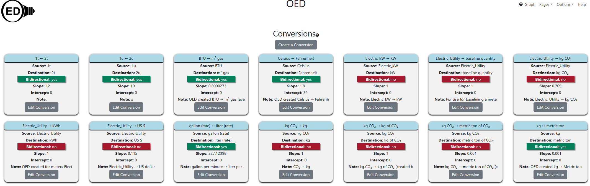
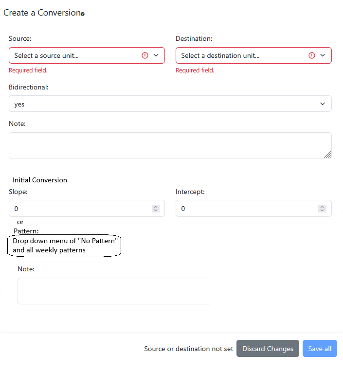
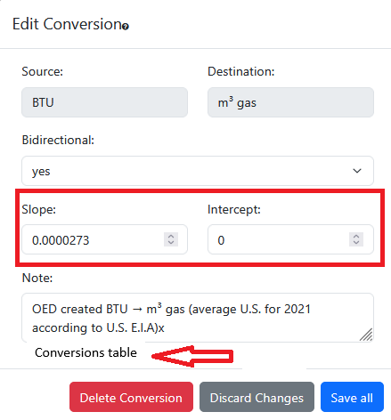
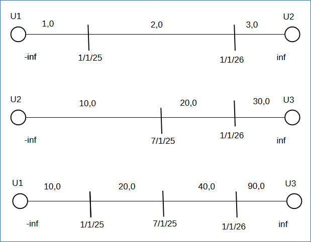

# Conversions that vary with time

## Introduction

The current [resourceGeneralization](../archive/resourceGeneralization/resourceGeneralization.md) designed conversions between units that did not vary. It was the core of OED V1.0.0. This document discusses how OED can extend this idea so conversions will vary with time.

There are conversions that sites want to vary by time including:

- Area normalization (see [design document](../archive/areaNormalization/areaNormalization.md)) where values can vary with building changes. If variation is allowed then changes will be needed to how it is implemented since it assumes fixed areas and is done on the client rather than the server side.
- Cost. This one may differ from the others in that costs can vary by time of day and even the day of the week. Thus, the general solution would allow repeating costs over time that can be also change periodically. This means lots of time variations which is unlike the first use above.
- Baselines which can change if a building is changed. OED has yet to implement this feature but it is moving forward (see [design document](../baseline/baseline.md)).
- Weather. Normalize usage by the [weather](../weather/weather.md). In a common way, the degree heating/cooling for each day is determined from local weather and then used to normalize the usage. Other ways are possible. This usage has similarities to cost in the frequency of variation but there is no regular pattern. OED now has a way to get weather data but not normalize it.

See [issue #896](https://github.com/OpenEnergyDashboard/OED/issues/896) about this.

This change is expected to be large and is hoped to be the core of OED V3.0.0. In the big picture, here is the work envisioned:

- The database needs modification to store time-varying conversions and use them to acquire graphic data from readings. It will start with line graphics to do this. This is a critical first step to show the viability of doing this.
- The DB will need further changes to make time-varying conversions work for all graphics.
- A UI will be needed to allow admins to enter time-varying conversions.
- The analysis of the conversions to create the compressed conversions (cik) used by the database will need substantial changes. This will involve JS code and DB changes to store the new information.
- New test cases for time-varying conversion will be needed.

Each of these steps is elaborated on in sections below.

## Basic DB changes & testing

### Background

OED keeps the readings in the original unit of the meter (meter unit). There are conversions from meter units to graphic units. The graphic units are the ones that users can see/display readings in. The OED admin documentation has information on [meter units](https://openenergydashboard.org/helpV1_0_0/adminUnitInfo/) along with information showing the setup of the [website units/conversions](https://openenergydashboard.org/helpV1_0_0/exampleDescription/). OED analyzes the conversions input by admins to create direct conversions from a meter unit to every allowed graphing unit. This information is stored in cik in the database where the i is the meter unit and the k is the graphic unit. This allows OED to easily convert from meter readings (in the meter unit) to the desired graphic unit. The original design is discussed in the [resource generalization design doc](../archive/resourceGeneralization/resourceGeneralization.md) where it has been modified over time, esp. to [remove pik state](../archive/pikState.md). All conversions are done in the DB at the time of a readings request. OED has considered doing some on the client-side (see [issue 1303](https://github.com/OpenEnergyDashboard/OED/issues/1303)) but this will not ever be done if time-varying is done. The complexity of doing time-varying means it will be limited to the server/DB. The update of cik is discussed in a later section. However, what is important for this section is that changing how the DB does conversions when getting readings will implement time-varying assuming cik now properly reflects this idea. The format of the returned readings, all routes and graphics will remain the same.

### Basic DB changes

The conversions and cik tables need to be modified so each one has a date/time range (or a start/end time). The next step is to modify the meter line reading function (meter_line_readings_unit in src/server/sql/reading/create_reading_views.sql) to properly use the new cik that has time ranges. Here are the steps envisioned:

- The current developer test data will be used where the time range will be set to (-infinity, infinity) so they span all time. This means they will act the same as the original system. The changes will initially be validated for these conversions and timed to see how much the system slowed down.
- A conversion will be split at a day boundary with different conversions for each part. Doing it on a day boundary will guarantee that the conversion completely overlaps all test data except the 23 minute ones that will not be used at this point. This will test a simple conversion that varies with time. The daily, hourly and raw data can be tested. The result will be validated and timing determined.
- A conversion will be split at several points to validate/time the system.
- Now a conversion will be split at many points but on day boundaries. A one year test meter (such as the 15 min meters) can be tested with a conversion that varies each day. Using a script/program to generate the needed inserts into cik in the DB should make this fairly quick. This will be tested/timed. It should be a strong test of the new system with about 365 different conversions applied for each day.
- The same idea as the previous step but split on each hour boundary. For a year this would create about 365 x 24 = 8760 different conversions. This will see the correctness and timing in this case.
- A 23 min meter can be tested to see what happens when the reading can cross conversion boundaries with the same conversions as the last two step. This will require extra SQL logic to work so it is important to know if it is fast enough so OED can allow arbitrary conversion times.
- The 4 day meter can be used to test what happens when a reading is longer than the conversions with the conversions by the hour. The inverse of a reading inside the conversions was already tested.

At some point both the result from the DB and on the web page showing a graphic should both be validated.

If all these are successfully accomplished and the timing is okay then it would seem time-varying conversions should work across OED. The basic testing would be complete.

A team is working on doing this testing in the spring of 2025.

### Potential DB solution

During a discussion with @simonbtomlinson, he felt OED could efficiently implement this by creating conversions that had time ranges in a way similar to readings. He outlined potential SQL as (done quickly and does not exactly match what OED has now):

```sql
create table conversions (
    id serial,
    rate real,
    valid_for tsrange
)

    -- for example, for conversions valid forever
    insert into conversions(rate, valid_for)
    values ('1000 watts / kw', tsrange(-inf, inf));
    
create table hourly_readings (
    reading real,
    duration tsrange,
    conversion_id integer references conversions(id)
);
    
select
    hourly_readings.reading,
    hourly_readings.duration,
    sum( -- Calculate adjusted rate = reading * (conversion_rate * % of reading that conversion applies for)
        hourly_readings.reading * conversions.rate
        * (
            conversions.valid_for * hourly_readings.duration)
            / (hourly_readings.duration)
            ) as converted_reading
from hourly_readings
inner join conversions on conversions.id = hourly_readings.conversion_id
                    conversions.valid_for && hourly_readings.duration -- they overlap
group by hourly_readings.duration -- unique per reading, need more with meters
```

The basic idea to apply the time varying conversion in a similar way that readings are averaged by determining the overlap in time and properly applying. Note that an actual solution would do a slope (rate above) and an intercept (not above). The above has a key for the conversion in the hourly_readings table but OED does not do this. The conversion is found from the passed meter and graphic unit. This and other items will mean the actual OED SQL will differ from what is above.

Note OED has an hourly and daily view so both will need changes. If these work then the raw/meter readings also need to be incorporated into the system. See src/server/sql/reading/create_reading_views.sql for those DB functions. It may be valuable to see the description in the devDocs for [resource generalization](../archive/resourceGeneralization/resourceGeneralization.md) that describes how the older functions worked (see [section other-database-considerations](https://github.com/OpenEnergyDashboard/DesignDocs/blob/main/archive/resourceGeneralization/resourceGeneralization.md#other-database-considerations)).

The design of the new conversion storage in the DB needs to be worked out. It may be the case that there will be a new conversion table that holds the conversions by time with a foreign key into the modified current table that holds the rest of the information on the conversion that does not vary with time. If the conversion does not vary then there would only be one entry in the new table for that conversion. If it varies then there would be one entry per range (see below). At the current time this is not being done. The hope is all conversions will vary with time and (-infinity, infinity) will be used for ones that effectively don't. Note a basic implementation was done in spring 2025.

How efficient this will be, esp. when the conversion varies with time, needs to be tested. If necessary, limitations on the variation can be imposed and OED could retain the current non-varying conversion system. Another alternative is to create views for each meter unit to graphic unit so the overall conversion is precomputed and not done on the fly. The view may be needed.

Note that Simon is still helping to figure out good ways when conversions and readings cross boundaries. It is not clear that will be fast so an alternative may be altered views.

## Further DB reading data changes

It is unclear which readings from the DB will be completed as part of the basic DB changes. This is a complete list:

- line: meter_line_readings_unit & group_line_readings_unit in src/server/sql/reading/create_reading_views.sql; same used by radar & compare line.
- bar: meter_bar_readings_unit & group_bar_readings_unit in src/server/sql/reading/create_reading_views.sql; same used by map.
- compare bar: meter_compare_readings_unit & group_compare_readings_unit in src/server/sql/reading/create_function_get_compare_readings.sql
- 3D: meter_3d_readings_unit & group_3d_readings_unit in src/server/sql/reading/create_function_get_3d_readings.sql

While the ideas will be similar across all the functions, the details will vary. Note many group functions call the equivalent meter function so they could work without change.

Each item needs to be tested (DB and web graphic result) & timed to test efficiency. Any needed/desired optimizations will be performed. The results will be added to the ones already documented from the basic DB work.

## Other DB changes

Overall conversions discusses a link between this and individual conversions. To support this, the database needs a second table conversion_segments to associate all conversion regions with a foreign key to the conversion table for which it applies. Thus, there will a row for for each conversion segment and the conversion id for which it applies. The number of rows with the same conversion id will be the number of conversions in that overall conversion. Each row will have the needed info for a conversion. Also, the (overall) conversion table will no longer have a slope and intercept as these are in the associated conversions. A migration will be needed to convert an existing conversion into a new one with only one associated conversion with the current slope/intercept that goes from -inf to inf.

See the sections on patterns for day and week for items. The database needs tables to support these.

See section on Cik for the new table needed to do those implementation steps.

## UI for time-varying conversions

As is the current case, all pages for conversions will be restricted to admins.

### Overview

Time varying conversions will fall into two categories for OED. In this discussion, a conversion is what the admin enters (not the cik from OED's analysis) for a given conversion between two units. The units of the conversion may be of any type within the restrictions that OED already imposes. An overall conversion is the fact that a given pair of units have a conversion between them. An overall conversion will be associated with one or more conversions to show how it varies with time. Note it is allowed that different time ranges (conversions) for an overall conversion can use any type of conversion (described next).

These are the types of conversion that will be used. They are broken up into two overlying groups since those represent how they will be implemented.

- The conversion has only one slope/intercept that spans the entire time of the conversion. This covers several types of usage:
  - The overall conversion spans (-infinity, infinity). In this case there will be only one conversion in the overall conversion. This is the way to specify the equivalent of the original conversions that do not span time.
  - The overall conversion has multiple conversions that do not have a pattern or are not entered as a pattern. The different conversions for each time range are entered manually by the admin so there are multiple entries for the overall conversion.
  - The overall conversion has multiple conversions where there are many of them and manually inputting them would be difficult. This is similar to the previous case but is not entered manually.
- The overall conversion has multiple conversions that follow a regular pattern that OED supports. The plan is to have a single conversion entry that represents the pattern where OED will then determine the days for which it applies.

Two of the types of conversions will be future work but the system is designed to make that extension fairly easy. These are:

- Multiple conversions that are not manually entered. There are some utility rates that are varied based on overall system usage that fall into this category. The rate is provided after the fact. OED should have a method to upload the the varying conversion that will likely be similar to uploading readings or meters via a CSV or route point. There are a number of potential issues including: care will be needed to be sure there are no gaps in time (assuming that is required as expected) and readings may appear before the corresponding conversion is entered.
- Exceptions for the regular pattern. For example, many utilities charge the low/weekend rate on certain holidays. See the later section on basic research done on this.

## Conversion ideas

The current ideas in resource generalization are mapped to the new system by setting the start/end timestamp (valid_for in @simonbtomlinson code) to -inf and inf (or some appropriate value) to indicate they apply to all time. These effectively create conversions that do not vary with time.

For ones that vary with time, there would be multiple conversions (OED uses the source/destination as the primary key and not the id as in @simonbtomlinson code) where the primary key would also include the start timestamp as does readings. The exact primary key needs to be worked out.

To simplify the system and to make it (probably) better, OED will not allow gaps in time for conversions for a given source/destination. This means that all the conversions for a given source/destination must span -inf to inf without any gaps. Clearly the ones that don't vary, as described just above, meet this criterion. The rationale for this is if there are gaps then the conversion will not be applied and the values would probably be misleading. With readings, gaps are allowed because the values are generally coming via meters where failures can occur. This is somewhat beyond the control of the admin of the OED system so OED deals with them. In this case the reading value shown by OED will be impacted but there is not much OED can do. OED does account for the missing time to make the average reflect the time for actual points if they partly overlap the reading point being shown. If there is no overlap then no point is shown. While something similar could be done for conversions, it is unclear we should. The main argument is that the conversions are set by the admin so they can enter a value for all times. If it is unknown they can set the slope/intercept to 0 so the value will be forced to the x-axis in the graphic. However, it does not seem common that part of the conversion time would be unknown. One case that might cause issues is where conversions are automatically set such as weather or cost. Something needs to be done if there are missing values. This decision needs review and finalization.

## Entering conversions

Given you can have lots of conversions that vary with time, a new interface will be needed for the admin to enter these values.

### Overview page

This will be modeled on the current admin conversion page with a card for each existing conversion:



The "Create a Conversion" button will serve a similar purpose to create the first time varying conversion for a given source/destination but the details are different.

 The card will show similar information but not a slope/intercept and represent the overall conversion. The "Edit Conversion" (planned to be updated to "Details/Edit Conversion") will allow for viewing all the conversions associated with the overall conversion and for modifying it. As such it will be very different from the current popup. It will be similar to the [baseline display/table for meters](https://github.com/OpenEnergyDashboard/DesignDocs/blob/main/baseline/baseline.md#detailsedit-baseline-of-a-meter).

 Note there is a good chance the related look of the baseline effort is ongoing while this effort is made. Coordination between the efforts and reuse of code should be utilized.

 Each popup/page is described next.

### Creating a conversion

 This page is similar to the current popup but also allowing to set the first conversion for this overall conversion. The popup will look something similar to the following:



When a conversion creation is started, the pattern will be No Pattern and Slope = Intercept = 0. Whenever the pattern is No Pattern, the slope and intercept values are shown and can be edited. When the pattern is a weekly pattern the slope and intercept are grayed out without a value and cannot be changed. This enforces that only one of these is set/active at any time. If it goes from a weekly pattern to no pattern then the Slope/Intercept start with a value of zero. In all cases, the admin is warned, as is currently done, if the Slope and Intercept remain zero and if the Intercept is non-zero (only applies if pattern is No Pattern).

The Pattern will be set via a drop down menu where the selected item is the current choice of pattern. The first choice in this drop down will be "No Pattern" that indicates there is not a pattern. The remaining choices are an alphabetical list by name of weekly patterns.

The Note below Initial Conversion is a Note for the conversion and differs from the Note above for the overall conversion.

When this first conversion is finished being created, the admin returns to the creation modal to allow for saving (or cancelling). The save is slightly more complex because the id of the new overall conversion is not known until it is added to the DB. The initial conversion needs this id as a foreign key to save the conversion. It should be dealt with in a single route to the server and multiple steps to save the two items. Note the dates for the initial conversion are (-inf, inf) since it must span all time.

### Editing a conversion

As described above, editing a conversion will have similarities to baseline but with some changes:



The Slope/Intercept will be removed as shown in the red box. The conversions table will be added where indicated and highlighted with a red arrow in the figure (not in OED). As noted for baselines, this may need to be changed to a page for space reasons but hopefully not.

The admin can directly edit the Bidirectional and Note but not the other values as is currently done.

The "Delete Conversion" button will still delete this overall conversion. This means all the associated conversion are no longer associated with it so that also needs to happen. It is believed the same rules will apply as currently deleting a conversion but this should be verified.

The conversions table has a row for each conversion in this overall conversion. The conversion rows will be sorted by the time range it applies where the start date/time is equivalent. The following tables have the basic layout/structure but it will look a little different on the OED page and similar to baseline. The first row is the headers, the next a description and the following rows are examples.

| Dates | Slope |  Intercept | Pattern | Note |    |    |    |    |    |
| :---- | :---- |  :-------- | :------ |:--- | :- | :- | :- | :- | :- |
| The date range that this conversion applies separated by a hyphen. If it is -inf or +inf then it has a special representation. | Slope for conversion where it is empty if a pattern (not No Pattern). | Intercept for conversion where it is empty if a pattern (not No Pattern). | Will have the pattern name to use or "No pattern" if not using a pattern. | Any note associated with this conversion. The first ~100 characters (value based on look) will be shown and popup with the full message on click as done with the log messages. This differs from the Note above that is for the overall conversion. | Button "edit" | Button "Split adding earlier conversion" | Button "Split adding later conversion" | Button "Delete changing earlier conversion" | Button "Delete changing later conversion" |
| March 9, 2024 00:00:00 PM to January 2, 2025 00:00:00 PM | 123.45 | 0 | No Pattern | Sample with full dates and no pattern | see below | see below | see below | see below | see below |
| March 9, 2024 00:00:00 PM to January 2, 2025 00:00:00 PM |  |  | Weekly ABC | Sample with full dates and pattern | see below | see below | see below | see below | see below |
| to January 2, 2025 00:00:00 PM | 123.45 | 0 | No Pattern | Sample where it applies from -inf and no pattern | see below | see below | see below | see below | see below |
| from January 2, 2025 00:00:00 PM |   |  | Weekly XYZ | Sample where it applies to +inf and pattern | see below | see below | see below | see below | see below |

The buttons will each allow the admin to modify the conversion in this row as described below. The comments in baseline (except applies to a conversion) are not repeated here and only differences are noted.

#### Edit button

The admin can modify the non-button values in the row. The actions are similar to creating the first conversion. Editing the Dates or Note is similar to baseline. The Pattern will be set via a drop down menu as done above for creating a conversion along with the slope and intercept.

#### Split adding earlier conversion button

This is similar to baseline. The new conversion takes on the standard default values and is created similarly.

#### Split adding later conversion button

Similar to the item above and baseline.

#### Delete changing earlier conversion button

Similar to baseline but for conversion.

#### Delete changing later conversion button

Similar to baseline but for conversion.

## Days & Weeks to create patterns

The following sections describe how to enter a pattern for use in a conversion. Note, non-repeating values is covered above through creating an overall conversion and editing conversions.

## Pattern: Repeating values

OED will support repetition patterns where the pattern is on a per week basis. This will simplify the system while still supporting these known use cases:

- Each weekday has the same values and each weekend day as the same values that differ from the weekday.
- Each day of the week is different.
- Weekly patterns that periodically change by specifying the range on each pattern. For example, the daily cost is one value from April through September and a different values from October through March. At this time OED will not have a yearly pattern so this must be done manually which seems acceptable since these tend to be long-term changes and the value can also change over these long timeframes. This is done by setting appropriate time frames on the overall conversion.

This will be accomplished by specifying the conversions across a day and then assigning a specific day to each day of a weekly pattern. This means a week is composed of seven separate days where the same day can be put in multiple days of a week. An advantage of this setup is that holidays that span a full day(s) (as is normal) will be an exception to a given day in the weekly pattern. It is possible to do this with the exception system envisioned (see below). A disadvantage of this setup is that conversions that cross a day boundary will show up as two conversions. For example, if the cost goes from 22:00 to 06:00 then one day would have this conversion from 22:00-24:00 and the next would have the same conversion values from 00:00-06:00. (Note the actual end of a day is 00:00 of the next day in the code.) It may be possible to optimize this case in the future to combine the two conversions when applying but it is unclear that is necessary for efficiency so it will not be done initially.

The following sections discuss how day & week will be specified. As discussed above, the week can be used as a pattern in a conversion. It is fine to use a week in multiple patterns knowing that changing the pattern will impact all uses.

### Day

Conceptually, OED will treat a day as an overall conversion which starts at 00:00 and ends at 24:00. When a new day is created, it has an initial conversion with these time limits along with a slope and intercept (0 until set). There is also a name and note associated with a day. The vision is there will be a new "Day" choice in the "Pages" menu for admins. This will take the admin to a new page that is similar to conversion (and other pages) that has a create button and cards for each existing day. Creating or going to the details/edit of a card will have similar looks and processes to the conversion page described above. Keeping them consistent is valuable for the admin to reduce the cognitive load to use the pages. Once the first day range/conversion is created, the table will allow editing, splitting and deleting of the day range/segment. Each day segment row will have these values:

- Hours in the day to which it applies.
- slope
- intercept
- note

and the buttons as for the conversion table above using day in the text. Clicking a button will have a similar action to the conversion above.

Note one difference is that start/end of the first/last day range is the hours described and not -inf to inf.

The database needs a day table to store the information on each day. It will need a second table day_segments to associate all day segments with a foreign key to the day table for which it applies. Thus, there will a row for for each day segment and the day id for which it applies. The number of rows with the same day id will be the number of segments in that day. This is similar to the tables for conversions and conversion_segments.

### Week

There will be a new "Week" choice in the "Pages" menu for admins. This will take the admin to a new page that is similar to day that has a create button and cards for each existing week. Each week has these values:

- name
- note
- The seven days that make it up.

Creating or editing a week is similar (except initial values). Everything is blank on creating and the current values on editing. The days in a week will be shown as a table:

| Day of Week | Day |
| :---------: | :-: |
| Sunday      | drop down menu of days |
| Monday      | drop down menu of days |
| Tuesday      | drop down menu of days |
| Wednesday      | drop down menu of days |
| Thursday      | drop down menu of days |
| Friday      | drop down menu of days |
| Saturday      | drop down menu of days |

The drop down menu of days will have a list of all days with the current value selected. If there is no current value then it will indicate the need to select an item as done in the Meters or Groups drop downs on the graphic pages. During creation of a week, the save should be grayed out/un-selectable until all days of the week have a day selected.

A week is composed of seven days and each one will be a separate column in the week DB table. The other needed items will also be included. Each day is a foreign key into the day table as the id.

### Applying a pattern to create conversions

To allow the pattern to be as general as desired and easily support exceptions in the future, the plan is to use ical format. This easily allows repetition of each day segment (RRULE) along with exceptions. There is also software to take the ical format and generate all desired dates across the desired time. The details have not been worked out so decisions and testing will be needed.

Some possible software of interest for doing this follows. It is not an exhaustive list.

- [rrule.js](https://www.npmjs.com/package/rrule): Seems to allow input of RRULE as JSON object and it gives the occurrences/date instances including excepitons. Has ability to get certain ones and provide human readable rule equivalent. Does RRuleSet. BSD license. Seems nice. Seems best obvious one on npmjs.com. Mostly done 2013 & 2018 and a little at other times. Heavily used.

- [ical.js](https://github.com/kewisch/ical.js?tab=readme-ov-file): Parse formats such as iCalendar & jCal. MIT license. Maybe be part of Mozilla.

- [iCalendar Viewer](https://www.ratfactor.com/tools/icalendar-viewer): Uses ical.js from Mozilla to parse and display iCal format in a human readable format. Last update in 2023. Unsure needed except debugging.

- [iCalcreator](https://sourceforge.net/projects/icalcreator/): PHP, for using with other software. Last update 2017. GNU license. Uses ical.js and probably less directly relevant and license is an issue.

- [RRULE generator](https://icalendar.org/rrule-tool.htm): Menus to tell rule and gives RRULE. May be good for testing the rule created.

- [iCal4j](https://www.ical4j.org/) Seems to have lots of software to work with iCal and generate needed info along with extensions. Maybe of interest but in Java.

- [ical-ts](https://github.com/filecage/ical-ts): TS compliant but no license, unsure if really used, done by one person mostly in 2023.

### 251103 Update for applying RRULE to cik_vary

The creation of cik_vary needs to be updated for patterns. The code to deal with conversion segments that have a slope/intercept (no pattern) was added in PR 1532 to the timeVary branch of OED. The envisioned changes follow.

``timeVaryingPathConversion()`` in src/server/services/graph/timeVaryingPathConversion.js handles the conversion segments. It needs logic to deal with conversion segments with patterns. For now, OED will create new segments so a given conversion segment in the current code will be split into multiple segments based upon the pattern specified in the original conversion segment. This means OED will need to store a lot more segments for the pattern and these may create more new entries in cik_vary when combined with other segments along a path. Currently the code stores all the cik_vary items and then puts them in the DB. The hope is that the total number will still be low enough so this is possible in the code. For an example that pushes the sizes involved to be a maximum:

- 5 day segments in each day.
- For 7 days per week there are 5 x 7 = 35 segments/week.
- In a year there are about 35 x 365 = 12.8k segments/year.
- You need a slope, intercept, start date/time & end date/time for each segment entry. Say this takes 50 bytes (exact size unclear).
- Assume the pattern spans 20 years then you have 12.8k segments/year x 20 years x 50 bytes/segment = 12.2 MB.

How large the total cik_vary will be is uncertain but (hopefully) most paths are not likely to have multiple time-varying patterns so the total number of cik_vary and size should be similar. If this is true then the max size is low tens of MB and that should be doable on an OED server. Given this process is not done often and the next step of calculating all the reading views takes time/memory, it is hoped patterns will not substantially change resource usage. This could change if view refreshing is better optimized. This issue will be revisited if concerns are found during implementation or in the future.

- If OED wants to avoid this size because it is too large and/or to optimize memory then the algorithm should be modifiable to generate patterns on the fly to get the next item rather than in advance. For now, that has not been investigated.

In the following, the modifications needed have comments with "NEW" with "NEW - start"/"NEW - end" surrounding code with multiple new lines. The code has not been tested and is really pseudocode.

The modified code for ``timeVaryingPathConversion()`` is:

```js
for (let i = 0; i < path.length - 1; ++i) {
	const sourceId = path[i].id;
	const destinationId = path[i + 1].id;
	//segments are sorted by start_time in getBySourceDestination
	let segments = await ConversionSegment.getBySourceDestination(sourceId, destinationId, conn);
	// NEW - start
	// Tell if the conversion direction is okay (false) or must be reversed (true). Assumed false unless found otherwise in next step.
	let reversed = false;
	// NEW - end
	// Did not find the conversion segments. Since conversion should exist, it must be the other way around and bidirectional.
	if (!segments || segments.length === 0) {
		// Check if reverse conversion exists and is bidirectional
		const reverseConversion = await Conversion.getBySourceDestination(destinationId, sourceId, conn);
		// This should never happen. It should have been in the table one way or the other.
		if (!reverseConversion || !reverseConversion.bidirectional) {
			throw Error(`No bidirectional conversion found between ${sourceId} and ${destinationId}`);
		}
		// Fetch reverse segments and invert them
		segments = await ConversionSegment.getBySourceDestination(destinationId, sourceId, conn);
		// This is also really weird that it exist and yet no segments found.
		if (!segments || segments.length === 0) {
			throw Error(`No conversion segments found for reverse direction between ${destinationId} and ${sourceId}`);
		}
		reversed = true; // NEW
	}
	// NEW - start
	for (let segmentIndex = 0; segmentIndex < segments.length; segmentIndex++) {
		const curSegment = segments[segmentIndex];
		if (curSegment.week_patterns_id is null) {
			// The segment does not have a pattern so can use the segments found above for slope/intercept.
			if (reversed) {
				//  Reversed so invert segment found.
				const { convertedSlope, convertedIntercept } = invertConversion(curSegment.slope, curSegment.intercept)
				curSegment = {
					...curSegment,
					slope: convertedSlope,
					intercept: convertedIntercept
				};
			}
			// It may be possible to avoid this push by directly putting segments into edgeSegments. Given there should not be
			// too many without a pattern it probably is not too important.
			edgeSegments.push(curSegment);
		} else {
			// The curSegment has a pattern.
			// Here are the steps needed:
			// 1. Use the pattern for this segment to create an RRULE.
			// 2. Use an RRULE generator to create all the needed conversions from segments.start_time to segments.end_time.
			//   2.b. If reversed is true then invert the slope/intercept for each conversion using invertConversion().
			// 3. Each segment is added to edgeSegments with the start_time, end_time, slope & intercept.
			// It can be done one at a time or all at once. If possible, this should be done without another copy as patterns can
			// generate a lot of items so fewer copies is better.
			// Note the next step assumes the segments/conversions are sorted by start_time order for each entry in edgeSegments. It does not matter
			// how these are generated but they must be sorted in the end so manually sort the ones created by RRULE if needed. This may be needed
			// if each day segment is generated by its own RRULE so all the segments have to be merged together. If this is done
			// the the values across segments will be fine as they are processed in the sorted order of time.
			// NEW - end
		}
	}
}
```

### Duplication

There may be some value to users to allow them to duplicate a day or week to simplify changes. This would take a little effort and given that setting up a day or week is not too hard it will not be done initially. It could be added later.

## Updating cik

In the current system, admins input conversions. OED then analyzes the conversions to create cik. This uses a graph where the units are vertices and the conversions are edges with arrows so directional. Starting at each meter unit, all paths to graphic units are found and the overall conversion is obtained. The overall conversion from each meter to graphing unit is stored in cik in the DB and transferred to the client on starting. These are all that is needed to determine unit relationships for the menus and graphics.

Time-varying conversions do not fundamentally change the idea but it does add complications. Primarily, to support this, the equivalent cik values need to have time ranges associated with them. OED may keep the original cik table without the slope/intercept since that simplifies getting it to the client when needed. A new table, say cik_vary, will store the conversion (slope, intercept) for each time range and meter/graphic unit. Determining the slope, intercept is more complex since it is combining a series of conversions that can vary with time and the time range may differ across conversions. As a simple example, an overall conversion for three units that are chained together with only a few conversions for each overall conversion is used (ote the scale of time is not accurate).



An example of the values: from 1/1/25-7/1/25 has 2,0 for U1→U2 and 10,0 for U2→U3 so combined is 20,0 for U1→U3. Note that whenever the time ranges do not line up in the chaining will cause another range in the chained conversion. When you have lots of different ranges and a longer sequence of units it can add a lot of ranges.

The general algorithm proposed for combining conversions is outlined here:

- Find the path from the meter unit to the graphic unit as was done previously using the overall conversions.
- Set currentStart to -inf.
- Sort each coverall conversion on the path by increasing time of the range for each conversion in that overall path.
- Set the currentRange for each overall conversion in the path to first sorted conversion.
- Begin loop
  - Find the minimum time for the end of the currentRange for all overall conversions on the path and call this currentEnd. In case of a tie then choose any of these.
  - Combine all the conversions for the path in the proper order for the slope & intercept. This is the needed conversion for cik_vary where the time range is currentStart to currentEnd.
  - If currentEnd is inf then exit loop (better way would be nice to avoid exit in middle of loop)
  - Set the currentRange to the next segment on any overall conversion that has its end time of the current range the same as the currentEnd. The example shows this at 1/1/26. The algorithm will pick either one for the minimum end time but all must advance since the total range of both conversions has been included already.
  - set currentStart to be currentEnd.
- End loop

This should give all the ranges in the overall conversion from the start unit to the end unit on the desired path. Each one must be stored in cik_vary.

Here are two alternative to storing cik during the calculation of cik_vary. Since they are done in the DB they guarantee that cik and cik_vary are consistent (but they should be if the above algorithm is correct).

- Use a materialized view for cik that finds all the unique meter unit/graphic unit rows in cik_vary. This would be refreshed each time cik_vary is changed.
- Same idea but do each time cik is needed. This avoids duplicating information but it might be too slow or use a lot more server time since it is done each time a user requests the cik data for the client.

## Other items

### Routing

The current graphics route back data from the server to the client and into Redux state. It is hoped that the new system will have conversions that are similar to the current system so there are not many changes in this area. Note cik has the slope and intercept but it is never used. It should be removed. The routes for conversions need to be updated for the new information for time-varying.The time-varying equivalent of cik is not needed on the client-side.

### Graphics

Unless there are performance differences that are of concern, the plan is to treat all conversions similarly so they will show on the same user graphics as they currently do. The fact that a conversion varies with time does not change any of the calculations concerning its compatibility for menus/graphics. Thus, the hope is for minimal changes in this area.

### New test cases

These need to be worked out. The current reading tests will be a good start.

### Exceptions for conversion patterns

Assuming the plan to use ical RRULE to create patterned conversions is used, the exceptions for holidays could be added via EXDATE. The question is how to do that. This has not been completely worked out. However, basic research found that there is free software to determine holiday dates for locations around the world. These are specified here as a starting point for future efforts.

- [date-holidays](https://github.com/commenthol/date-holidays): npm package with lots of downloads, ISC license. Lots of contributors. Works worldwide. Returns holidays as array of JSON objects. Can also check if a date is a holiday. This may be the most promising.

- [date-holidays-ical](https://github.com/commenthol/date-holidays-ical): ISC license. Looks interesting but unclear exactly what does. Uses date-holidays. It may be a way to convert date-holidays to ical. Seems interesting but not used much and pretty much one person.

- [dates-holidays-parser](https://www.npmjs.com/package/date-holidays-parser): ICS. Seems an add-on to date-holidays but unsure what adds.

- [CalendarLabs](https://www.calendarlabs.com/ical-calendar/holidays/afghanistan-holidays-327/): Seems to allow subscription and download but uncertain. Unsure have archive of all years.

- Google calendar API: Unsure works as desired but start of idea may be at [stack overflow](https://stackoverflow.com/questions/30833844/get-holidays-list-of-a-country-from-google-calendar-api#).

## Update May 2024 - Historical

These are mostly notes from a team that did preliminary work on this. They may be useful as the process moves forward.

This part of the design document describes a potential solution attempt for issue #896, it involves implementing the needed database function to efficiently allow for a time conversion feature.

As of now, any changes we have made exist in new files with similar names to the current existing files for testing purposes. After testing has been done the current files should be updated.
We have updated the current conversion table to include a *start_time* and *end_time*, this would replace the *valid_for* in the original table.
The new *conversions_time* table is found in ``create_conversions_time_table.sql``

The source and destination id's reference units that already exist in the ``create_units_table.sql`` By adding a CHECK, the database will prevent duplicate conversions. The slope factor represents the proportional change applied to the original reading.

Bidirectional refers to if the conversion can be done forwards and backwards between the two units. Not all conversions can be bidirectional.
conversions_time.reading is a placeholder parameter for our testing purposes that may need to be removed after implementation.

We have found that using a '-infinity' and 'infinity' are acceptable timestamp values for start_time and end_time, for conversions that can exist across all time.

```sql
CREATE TABLE IF NOT EXISTS conversions_time(
    conversion_id SERIAL PRIMARY KEY,
    source_id INTEGER NOT NULL REFERENCES units(id),
    destination_id INTEGER NOT NULL REFERENCES units(id),
    reading FLOAT NOT NULL, 
    bidirectional BOOLEAN NOT NULL,
    start_timestamp TIMESTAMP, --  TIMESTAMP ‘-infinity’
    end_timestamp TIMESTAMP, --  TIMESTAMP ‘infinity’
    slope FLOAT, --this is the rate
    intercept FLOAT,
    note TEXT,
    CHECK (source_id != destination_id)
);
```

Currently, the dashboard still does not have the front-end functionality for admins to insert the actual conversion information. This is a front-end feature that should be handled by a front-end team.
For example, the admin would insert a conversion whose time ranges are -infinity to infinity, this front-end functionality should be implemented using ``insert_new_time_conversion.sql`` and ``ConversionsTime.js``

```sql
INSERT INTO conversions_time (source_id, destination_id, reading, bidirectional, start_timestamp, end_timestamp, slope, intercept, note)
VALUES (1, 2, 10, true, '-infinity', 'infinity', 0.5, 2.0, 'Example conversion');
```

The unit selected by a user can then be converted into another unit, if the time selected by the user exists in a conversion.

The updated readings table in ``create_readings_time.sql`` that now includes a conversion id

```sql
CREATE TABLE IF NOT EXISTS readings_time (
    meter_id INT NOT NULL REFERENCES meters(id),
    reading FLOAT NOT NULL,
    start_timestamp TIMESTAMP NOT NULL,
    end_timestamp TIMESTAMP NOT NULL,
    CHECK (start_timestamp < readings_time.end_timestamp),
    conversion_id integer references conversions_time(conversion_id),
    CHECK (start_timestamp < readings_time.end_timestamp),
    PRIMARY KEY (meter_id, start_timestamp)
);
```

This is more example test data we plan to use

```sql
INSERT INTO conversions_time (source_id, destination_id, reading, bidirectional, start_timestamp, end_timestamp, slope, intercept, note)
VALUES 
(1, 2, 5, true, '2024-04-01 00:00:00', '2024-04-02 00:00:00', 0.5, 2.0, 'Example conversion 1'),
(2, 3, 10, false, '2024-04-01 00:00:00', '2024-04-03 00:00:00', 1.0, 0.0, 'Example conversion 2');


INSERT INTO readings_time (meter_id, reading, start_timestamp, end_timestamp, conversion_id)
VALUES
(1, 50, '2024-04-01 06:00:00', '2024-04-01 12:00:00', 1),
(2, 75, '2024-04-01 12:00:00', '2024-04-02 06:00:00', 1),
(3, 100, '2024-04-01 06:00:00', '2024-04-02 06:00:00', 2);
```

We have built upon the proposed solution and adjusted it to reflect the new tables. However in the provided SELECT query, there is still no involvement of the intercept column from the conversions_time table in the calculation of the converted readings. The calculation only utilizes the slope column. The result set itself is not stored permanently in the database; it's just used temporarily as part of the query execution process.

```sql
select
    readings_time.reading,
    readings_time.start_timestamp,
    readings_time.end_timestamp,
    conversions_time.start_timestamp,
    conversions_time.end_timestamp,
    sum( -- Calculate adjusted rate = readings_time.reading * (conversions_time.rate * % of reading that conversion applies for)
        readings_time.reading * conversions_time.slope
        * (
        (readings_time.end_timestamp - readings_time.start_timestamp) * (conversions_time.end_timestamp - conversions_time.start_timestamp))
        / (conversions_time.end_timestamp - conversions_time.start_timestamp)
    ) as converted_reading
    from conversions_time
    inner join readings_time on readings_time.conversion_id = conversions_time.conversion_id AND (readings_time.end_timestamp - readings_time.start_timestamp) && (conversions_time.end_timestamp - conversions_time.start_timestamp) -- they overlap
    group by (conversions_time.end_timestamp - conversions_time.start_timestamp) -- unique per reading, need more with meters
```

We have tested the creation and insertion of the tables and have seen expected results. We have not tested the select query against the tables. We expect that when testing a reading that does not vary with time, it should maintain its same reading value.

### Notes

These notes were added during review but may not be complete:

- The readings table will not include the conversion. Readings are stored in the meter unit and converted for graphing.
- It is suspected that the final select for readings needs to be modified for multiple conversions that change over time.

## Update May 2025


### Table Modifications
The CIK table has been modified to include time-based parameters. Specifically, we added:

- ``start_time``: Defines when a conversion begins being valid.
- ``end_time``: Defines when a conversion stops being valid.

These columns use timestamps type with defaults of ``-infinity`` and ``infinity`` respectively for conversions that don't vary with time, essentially maintaining backward compatibility with the existing system.

The updated CIK table now looks like:

```sql
CREATE TABLE IF NOT EXISTS cik (
    source_id INTEGER REFERENCES units(id),
    destination_id INTEGER REFERENCES units(id),
    slope FLOAT,
    intercept FLOAT,
    start_time TIMESTAMP DEFAULT '-infinity',
    end_time TIMESTAMP DEFAULT 'infinity',
    PRIMARY KEY (source_id, destination_id, start_time)
);
```
Note that the primary key has been modified to include ``start_time`` to allow multiple conversions rated for the same source across different time periods.

### Integration with Readings
We maintained the existing readings table structure rather than adding a direct conversion reference to it. As noted in the design document, “Readings are stored in the meter unit and converted for graphing.” This decision preserves the separation of concerns in the database design while allowing for the new time-varying functionality.

### SQL Function Updates
We updated the ``meter_line_readings_unit`` function in ``create_readings_views.sql`` to incorporate time-based conversion lookups. The key modification was changing the ``JOIN`` condition to include time range overlap check:

From:
```sql
INNER JOIN cik c on c.source_id = m.unit_id AND c.destination_id = graphic_unit_id
```

To:
```sql
INNER JOIN cik c on c.source_id = m.unit_id AND c.destination_id = graphic_unit_id AND tsrange(c.start_time, c.end_time, '()') && hourly.time_interval
```
We also updated the ``daily_readings_unit`` to incorporate smaller time-based conversion functionality.

### Timestamp Handling
The implementation successfully supports ``-infinity`` and ``infinity`` timestamp values, allowing for both:

- Finite time ranges for conversions that changes at specific points in time.

- Infinite ranges for conversions that apply for all time


We enforced the no gaps are allowed in conversion periods for a given source pair. This ensures that a valid conversion is always available for any timestamp.  

## Testing Results

### Hourly Readings Tests w/ Time Varying

Query: ``select meter_line_readings_unit('{24}', 1, '-infinity', 'infinity', 'hourly', 200, 200);``

| Timespan | Points of data | Time (ms) PC #1 | Time (with caching) | Time (ms) PC #2| Time (with caching) |
|----------|---------------|---------------------|---------------------|----------------------|---------------------|
| 1 Day    | 24            | 500.891 ms          | 315.327 ms          | 131.380 ms           | 130 ms              |
| 7 Days   | 167           | 847.195 ms          | 841.690 ms          | 437.492 ms           | 434.791 ms          |
| 1 Month  | 744           | 3282.888 ms         | 3279.741 ms         | 1672.792 ms          | 1609.225 ms         |
| 3 Months | 2184          | 9306.561 ms         | 9153.339 ms         | 4618.551 ms          | 4536.902 ms         |
| 6 Months | 4368          | 18871.800 ms        | 18821.291 ms        | 7930.092 ms          | 7834.928 ms         |
| 1 Year   | 8784          | 37837.269 ms        | 36410.803 ms        | 17335.164 ms         | 17301.856 ms        |
| 2 Years  | 17540         | 64763.023 ms        | 76054.927 ms        | 47652.153 ms         | 45804.863 ms        |

### Daily Readings Tests w/ Time Varying

Query: `select meter_line_readings_unit('{25}', 1, '-infinity', 'infinity', 'daily', 200, 200);`

| Timespan | Points of data | Time (ms) PC #2 | Time(with Caching) |
|----------|---------------|-----------|-------------------|
| 6 Months | 182 days      | 36.058 ms | 35.360 ms         |
| 1 Year   | 365 days      | 60.254 ms | 57.114 ms         |
| 1.5 Years| 547 days      | 82.422 ms | 81 ms             |
| 2 Years  | 736 days      | 108.398 ms| 106.645 ms        |

Note: Both queries have different numbers at the beginning. Each environment that you run OED on may have different meters numbers. For the meter, we used meter "Sin Amp 1 kwh" ({24} for the first query, {25} for the second query) and for the units we used "kWh" (it is {1} for both queries, but may vary on different environments).

For detailed instructions on how to reproduce these test results, see the [Test Instructions](timeVaryingTesting.md) document.

### Notes
- The timing appears to be linear as data volume increases. There is also a benefit to caching as it shows improvements across all tests. For shorter timeframes (1 day), caching does provide a significant benefit, while for longer timeframes the benefit is less pronounced but still valuable.

- Daily readings are substantially faster than hourly readings. For 2-year timeframes with hourly data (around 17,540 points), query times approach or exceed 1 minute, which might be the upper limit of user timeframe interaction. 

- There is also a noticeable performance difference between two different PC's. PC #2 is roughly 2-2.5x faster than PC #1. This can highlight a potential importance of hardware consideration when it comes to deploying a solution in various environments.

## Update August 2025


### Preliminary Work
We began by integrating the CIK table modifications, integration with readings, SQL function updates, and timestamp handling changes as outlined above in **Update May 2025**. Following this, we were able to replicate consistent testing results, specifically for hourly and daily readings with time-varying inputs, by following the [Test Instructions]([url](https://github.com/OpenEnergyDashboard/DesignDocs/blob/main/unitVaryTime/timeVaryingTesting.md)).

Below are the testing results after incorporating the May 2025 changes. These results will serve as a baseline to track progress as the team works to improve database runtime performance.

### Hourly Readings Tests w/ Time Varying

Query: ``select meter_line_readings_unit('{25}', 1, '-infinity', 'infinity', 'hourly', 200, 200);``
| Timespan | Points of data| Time (ms) PC #1*  | Time (with caching) | Time (ms) PC #2**      | Time (with caching) | Time (ms) PC #3***       | Time (with caching) |
|----------|---------------|---------------------|---------------------|----------------------|---------------------| ----------------------|---------------------|
| 1 Day    | 24            | 111.166          | 143.073         | 281.423          | 65.789           | 157.324          | 115.315          |       
| 7 Days   | 167           | 537.052          | 599.264          | 327.736          | 271.153          | 378.85             | 376.068           |        
| 1 Month  | 744           | 2466.772         | 2483.517        | 1216.803         | 1202.195         | 1648.254           | 1654.315         |     
| 3 Months | 2184          | 6976.787         | 8879.787        | 3975.886         | 3940.586         | 4705.968           | 4745.863         |         
| 6 Months | 4368          | 14382.343       | 15165.883       | 7718.051         | 7814.561         | 9443.269            | 9459.786         |        
| 1 Year   | 8784          | 28702.139       | 28815.986       | 15432.595        | 15693.478       | 19141.15           | 18947.708         |                  
| 2 Years  | 17540         | 58456.253       | 57630.675       |                      |                     | 37087.503          | 36964.301         | 

### Daily Readings Tests w/ Time Varying

Query: `select meter_line_readings_unit('{25}', 1, '-infinity', 'infinity', 'daily', 200, 200);`

| Timespan | Points of data | Time (ms) PC #1* | Time(with Caching) | Time (ms) PC #2** | Time(with Caching) | Time (ms) PC #3*** | Time(with Caching) |
|----------|----------------|-----------|-------------------|----------------------|---------------------|----------------------|---------------------|
| 6 Months | 182 days       | 48.474  | 76.159         | 13.258             | 20.82             | 36.774             | 34.135            |
| 1 Year   | 365 days       | 108.081 | 108.288        | 46.332             | 60.429            | 56.004             | 54.74             |
| 1.5 Years| 547 days       | 105.243 | 112.464        | 82.309             | 75.299            | 79.511             | 76.441            |
| 2 Years  | 736 days       | 132.841 | 125.611        | 99.994             | 90.001            | 97.683             | 97.414            |

<p>&#42; PC #1: Macbook Pro 2019 2.3 GHz 8-Core Intel Core i9 (9th gen) 32 GB RAM (DDR4)</p>
<p>** PC #2: Macbook M1 Pro 2021 8-Core Intel 16 GB RAM</p>
<p>*** PC #3: </p>

### Automatic Query Performance Logging

The following settings enable automatic logging of execution plans for all SQL statements, including those nested within functions or triggers:

LOAD 'auto_explain';
SET auto_explain.log_min_duration = 0;       -- Log all queries, regardless of duration
SET auto_explain.log_nested_statements = on; -- Include nested statements in logs

### Added Indices 

Several indices were added to the cik, meters, daily_readings_unit, and hourly_readings_unit tables. The following screenshot shows all added and preexisting indices across the 4 relevant tables:


By executing the meter_line_readings_unit function with an hourly step and enabling automatic query performance logging, it was determined that PostgreSQL utilized the following indexes to optimize performance:
- idx_hourly_readings_unit_meter_time ( This index already exist )
- idx_hourly_readings_time_interval_gist (``` CREATE INDEX CONCURRENTLY idx_hourly_readings_time_interval_gist ON hourly_readings_unit USING GIST (time_interval); ```)
- idx_cik_tsrange_overlap (``` CREATE INDEX CONCURRENTLY idx_cik_tsrange_overlap ON cik USING GIST (tsrange(start_time, end_time, '()')); ```)
- idx_cik_source_dest_time_range (``` CREATE INDEX CONCURRENTLY idx_cik_source_dest_time_range ON cik (source_id, destination_id, start_time, end_time); ```)

Significant improvements in query performance were observed, though results were inconsistent. Further testing across multiple systems is required to validate the effectiveness of these indices.

### Materialized Views

This work was conducted in the following repository/branch:  
🔗 [OED-backend: `views` branch](https://github.com/oed-csumb-su25/OED-backend/tree/views)

We began by building on the previous group's implementation. Rather than embedding the conversion logic directly within the graphing functions, we refactored it into a materialized view—`meter_hourly_readings_unit_old`. This allowed hourly conversions to be precomputed and stored for improved performance. Additionally, a daily materialized view—`meter_daily_readings_unit`—was created to store daily aggregates of the converted hourly data. Notably, the daily view does not apply conversions directly; instead, it aggregates the already-converted hourly values.

The graphing functions (`line`, `bar`, `3d`, and `compare`) were updated to retrieve converted readings from these views, eliminating the need to apply conversions on-the-fly during each query.

Several indexes were evaluated to determine their impact on query performance. The testing process, including index definitions and timing results, is documented here:  
🔗 [Index Testing Spreadsheet](https://github.com/oed-csumb-su25/DesignDocs/blob/update_conversionsVaryTime/unitVaryTime/OEDFunctionTimings.ods)

Based on these results, a composite index was selected for both the hourly and daily views to optimize filtering and ordering:

```sql
CREATE INDEX idx_meter_hourly_ordering 
ON meter_hourly_readings_unit (meter_id, graphic_unit_id, lower(time_interval));
```

---

### A New Approach

During testing of the `meter_hourly_readings_unit_old` view, we discovered that its implementation of time-varying conversions only functioned correctly when each reading aligned perfectly with the duration of the applied conversions. For example, a 1-hour reading could be split by four 15-minute conversions, but the system failed when those conversions were of unequal lengths (e.g., two 15-minute conversions and one 30-minute conversion). This approach also failed when conversions partially overlapped readings or varied in duration.

To address these limitations, a new view—`meter_hourly_readings_unit`—was developed. The logic from the `hourly_readings_unit` view (which stored unconverted hourly readings) was extracted and embedded into a Common Table Expression (CTE) within the new view. This allowed the new view to independently compute time-weighted conversions without relying on the old `hourly_readings_unit`.

However, further testing revealed limitations even in this improved approach. Specifically:
- **Precision Loss:** Since conversions were applied to pre-averaged hourly readings, the results could deviate from what would have been computed using raw readings.
- **Lack of Extremes:** It was not possible to derive accurate `min` and `max` rates without referencing the underlying raw data.

These findings highlighted the trade-offs between performance and precision and motivated continued refinement of the conversion pipeline.

---

### A Final Attempt

To address this loss of precision, an additional materialized view, `meter_raw_readings_unit`, was created to apply unit conversions directly to the raw readings and store the results.  

A new version of the hourly view, `meter_hourly_readings_unit_v3`, was then implemented. Similar to the daily view, it aggregates the converted raw readings into converted hourly readings. This approach eliminates the need to apply conversions directly at the hourly level, since the raw readings are already converted and the hourly readings become an aggregate of those converted values.  

However, after observing several test cases, it became clear that this method also has limitations—albeit the inverse of the previous approach. When raw readings span across multiple hourly partitions, the hourly aggregates no longer reflect only the conversions that apply within that specific hour. Instead, they also include the effects of conversions applied to portions of the raw readings that lie outside the hour being analyzed.  
