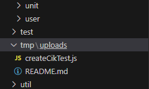

# Time Varying Conversion Test Instructions

*Written by GitHub users: @SGalindo831, @KobiMurakami*

This document provides detailed instructions for reproducing the test results reported in the [Time Varying Conversions Implementation](conversionsVaryTime.md).

## Creating Test Data

1. Add this script entry to your ``package.json``, at the end of the `` "scripts" `` section:  
``` json
 "createCikTest": "node -e 'require(\"./src/server/tmp/uploads/createCikTest.js\").createHourly()'" `
 ```

2. In your file explorer on VSCode, locate the `` "tmp\uploads" `` folder and create a new JavaScript file and name it `` createCikTest.js ``. Reference the photo below if you are having trouble finding the tmp folder.



3. Once you have created the JS file and added the script entry to `` package.json ``, copy and paste the following code into the createCikTest.js:

``` javascript
const moment = require('moment');
const { callbackify } = require('util');

async function createHourly() {
	// startTime = moment("2021-06-01 00:00:00");
	// endTime = moment("2021-06-06 00:00:00");
	startTime = moment("2020-01-01 00:00:00");
	endTime = moment("2021-01-01 00:00:00");
	stepTime = moment.duration(1, 'day');
	// stepTime = moment.duration(1, 'hour');
	meterUnit = 10;
	graphicUnit = 1;
	slope = 1;
	stepSlope = 0.1;
	// Move endTime back one stepTime so can check vs. startTime.
	endTime.subtract(stepTime);
	// Loop over all times wanted.
	while (startTime.isSameOrBefore(endTime)) {
		// First one really should be -infinity and last infinity but not doing now.
		// insert into cik values(10, 1, 2, 0, '-infinity', '2021-06-02 00:00:00');
		// Output a cik to insert into DB. Note it also steps the start time to get the end time so ready for next iteration.
		console.log(`insert into cik values(${meterUnit}, ${graphicUnit}, ${slope.toFixed(2)}, 0, '${startTime.format("YYYY-MM-DD HH:mm:ss")}', '${startTime.add(stepTime).format("YYYY-MM-DD HH:mm:ss")}');`);
		// Next slope.
		slope += stepSlope;
	}
}

module.exports = {
	createHourly
}
```
4. Before creating the data, make sure to adjust your `` startTime `` and `` endTime `` to the desired time length you want to test. Also make sure to change the `` stepTime `` to either `` 'day `` or `` 'hour' ``, depending on what you want to test time wise. Check the `` meterUnit `` number. For testing, we used `` Electric_Utility `` which was meter number 10.

To check what number your  `` Electric_Utility `` is, navigate to your OED Database Shell and first enter `` psql -U oed ``. 

Then enter the following: `` select * from units; `` It will bring up a table of all of the meters and find your `` Electric Utility `` meter number.


5. Now, navigate to your OED Web Shell and type in the following npm command:
`` npm run createCikTest ``. This will generate the test data. Make sure to copy and paste all of your test data into a outside document, this will make it easier when you insert the data into your OED Database Shell.


## Inserting Data and Running Tests
Now that you have gotten your test data, we will go over how to insert it to run the queries to test said data.

1. Navigate to your OED Database Shell. If you haven't done so, type `` psql -U oed ``.

2. For timing, simply type `` \timing ``. This will show the amount of time (ms) it takes to run the queries.

3. Make sure your `` CIK `` table is empty before inserting the test data. To do this simply use: 

``` sql
 select * from cik where source_id = 10 and destination_id = 1; 
```

This will display your `` CIK `` table. You can also run this to simple get a count of what is in the `` CIK `` table:

``` sql 
select count(*) from cik where source_id = 10 and destination_id = 1; 
```

If there is items in your `` CIK `` simply run to remove anything from the `` CIK ``:

``` sql 
delete from cik where source_id = 10 and destination_id = 1; 
```

Note: In the queries provided above, we have `source_id = 10` and `destination_id = 1`. The `source_id` being used is `"Electric_Utility"` and the `destination_id` is `"Electric Utility kWh"`, which represents a graphic unit in kilowatt-hours (kWh).

 To find the right `` source_id ``, enter the following in your OED Database Shell: `` select id,name from units; `` . For the `` destination_id `` enter the following: `` select id,name from meters; ``

 4. Once you have the proper `` source_id ``, `` destination_id ``, and cleared the `` CIK `` table. Navigate to the test data you saved from the previous section. Simply select all of the data and copy and paste it into the OED Database Shell. This may take a while depending on how much data you are pasting into your shell. Once all of the data has been pasted, simply hit "Enter" and it should insert all of the data into the `` CIK `` table. To check the amount of data that was inserted, simply run the following to to get a count of the data.

 ``` sql
  select count(*) from cik where source_id = 10 and destination_id = 1; 
 ``` 

 5. Finally, once you have all of your test data inserted, we can begin testing using the following query for `` daily ``: 

 ``` sql
  select meter_line_readings_unit('{25}', 1, '-infinity', 'infinity', 'daily', 200, 200);
 ```

 or this query for `` hourly ``:
``` sql
  select meter_line_readings_unit('{25}', 1, '-infinity', 'infinity', 'hourly', 200, 200);
 ```

 Note: 
 - The `` {25} `` in the query is the meter we are using for testing. This meter is `` Sin Amp 1 kWh ``. To make sure you are using the same meter for the tests, use the following query to lookup the meters and find which meter number is `` Sin Amp 1 kWh ``:

``` sql
select id,name from meters;
```
 - Also, when generating the test data, make sure you are using the proper step. If generated test data is using "day" `` stepTime ``, use the first `` daily `` query above. If using "hour" `` stepTime ``, use the second `` hourly `` query above.

6. After running the last query, you now have begun testing the query. Simply hold `` Space `` to see all of the test data that was inserted, if you don't want to see the test data, simply press `` Q `` and it should quit the query and display the time it took to run the query. Make sure to run the same `` select_line_readings `` 2-3 times to ensure caching. The completion times will vary from the first time your run the query compared to the second or third time.

*Documentation written by @SGalindo831 and @KobiMurakami*
---