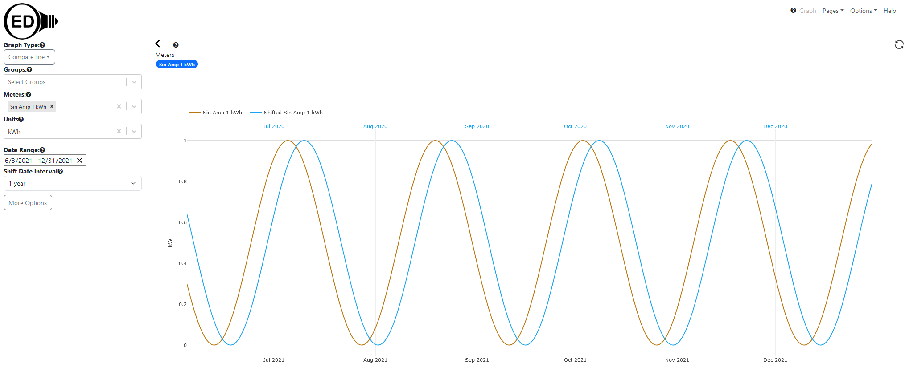
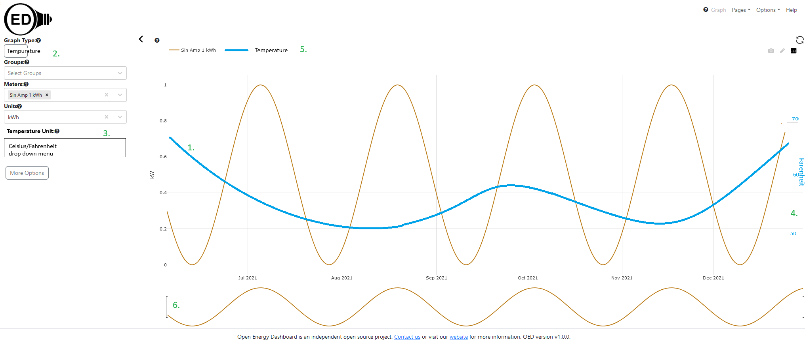
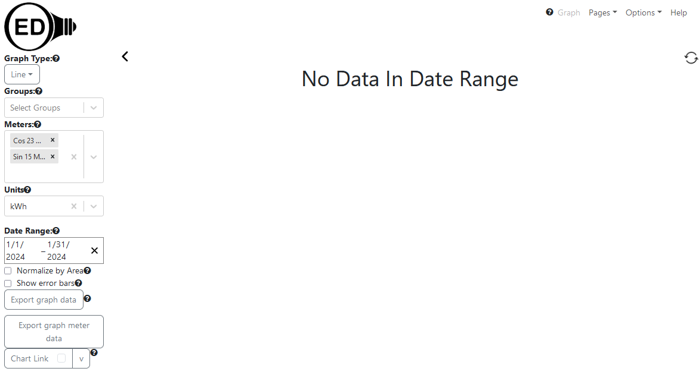
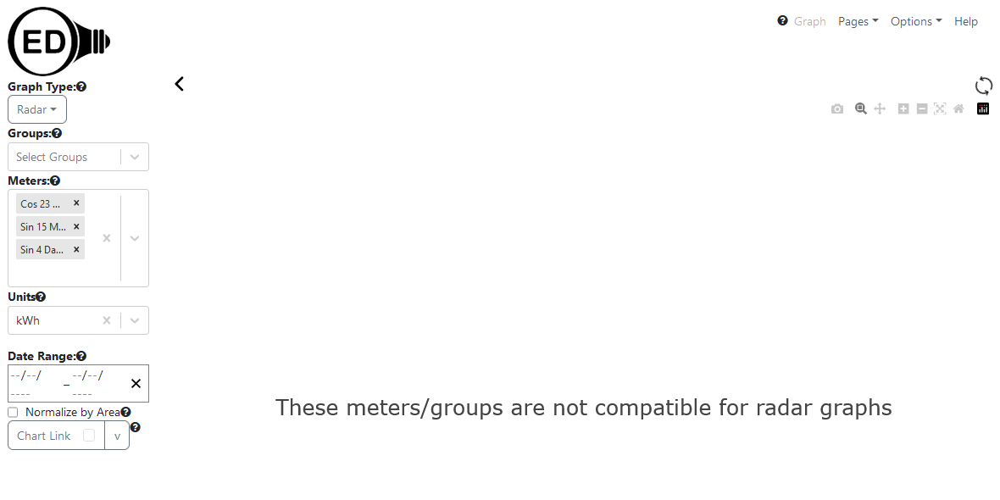

# Weather data

As part of [time varying units](../unitVaryTime/conversionsVaryTime.md), OED wants to track weather data and use to normalize reading data. OED may also do graphics where usage and temperature are shown together. This will mean having two different y-axis scales, something being done for line compare.

At a minimum, OED will want to have temperature data. It may want other information. Exactly what needs to be determined. For now, only temperature is being considered.

See [issue #1291](https://github.com/OpenEnergyDashboard/OED/issues/1291) about this.

## Getting weather data

Update 7/2024: A team created code in this [GitHub repo](https://github.com/9brian/OED/tree/frontend-team) on branch frontend-team to create a weather location and get the temperature data. While working, it needs the following:

- Several translation keys are not done: weather.input.error, weather.failed.to.create.location & weather.successfully.create.location where others should be checked.
- There is a fetchData npm command in package.json. It is not working, the name should be changed and there should be a way to specify dates. See src/server/services/weather/fetchData.js.
- A system needs to be set up to get weather data for a location. This should be via a admin interface and cron jobs to do automatically.
- The code should be reviewed and updated as needed. See src/client/app/components/weather/ for the UI code. Note @huss did a review of one version and their notes can be asked for.
- The SQL code in src/server/sql/weather_data/ and src/server/sql/weather_location/ does not have a migration in src/server/migrations/1.0.0-2.0.0 (or whatever version is needed).

This code is now out of data with development so the first step is to merge with development to get it up to date.

In addition, the graphic with meter/group data and weather data needs to be done. See section below on this.

It has become clearer that normalizing by temperature is more complex:

- Many resources should not be normalized by temperature (such as mass for recycling). OED needs to work out how admins will set which ones can be done.
- Normalizing probably requires time of year info since, for example, electricity may differ in hot vs cold months. It is possible a model will automatically take this into account.
- The model seems to need other information such as building nominal temperature where it does not heat or cool. If so, how will this relate to meters/groups.
- Many other factors may be needed.

Given this, researching and testing the models will need to happen before it is incorporated into OED. If possible, it is desired to use previous data to create a model to then predict future usage based on temperature. That could be used, for example, to see how much a change in a building actually saved. Currently OED could show this but not taking into account temperature changes between years (for example).

## Temperature graphic

OED has long supported line graphics. The new (or almost complete) compare line graphic added a new line graphic where there were two different scales for the y-axis to show the two different date ranges overlapping as seen here:

This new graphic will also have two different scales but for the x-axis where one is the current line graphic values and the other is for temperature. It will roughly look like this:

Some notes:

1. The line color of the temperature line is the same as the compare line in blue. This color is not used for any meter/group so it is the alternative color OED uses. The width should match the normal lines in OED.
2. There is a new graphic type of temperature (internationalized/translated) in its correct alphabetical location in that drop down menu.
3. There is a new drop down menu for "Temperature Unit" with a help link that has the options of "Celsius" and "Fahrenheit" (all internationalized using enums). It will default to celsius but see below on admin setting the default. OED should always collect the temperature data in a set unit (it may already be celsius). No conversion is needed for that but the values in Redux state for temperature need to be converted for the other temperature unit. While this could be a unit/conversion as done for reading data, it is easier to do this and avoid complications so that will not be done unless others think it should be.
4. The new temperature axis is on the right side in the blue color of the line. It is shown as Fahrenheit axis label but it would be the temperature unit selected.
5. The temperature line is labeled at the top for the line.
6. There is no slider on the compare line because it could not be made to work. Hopefully it can here but can be removed if necessary.

The temperature data shown will be for the meter(s)/group(s) shown (when possible). See the following section on this. An enhancement that can be done after the basic implementation is to place a message if there is no temperature data for the location and time interval. It is similar to this one for line graphic:

but would be "No Temperature Data in Date Range" (internationalized). It would be done in the way discussed in th next section for the compatible meters/groups. The warning if no meter data would also display if that was the case (only one case needs to be shown and it probably does not matter which but would be nice if follows the choices for line that are similar).

### Meter/Group menus

A check is made if all the meters and groups selected are in the same location. Note if any have no location then the check counts this as incompatible locations. If the locations are incompatible then a message is placed in the graphics area that states "These meters/groups are not compatible for temperature graphs" (internationalized). This is similar to (and done the same way as) the radar notice:

Note it should be done as in [PR #1402](https://github.com/OpenEnergyDashboard/OED/pull/1402) in case it is not yet merged.

If the meters/groups are compatible for the temperature graphic then the menus will be filtered so all that are in a different location then the current location will be placed in the incompatible section for the meters and groups drop down. This is similar to the filtering for units (which also applies here) but can further restrict choices on this graphic. This filtering can be done at a later stage where the incompatible message will appear if one of those meters/groups are selected until this is added.

The temperature line will use the compatible location (the one shared by all meters/groups) to get the needed temperature data as described below.

### Temperature data

There needs to be an SQL query, model, route and Redux state for the temperature data. The Redux Toolkit method should be used. The temperature data will be unique for location and time interval and stored in Redux state with these values. It is requested when temperature data is being graphed.

### Meter location

The meter admin pages need a new location selection. By default there is no default location and if none is given or chosen then it will be stored as null in the database. It will have similarities to the meter "Unit" drop down where the choices are the locations set on the weather admin page with the addition of no location (default on create). The route, model and database for meters needs to be updated for this new value. The database migration will set the value to null (no location) for any existing meters.

### Default temperature unit

The Admin Settings page needs a new entry for the default temperature unit. It will allow Celsius and Fahrenheit where the default will be Celsius. It will be similar to the area unit but may not need none as an option. Similar to this setup, it should use an enum/Object for the values in JS/TS/SQL and there should be an added test (see src/server/test/db/enumTests.js) for them being equal. Once this is added then the temperature graphic will use/select this temperature unit at first and only change if the user selects a different unit.

### Deployment

Once this graphic and  related updates are complete along with addressing comments/needs for the acquiring the weather data then it can be integrated. This is being done since normalization (below) is a bigger issue.

## Original

OED need to acquire weather data to support this feature. In a perfect world, there would be a single source of data for all sites. This may not be possible so having a standard format with modules to talk to different weather sources (similarly to how meter data is done) would be desirable. Demonstrating with two sources (or one if a standard source exists) would be good for the initial work.

Here are some possible sources where more may exist. The value and appropriateness of any options needs to be evaluated.

- [U.S. National Centers for Environmental Information with world-wide data & historical](https://www.ncei.noaa.gov/about-us)
  - [all data](https://www.ncei.noaa.gov/services/world-data-system)
  - [land data including weather](https://www.ncei.noaa.gov/products/land-based-station)
- [seems to have lots of historical and current data world-wide with API](https://open-meteo.com/en/docs/historical-weather-api)
- [U.S. NOAA info with weather/degree days, etc. Need to see what has and if API.](https://www.ncdc.noaa.gov/cdo-web/)
- [U.S. National Weather Service API to get data. Unclear if historical and probably not world-wide.](https://www.weather.gov/documentation/services-web-api)
  - [FAQ](https://weather-gov.github.io/api/general-faqs)
  - https://www.weather.gov/documentation/services-web-api Documentation
- [question about getting weather data but dated](https://opendata.stackexchange.com/questions/7578/historical-weather-forecast-api)
- others are available if needed and find with a web search

## Admin control of weather data

Admins need to be able to set if and how (if needed) weather data is acquired. The exact design depends on how weather data is acquired. Its page may be the general admin panel if it is simple or a newly linked page.

## Use weather data to normalize values

Once appropriate weather data is available, it needs to be used to normalize the meter data. Here are some sources of information on using weather data to normalize usage with basic ideas to modeling. Others are available. The possibilities need to be analyzed, a choice made, tested against real data and implemented within OED.

- [PDF with how to use historical data to get energy normalized data.](https://www.energystar.gov/sites/default/files/tools/Climate_and_Weather_2020_508.pdf)
- [basic CDD/HDD](https://medium.com/builtrix/how-to-calculate-weather-normalized-energy-consumption-55acacad50ea)
- [research paper](https://buildingenergyscore.energy.gov/resources/download?key=publications%2Fweather_normalization.pdf)
- [normalization info and methods from company](https://www.energylens.com/articles/degree-days)
- [Heating/cooling days and normalization](https://energyforums.net/energy-concepts/)degree-days-and-weather-normalization/ 
- [free online CDD/HDD calculator](https://www.energystar.gov/buildings/tools-and-resources/degree_days_calculator)

## Database changes

The exact changes relate to the sections above as the needed data may change. The database and models need to be created. This is a first cut at the DB setup:

### weather location

id, identifier, gps, note

### meter

The field weather_location_id is added (foreign key into weather location table)

### group

Similar to meter

### weather data

weather_location_id (foreign key into weather location table), start_time, end_time, temp

May need other values depending on choices made.

## UI interface

This will be decided after other choices are made.

- It seems a good idea to have a group check the location of the underlying meters and warn if they differ from the group location. This is different but has some similarities to the area calculation for groups.
- Depending on how normalization is done, we may want DB views for hour, half day, full day or something else to optimize normalizing by weather.
- UI choices may be similar to area to turn on/off. Change y-axis label to include "normalized by weather" (internationalized) assuming it fits.
- Need to decide if compatible with area normalization (seems to be) or any other graphic choices.
- There limitations on what data can weather normalized. Need to specify precisely.
