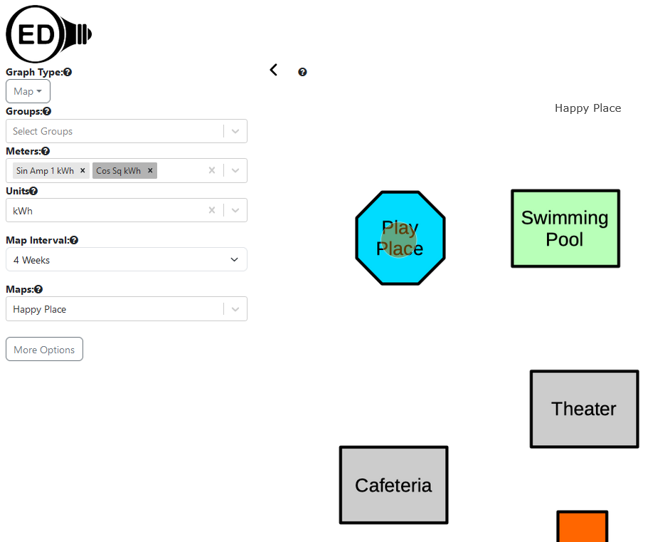

# Weather data

## Introduction

OED wants to incorporate weather data. For now, that will involve temperature data. There are two overall usages:

- A graphic where usage and temperature are shown together. This will mean having two different y-axis scales, something being done for line compare.
- As part of [time varying units](../unitVaryTime/conversionsVaryTime.md), OED wants to track weather data and use it to normalize reading data.

OED does not currently plan to use other weather information such as cloud cover, wind condition, etc. The reason is it is harder to get at arbitrary locations and others have generally indicated that usage normalization mostly depends on temperature.

There are three main areas to develop:

- Getting temperature data
- Displaying temperature data along with usage
- Normalizing usage by temperature

Each area is discussed in its own section/subsections below. There is also a section with historical information about the process.

See [issue #1291](https://github.com/OpenEnergyDashboard/OED/issues/1291) about this.

## Getting temperature data

OED researched possible freely available ways to acquire temperature data from most locations in the world. In the end, the decision was made to utilize [Open Mateo](https://open-meteo.com/) which is free for limited use. The basic idea is that given a location (GPS coordinates), OED will acquire the necessary historical data as well as regular updates for the temperature readings. Given planned OED usage and the normal speed of temperature changes, an hourly average will be acquired.

A team created code in this [GitHub repo](https://github.com/9brian/OED/tree/frontend-team) on branch frontend-team to create a weather location and get the temperature data. It has a admim weather page to define a weather location and try to get the temperature data. While working, it needs the following:

- It is now well out of date with the development branch so it must be carefully merged with that. OED is willing to help if desired.
- Several translation keys are not done: weather.input.error, weather.failed.to.create.location & weather.successfully.create.location where others should be checked.
- There is a fetchData npm command in package.json. It is not working, the name should be changed so weather related and there should be a way to specify dates. See src/server/services/weather/fetchData.js.
- When fetching temperature data, OED should track the last date received and ask for data from that date to the present time. An alternative is the use a DB query to get the latest date of the temperature data for this desired location.
  - On initial fetch, the start date should be the earliest date in any meter. See getEarliestTimeStamp in getEarliestTimeStamp to get the date. This might be best done in the database to get this value if the start date is not specified/special value.
    - In principle it should only be for meters that can graph temperature for this location but this is easier and should not be a major drain on the server since it is only done once. It is also safer.
  - A TODO should be placed in the code to state that this system should be updated to match the future code to optimize view refreshes that will track the actual dates of readings and when they are changed. This should also cover the case of earlier readings being added.
- A system needs to be set up to get weather data for a location. This should be via an admin interface and cron jobs to do automatically. Note OED plans to integrate a cron package to allow OED to automatically run cron-like tasks. This should use this new way. Please contact OED if it is not yet integrated.
- The SQL code in src/server/sql/weather_data/ and src/server/sql/weather_location/ does not have a migration in src/server/migrations/1.0.0-2.0.0 (or whatever version is needed).
- There are console.log statements that need to be removed. The commenting should also be improved as needed.
- The code should be reviewed and updated as needed. See src/client/app/components/weather/ for the UI code.

In addition, these are notes from a review of one version of the new code:

- The order should be latitude then longitude. Also, all other pages input as a single string separated by commas. This does make it easier to copy the value from other sources such as Google maps. Overall, to be consistent and for ease of use I think the weather page should have a single input in the same way. If you look at the meter page you will see how it is done.
- Take a look at src/client/app/utils/calibration.ts for isValidGPSInput() to see how it checks the values. I suspect you could use it if you put the two values into a string separated by a comma or easy if you go to single input. No matter what we should check for valid values.
- Other places store GPS as a point in the database. See src/server/sql/meter/create_meters_table.sql for example. This would allow OED to do GPS directly in the DB (if we ever wanted). This does require some manipulation to/from the DB but the meter code above already has that. Again, it would be good to be consistent with current usage.
- src/server/sql/weather_location/get_all_weather_locations.sql seems to return all columns. I think it is better to use * so it does not need to be updated if table change. Other places do this.
- Other places have a mapRow() function, e.g., src/server/models/Unit.js. I think the weather models should do this to be consistent and to encapsulate that process (even if only one use for now).
- src/server/models/WeatherData.js getByPrimaryKey() but I think it should be named getById() to be consistent with current usage.
- There is src/server/sql/weather_data/get_weather_data_by_id_and_start_time.sql but it is not in any model. I'm unsure what it would be used for, as getting weather point from a time going forward would seem unlikely. If needed, why and add to the model. If not, remove.
  - The update should probably remove this feature.
- I think the routes for amin work of creating/edits weather info need to verify it is an admin. See src/server/routes/maps.js for usage of adminAuthenticator to see how it should be done.
  - Note on creating the graphics: Access to temperature data will be needed for graphics so that will not be protected when it is created.
- PR #1173 changed how untranslated items are marked. I suspect you have yet to pull that PR.

Anyone working on this is welcome to contact OED to clarify any of these items.

The following sections have items that are not yet done but needed.

### Meter and group location

The meter and group admin pages need a new location selection. When a new meter/group is created, the value will be set to the site default meter/group location (see below). The admin can select a different weather location for the meter/group via a drop down menu that will list all weather locations with the addition of no location. Note that no location is stored as null in the database but will have a different value in Redux/TypeScript code (see ``unitId`` for meter creation for an example of this).
The route, model and database for meters/groups needs to be updated for this new value. The database migration will set the value to null (no location) for any existing meters. It is fine to do meters first and then add similar code to groups.

Note the changes to min/max values in [PR #1396](https://github.com/OpenEnergyDashboard/OED/pull/1396) has some similar ideas for setting min/max and using on other pages. It might be useful in making this change.

### Site default weather location & temperature unit

The Admin Settings page needs a new entry for the default weather location in the Site Settings section (below the last entry for documentation URL). It goes here rather than the meters section since it apples to meters and groups. The choices will be all weather locations added to OED and no weather location. The default value on OED creation will be no weather location.

The Admin Settings page needs a new entry for the default temperature unit in the Graph Settings section (below the last entry for area unit). It will allow Celsius and Fahrenheit where the default will be Celsius. It will be similar to the area unit but may not need none as an option. Similar to this setup, it should use an enum/Object for the values in JS/TS/SQL and there should be an added test (see src/server/test/db/enumTests.js) for them being equal. Once this is added then the temperature graphic will use/select this temperature unit at first and only change if the user selects a different unit.

As usual, these values will reside in Redux state.

## Temperature graphic

OED has long supported line graphics. The newer compare line graphic added a new line graphic where there were two different scales for the x-axis to show the two different date ranges overlapping as seen here:

This new weather graphic will also have two different scales but for the y-axis where one is the current line graphic values and the other is for temperature. It will roughly look like this:

Some notes:

1. The line color of the temperature line is the same as the compare line in blue. This color is not used for any meter/group so it is the alternative color OED uses. The width should match the normal lines in OED.
2. There is a new graphic type of temperature (internationalized/translated) in its correct alphabetical location in that drop down menu. See src/client/app/components/ChartSelectComponent.tsx.
3. There is a new drop down menu for "Temperature Unit" with a help link that has the options of "Celsius" and "Fahrenheit" (all internationalized using enums, see src/client/app/utils/getAreaUnitConversion.ts for how area unit does it and more info below). See above on admin setting the default so it will be in Redux state. OED should always collect the temperature data in a set unit (it may already be celsius). No conversion is needed for that but the values in Redux state for temperature need to be converted for the other temperature unit. While this could be a unit/conversion as done for reading data, it is easier to do this on the client when graphing and avoid complications so that will not be done unless others think it should be. Normalizing by area is also done on the client for similar reasons.
4. The new temperature axis is on the right side in the blue color of the line. It is shown as Fahrenheit axis label but it would be the temperature unit selected.
5. The temperature line is labeled at the top for the line.
6. There is no slider on the compare line because it could not be made to work. It should work here since it is a single x-axis. The hope is the current slider on the line graphic page will remain and work as it does now.

The temperature data shown will be for the meter(s)/group(s) shown (when possible). See the following section on this. An enhancement that can be done after the basic implementation is to place a message if there is no temperature data for the location and time interval. It is similar to this one for line graphic:

but would be "No Temperature Data in Date Range" (internationalized). It would be done in the way discussed in th next section for the compatible meters/groups. The warning if no meter data would also display if that was the case (only one case needs to be shown and it probably does not matter which but would be nice if follows the choices for line that are similar).

### Temperature data

There needs to be an SQL query, model, route and Redux state for the temperature data. The Redux Toolkit method should be used. The temperature data will be unique for location and time interval and stored in Redux state with these values. It is requested when temperature data is being graphed. The Redux state will likely have the data laid out as done for meter/group line data so graphing is the same.

### Meter/Group menus

A similar technique to maps will be used a shown here:

If a meter or group does not have gps coordinates or they do not reside on the selected map then they are still considered selected but shown grayed out (as seen for Cos Sq kWh). These are not shown on the map graphic. If a meter/group that cannot be graphed is not yet selected then it is shown in the incompatible section of the meter/group drop down menu and it cannot be selected on the map graphic page.

The temperature graphic will use the same idea where grayed out/incompatible if there is no weather location associated with the meter/group.

Another consideration is if the meters/groups all use the same weather location. A check is made if all the selected meters and groups that have a weather location (are not grayed out/incompatible) are in the same location. If the locations differ then a message is placed in the graphics area that states "These meters/groups are not compatible for temperature graphs" (internationalized). This is similar to (and done the same way as) the radar notice:

Note it should be done as in [PR #1402](https://github.com/OpenEnergyDashboard/OED/pull/1402) in case it is not yet merged. This should put the message at the top of the graphic area.

If the meters/groups are compatible for the temperature graphic then the menus will be filtered so all that are in a different location than the current location will be placed in the incompatible section for the meters and groups drop down. This is similar to the filtering for units (which also applies here) but can further restrict choices on this graphic. If the meters/groups are not compatible (different locations) then all other meters/groups that are not selected are placed in the incompatible section of the drop down menu. This filtering can be done at a later stage where the incompatible message will appear if one of those meters/groups are selected until this is added.

The temperature line will use the compatible location (the one shared by all meters/groups) to get the needed temperature data as described above.

## Normalizing usage by temperature

It has become clearer that normalizing by temperature is more complex:

- Many resources should not be normalized by temperature (such as mass for recycling). OED needs to work out how admins will set which ones can be done.
- Normalizing probably requires time of year info since, for example, electricity may differ in hot vs cold months. It is possible a model will automatically take this into account.
- The model seems to need other information such as building nominal temperature where it does not heat or cool. If so, how will this relate to meters/groups?
- Many other factors may be needed.

Given this, researching and testing the models will need to happen before it is incorporated into OED. If possible, it is desired to use previous data to create a model to then predict future usage based on temperature. That could be used, for example, to see how much a change in a building actually saved. Currently OED could show this but not taking into account temperature changes between years (for example).

It is anticipated that anyone working on this will be in regular contact with OED to discuss ideas. As stated, the modeling will likely be done outside the OED software to validate it works as desired. It can then be incorporated into OED. Note you can export OED reading data to a CSV file so it should not be hard to use it outside of OED.

### Information on normalizing usage via weather data

Here are some sources of information on using weather data to normalize usage with basic ideas to modeling. Others are available. The possibilities need to be analyzed, a choice made, tested against real data and implemented within OED.

- [PDF with how to use historical data to get energy normalized data.](https://www.energystar.gov/sites/default/files/tools/Climate_and_Weather_2020_508.pdf)
- [basic CDD/HDD](https://medium.com/builtrix/how-to-calculate-weather-normalized-energy-consumption-55acacad50ea)
- [research paper](https://buildingenergyscore.energy.gov/resources/download?key=publications%2Fweather_normalization.pdf)
- [normalization info and methods from company](https://www.energylens.com/articles/degree-days)
- [Heating/cooling days and normalization](https://energyforums.net/energy-concepts/degree-days-and-weather-normalization/)
- [free online CDD/HDD calculator](https://www.energystar.gov/buildings/tools-and-resources/degree_days_calculator)

## Future work/considerations

This will be decided after other choices are made.

- It seems a good idea to have a group check the location of the underlying meters and warn if they differ from the group location. This is different but has some similarities to the area calculation for groups.
- Depending on how normalization is done, we may want DB views for hour, half day, full day or something else to optimize normalizing by weather.
- Need to decide if compatible with area normalization (seems to be) or any other graphic choices.

## Historical information

This was originally elsewhere in the document but is not directly needed for current development. It is here for use as needed and as a record.

### Acquiring weather data

OED need to acquire weather data to support this feature. In a perfect world, there would be a single source of data for all sites. This may not be possible so having a standard format with modules to talk to different weather sources (similarly to how meter data is done) would be desirable. Demonstrating with two sources (or one if a standard source exists) would be good for the initial work.

Here are some possible sources where more may exist. The value and appropriateness of any options needs to be evaluated.

- [U.S. National Centers for Environmental Information with world-wide data & historical](https://www.ncei.noaa.gov/about-us)
  - [all data](https://www.ncei.noaa.gov/services/world-data-system)
  - [land data including weather](https://www.ncei.noaa.gov/products/land-based-station)
- [seems to have lots of historical and current data world-wide with API](https://open-meteo.com/en/docs/historical-weather-api)
- [U.S. NOAA info with weather/degree days, etc. Need to see what has and if API.](https://www.ncdc.noaa.gov/cdo-web/)
- [U.S. National Weather Service API to get data. Unclear if historical and probably not world-wide.](https://www.weather.gov/documentation/services-web-api)
  - [FAQ](https://weather-gov.github.io/api/general-faqs)
  - https://www.weather.gov/documentation/services-web-api Documentation
- [question about getting weather data but dated](https://opendata.stackexchange.com/questions/7578/historical-weather-forecast-api)
- others are available if needed and find with a web search

### Admin control of weather data

Admins need to be able to set if and how (if needed) weather data is acquired. The exact design depends on how weather data is acquired. Its page may be the general admin panel if it is simple or a newly linked page.

### Database changes

The exact changes relate to the sections above as the needed data may change. The database and models need to be created. This is a first cut at the DB setup:

#### weather location

id, identifier, gps, note

#### meter

The field weather_location_id is added (foreign key into weather location table)

#### group

Similar to meter

#### weather data

weather_location_id (foreign key into weather location table), start_time, end_time, temp

May need other values depending on choices made.
